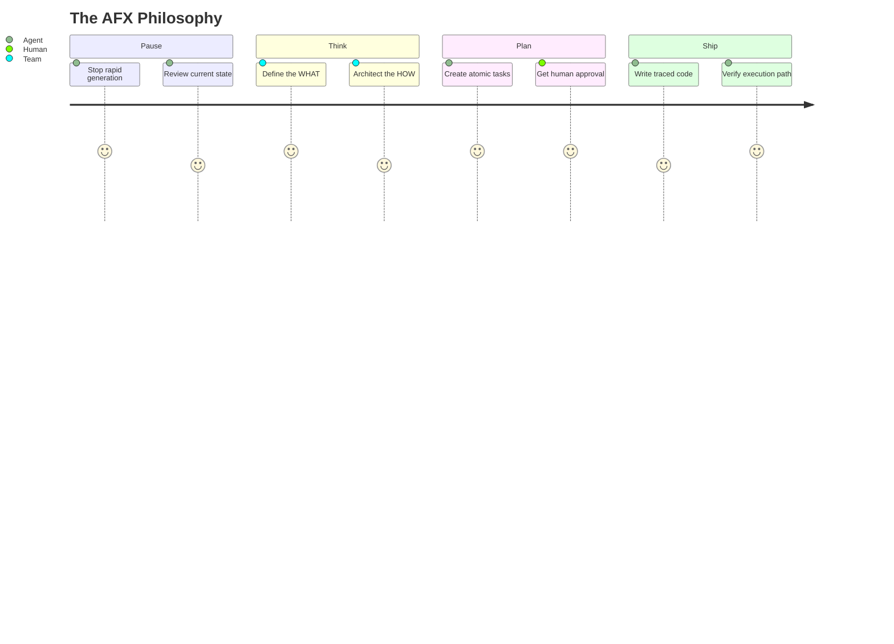
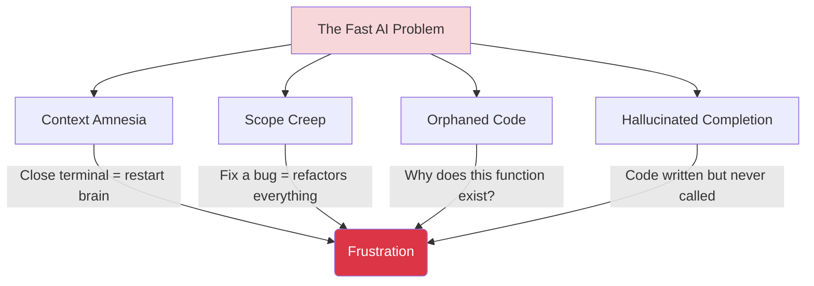
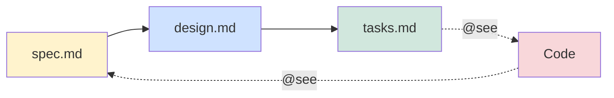
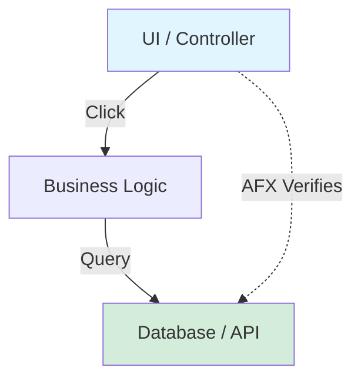
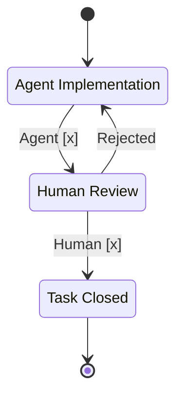
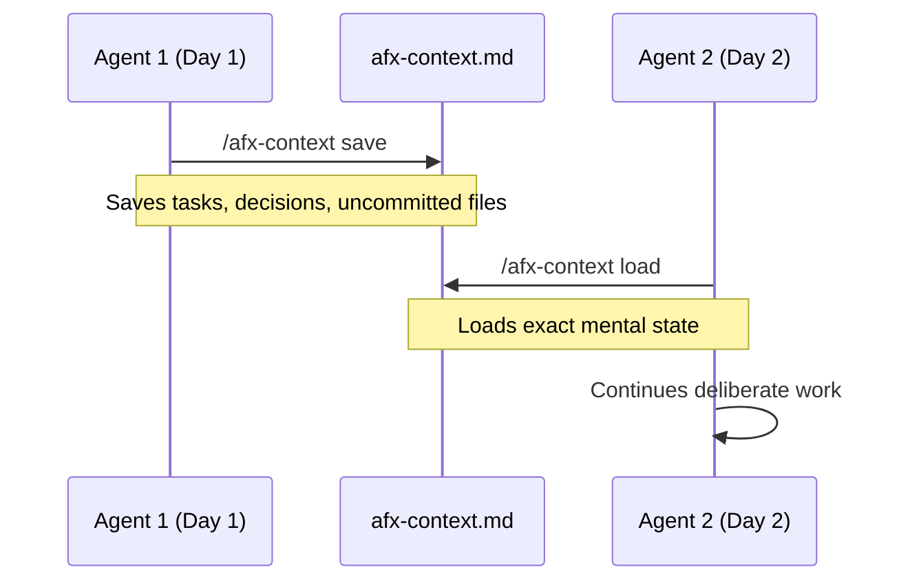
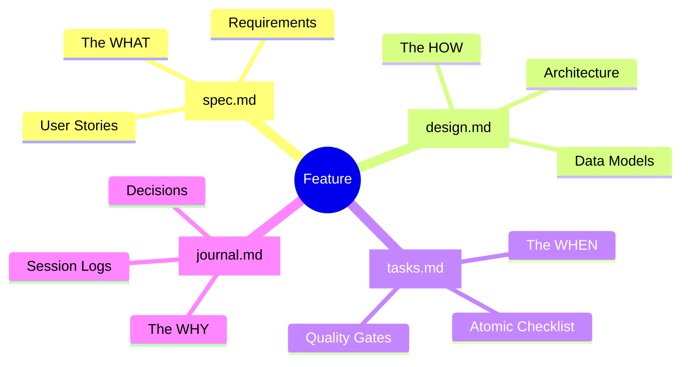
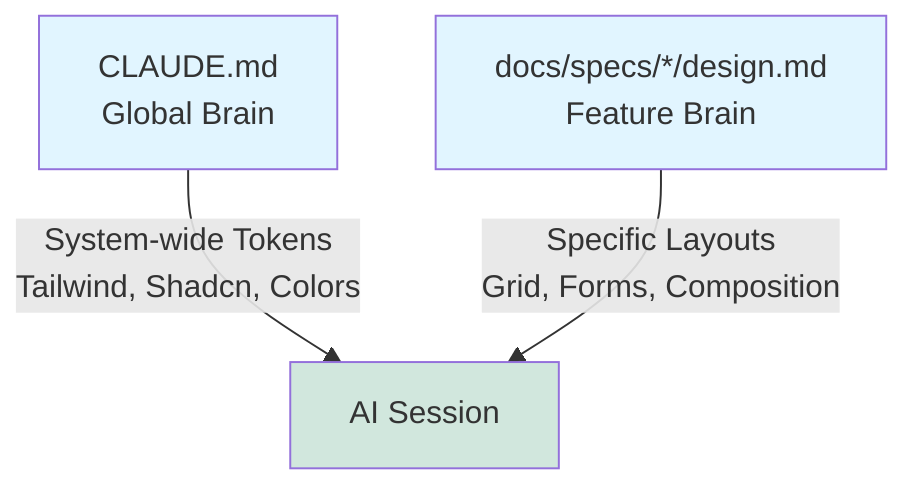
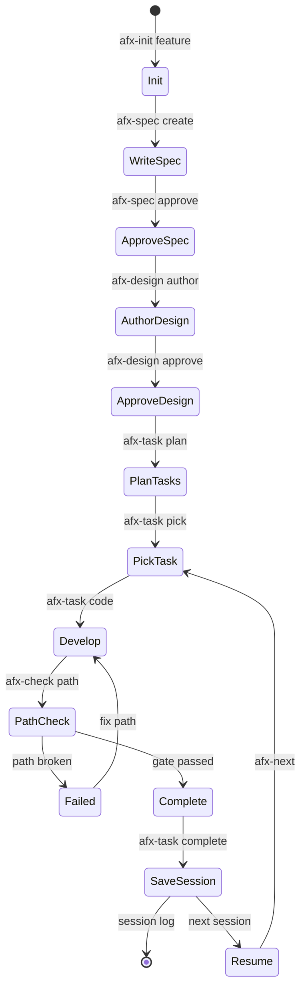
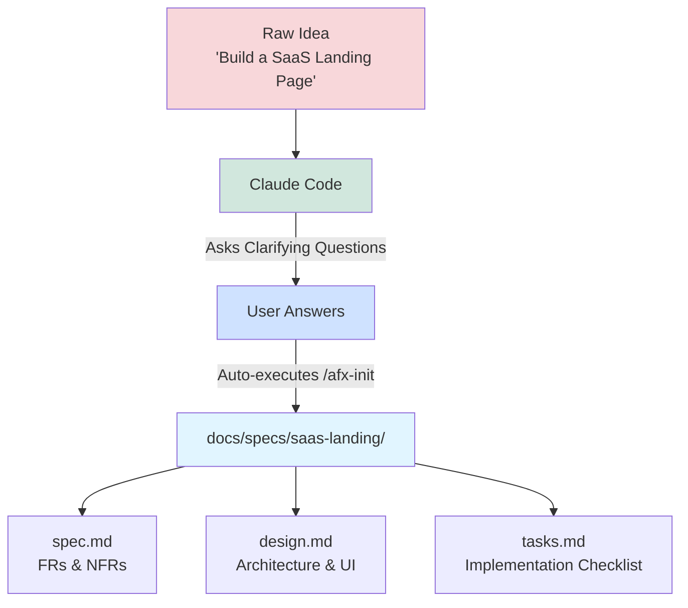

<p align="center">
  
  <br/>
  <strong>Works with</strong>
  <br/><br/>
  <a href="https://docs.anthropic.com/en/docs/claude-code"></a>
  <a href="https://platform.openai.com/docs/guides/codex"></a>
  <a href="https://cloud.google.com/products/gemini/code-assist"></a>
  <a href="https://docs.github.com/en/copilot"></a>
</p>

<a href="https://github.com/rixrix/afx/releases"></a>

**AgenticFlowX VSCode Extension (Alpha)** — A dedicated visual interface for the AFX workflow. Track your feature pipeline, navigate specifications, and manage skill packs directly in the editor. [Read more &rarr;](docs/agenticflowx/vscode-extension.md)

> [!WARNING]
> **Alpha Status** — Not yet on the VS Code Marketplace. Expect bugs. Some features may be unstable.
>
> - 🔒 Repository is private — not yet public on GitHub.
> - 📦 Download the `.vsix` from the [Releases page](https://github.com/rixrix/afx/releases).
> - 🤝 Companion tool — not a replacement for agents like Claude Code or Codex.
> - 🖥 Tested on macOS and WSL — not yet verified on native Windows.

**Install**

```bash
# Option 1 — One-liner (download + install)
curl -L -o vscode-afx.vsix https://github.com/rixrix/afx/releases/download/v2.1.0/vscode-afx-2.0.0-alpha.1.vsix && code --install-extension vscode-afx.vsix
```

Or from VS Code: download the `.vsix` from the [Releases page](https://github.com/rixrix/afx/releases), then `Cmd+Shift+P` → **Extensions: Install from VSIX...** and select the file.

**See it in action** — Open the [vscode-showcase](https://github.com/rixrix/afx/tree/main/examples/vscode-showcase) example project used in the [screenshots below](#agenticflowx-vscode-extension--screenshots):

```bash
git clone https://github.com/rixrix/afx.git && code afx/examples/vscode-showcase
```

---

# AFX (AgenticFlowX)

> **Pause. Think. Plan. Ship.**

AFX is a **spec-driven development framework** for AI coding assistants (Claude Code, Codex, Gemini Code Assist, GitHub Copilot).

**AFX is NOT a "one-prompt-builds-all" generator.**

We are currently in an era of rapid, sloppy AI generation where speed is prioritized over technical debt. AFX forces developers and AI agents to slow down, build a "bird's-eye view" of the architecture, and follow a strict, deliberate plan before a single line of code is written.

It prevents AI agents from going off-spec by enforcing bidirectional traceability between specifications and code, preserving context across sessions, and requiring quality gates before tasks close.



## The Problem

AI coding assistants are incredibly fast, but they suffer from fundamental flaws when building serious software:



## The Solution

AFX gives your AI coding agents a memory, a strict set of rules, and a deliberate workflow.

**1. Specs as Source of Truth & Traceability**

Every function gets an automatic `@see` link mapping it back to the exact spec requirement (`spec.md [FR-X]` and `design.md [DES-ID]` are required; `tasks.md` links are optional).



**2. Execution Verification**

Code isn't done just because it exists. `/afx-check path` traces logic from the UI down to the database to cryptographically prove the path works.



**3. Two-Stage Quality Gates**

AI agents can hallucinate completion. AFX forces tasks to require both Agent `[x]` and Human `[x]` before they can be closed.



**4. Stateful Session Contexts & Continuity**

Close your laptop without losing context. `/afx-session log` records your train of thought, and `/afx-context save` bundles it so another agent can instantly resume tomorrow.



## What's actually in the box?

AFX isn't just a script you run; it's made up of three parts that work together:

1. **The Workflow**: The actual rules and methodology. This is the "pause, think, plan" philosophy, the commands you use, and the verification steps that keep your project from turning into a mess.
2. **The Skills (`afx/skills`)**: These are the literal prompt instructions we feed to Claude, Codex, or Copilot. They follow the open [agentskills.io](https://agentskills.io) standard format, teaching your AI assistant how to follow the workflow, what commands like `/afx-next` do, and how to format their output.
3. **The Templates**: The physical markdown files (`spec.md`, `design.md`, etc.) that hold your project's rules and history.

> **Agent Compatibility**: Skills follow the open [agentskills.io](https://agentskills.io) standard. Tested and verified tools:

| Agent              | Status            | Notes                           |
| :----------------- | :---------------- | :------------------------------ |
| **Claude Code**    | ✅ Heavily tested | Primary development environment |
| **GitHub Codex**   | ✅ Tested         | Several validation runs         |
| **GitHub Copilot** | ✅ Tested         | Via `.github/prompts/`          |
| **Gemini CLI**     | ✅ Tested         | Via `.gemini/commands/`         |
| **Cline**          | ⚠️ Untested       | May work, not verified          |
| **AugmentCode**    | ⚠️ Untested       | May work, not verified          |
| **KiloCode**       | ⚠️ Untested       | May work, not verified          |
| **OpenCode**       | ⚠️ Untested       | May work, not verified          |

Let's look at those templates.

## The Four-File Structure

Every feature gets four files. **The sequence is mandatory** — you cannot start design until spec is approved, and you cannot open tasks until design is approved:

```
1. spec.md   → define WHAT to build (get human approval)
2. design.md → define HOW to build it (get human approval)
3. tasks.md  → define WHEN / atomic checklist (then implement)
4. journal.md → append-only log of decisions (every session)
```



- **`spec.md`**: Requirements only. No implementation details.
  ```markdown
  | ID   | Requirement                                       | Priority  |
  | ---- | ------------------------------------------------- | --------- |
  | FR-1 | Paginated, sortable list of all users.            | Must Have |
  | FR-2 | Filter by Role, Status, and Verification Context. | Must Have |
  ```
- **`design.md`**: Technical architecture. How you'll implement the spec.

  ````markdown
  ## Data Models

  | Column | Type   | Description       |
  | ------ | ------ | ----------------- |
  | `id`   | UUID   | Primary Key       |
  | `role` | String | User Access Level |

  ## Server Actions

  ```typescript
  export async function createUser(data: CreateUserSchema): Promise<Result<User>> {
    // 1. Validate permissions via CASL
    // 2. Insert into PostgreSQL
  }
  ```
  ````

  ```

  ```

- **`tasks.md`**: Implementation checklist. Structured using dot-notation derived from traditional **Work Breakdown Structures (WBS)**. Requires two-stage verification (Agent + Human) before a phase is closed.

  ```markdown
  ## Phase 1: Component Refactor

  | Priority | Phase     | Description                   | Status  |
  | -------- | --------- | ----------------------------- | ------- |
  | 1.1      | Phase 1.1 | Wire Users Table Dialogs      | Active  |
  | 1.2      | Phase 1.2 | Role Form Modal - Wire Update | Pending |
  ```

- **`journal.md`**: Append-only historical log of all discussions and decisions.

  ```markdown
  ## Agent Session [2025-10-24 14:00]

  **Decisions Made:**

  - Chose `uuid` over autoincrement integer for `id` to prevent enumeration.
    **Current State:**
  - API route `/api/users` completed. Next agent should wire frontend table.
  ```

- **`research/`**: (Auxiliary) Dedicated space for feature-local decision records (ADRs).

**Traceability in action**: When the agent writes code, every major function gets a `@see` backlink to the spec or task that required it. This is how AFX eliminates orphaned code.

```typescript
// ✅ AFX-compliant: every function is traceable back to its requirement

/**
 * @see docs/specs/user-auth/spec.md [FR-1]
 * @see docs/specs/user-auth/design.md [DES-AUTH]
 */
export async function generateVerificationToken(email: string): Promise<string> {
  // Implementation...
}

/**
 * @see docs/specs/user-auth/spec.md [FR-2]
 * @see docs/specs/user-auth/design.md [DES-API]
 */
export async function signInWithEmail(data: SignInSchema) {
  // Implementation...
}
```

> **Looking for the full templates or a working example?**
>
> 1. Check out the master schema files in [`docs/agenticflowx/templates/`](docs/agenticflowx/templates/) to see the exact YAML frontmatter and document structures expected by AFX coding agents.
> 2. Explore the [`examples/minimal-project/`](examples/minimal-project/) directory to see how a complete AFX continuous-development environment is structured in practice.

## Global Context vs Local Context

AFX prevents AI context window bloat and conflicting instructions by separating global rules from local rules.



## Commands

### Context & Navigation

**`/afx-next`** - Context-aware guidance
Analyzes your project state and tells you exactly what to work on next. Checks for unapproved specs, incomplete tasks, pending verifications, and stale sessions.

**`/afx-discover [capabilities|scripts|tools|project]`** - Project intelligence
Scans your codebase to understand build systems, test runners, package managers, and available tooling. Claude learns how to build, test, and deploy your project.

**`/afx-spec validate|discuss|review|approve`** - Specification management (owns `spec.md`)

**`/afx-design author|validate|review|approve`** - Technical design authoring, validation, and approval

### Development

**`/afx-task plan|pick|code|verify|complete|sync`** - Implementation lifecycle — plan, pick, code, verify, complete, sync

**`/afx-dev debug|refactor|review|test|optimize`** - Advanced diagnostics — debug, refactor, review, test, optimize

**`/afx-init feature|adr <name>`** - Scaffold new work

### Verification

**`/afx-check path|trace|links|deps|coverage`** - Quality gates

- `path` - **BLOCKING GATE**: Trace execution from UI → business logic → database
- `trace` - Verify all code has valid `@see` annotations
- `links` - Check spec integrity and cross-references
- `deps` - Check dependency health and compatibility
- `coverage` - Measure spec-to-code coverage

**`/afx-hello`** - Environment diagnostics and installation verification

### Session Management

**`/afx-session log|recall|list`** - Context preservation

**`/afx-context save|load`** - Context transitions
Package current context for transfer to another agent or future session. Includes spec state, task progress, verification status, and discussion history.

### Reporting

**`/afx-report traceability|health|coverage`** - Project metrics

## Example Workflow



## Quick Start

### One-Line Install

> **Note on OS Support**: The AFX CLI and commands are heavily tested on macOS and Unix-like systems (Linux/WSL). They have not been formally tested on native Windows.

```bash
# From your project directory
curl -sL https://raw.githubusercontent.com/rixrix/afx/main/afx-cli | bash -s -- .
```

Or if you have AFX cloned locally:

```bash
./path/to/afx/afx-cli /path/to/your/project
```

The installer prompts you to select which AI agents you use, then installs:

- AFX skills to selected skill targets (`.claude/skills/` and/or `.agents/skills/`)
- Templates to `docs/agenticflowx/templates/`
- Configuration file `.afx.yaml`
- AFX documentation to `docs/agenticflowx/`
- Context files for selected agents (`CLAUDE.md`, `AGENTS.md`, and optionally `GEMINI.md`)
- Directory structure: `docs/specs/` and `docs/adr/`

## How to create your first specs

A common difficulty for new users is translating a raw idea into structured AFX specifications (the "blank canvas" problem). You don't have to write these specifications manually - you can use Claude Code, Codex, Gemini CLI, or GitHub Copilot to scaffold them for you.



**Step 1: Start the CLI**
Navigate to your project directory and start the CLI by typing `claude`.

**Step 2: Paste the Kickoff Prompt**
Copy the prompt below and paste it directly into Claude. By default, it uses a simple "SaaS Landing Page" example so you can safely test how the framework operates. You can replace the first sentence with your actual feature idea:

```text
I want to build a single-page landing page for my SaaS product. Make it plain, static HTML/CSS/JS with no frameworks (no React, Next.js, etc) so I can easily preview it in my browser.

Please act as my Product Manager and Technical Architect:
1. Ask me 1-3 clarifying questions about this idea. Wait for my response.
2. Once answered, use the `/afx-init` command to scaffold the folder structure.
3. Write the `spec.md`, `design.md`, and `tasks.md` files based on our discussion. Remember to check `CLAUDE.md` for global UI conventions before writing the design document.

When you're done, ask me if I'm ready to run `/afx-task pick` to start coding!
```

**Step 3: Answer the Questions**
Claude will act as your Product Manager and pause to ask you a few clarifying questions.

**Step 4: Review the Generated Output**
Once you answer, Claude will automatically run `/afx-init` and build out your specification files tailored to your answers:

- `spec.md`: Contains your User Stories, Functional Requirements, and Non-Functional Requirements.
- `design.md`: Contains your system architecture, color palettes, and component layouts.
- `tasks.md`: Contains Phase 1, Phase 2, etc., with atomic checkboxes mapped back to the spec via `@see`.

## Reality Check: Working with LLMs

> **Important caveat**: The skills driving these AFX commands are still a work in progress and are rapidly evolving.

From extensive experience, we know that LLMs (like Claude, Codex, and others) can sometimes "drift" or hallucinate, even when provided with heavy instructions and stringent AFX guidelines. There will inevitably be times when tools and commands do not execute exactly as expected.

As a user, you should anticipate a hybrid workflow. You will often need to use a mix of strict AFX slash commands (e.g., `/afx-spec review`) combined with your own **on-the-fly custom prompting** to course-correct the agent when it loses context or drifts from the instructions. AFX provides the crucial rails, but you are still the driver.

---

## AgenticFlowX VSCode Extension — Screenshots

<table>
<tr>
<td align="center" width="50%">

<sub><b>Pipeline</b> — feature health across the pipeline</sub>
</td>
<td align="center" width="50%">

<sub><b>Tasks</b> — phases, checkboxes, and work session history</sub>
</td>
</tr>
<tr>
<td align="center" width="50%">

<sub><b>Analytics</b> — project health KPIs and pipeline gauge</sub>
</td>
<td align="center" width="50%">

<sub><b>Documents</b> — master-detail doc browser with markdown preview</sub>
</td>
</tr>
<tr>
<td align="center" width="50%">

<sub><b>Journal</b> — discussions across all spec journals</sub>
</td>
<td align="center" width="50%">

<sub><b>Board</b> — kanban boards backed by YAML in .afx/kanban/</sub>
</td>
</tr>
<tr>
<td align="center" width="50%">

<sub><b>Notes</b> — quick capture with markdown timeline</sub>
</td>
<td align="center" width="50%">

<sub><b>Architecture</b> — dependency graph and cycle detection</sub>
</td>
</tr>
</table>

---

## Standards & References

AFX's template system is a pragmatic hybrid of established industry standards:

- [IEEE 830 / ISO/IEC/IEEE 29148](https://standards.ieee.org/ieee/29148/6937/) -- Software Requirements Specification structure, adapted for agile feature-level specs
- [MoSCoW (Dai Clegg, 1994 / DSDM)](https://en.wikipedia.org/wiki/MoSCoW_method) -- Requirement prioritization: Must Have / Should Have / Could Have / Won't Have
- [User Stories (Mike Cohn / XP)](https://www.mountaingoatsoftware.com/agile/user-stories) -- Connextra format: "As a [role], I want [feature], So that [benefit]"
- [C4 Model (Simon Brown)](https://c4model.com/) -- Software architecture diagram levels (Context, Container, Component, Code)
- [ADR (Michael Nygard, 2011)](https://cognitect.com/blog/2011/11/15/documenting-architecture-decisions) -- Architecture Decision Records: Context, Decision, Consequences
- [WBS (PMI PMBOK Guide)](https://en.wikipedia.org/wiki/Work_breakdown_structure) -- Work Breakdown Structure for hierarchical task decomposition
- [Traceability Matrix (IEEE 29148 / DO-178C)](https://standards.ieee.org/ieee/29148/6937/) -- Cross-reference mapping from Requirements to Design to Code

---

## Contributing

Contributions are welcome! Please read [CONTRIBUTING.md](CONTRIBUTING.md) before submitting PRs.

## License

MIT License - see [LICENSE](LICENSE) for details.

## Acknowledgments

AFX was developed as part of real-world production projects and refined through extensive use with Claude Code, Codex, Gemini CLI, and GitHub Copilot.
