<p align="center">
  
  <br/>
  <strong>Works with</strong>
  <br/><br/>
  <a href="https://docs.anthropic.com/en/docs/claude-code"></a>
  <a href="https://platform.openai.com/docs/guides/codex"></a>
  <a href="https://cloud.google.com/products/gemini/code-assist"></a>
  <a href="https://docs.github.com/en/copilot"></a>
</p>

# AFX (AgenticFlowX)

> **Keep AI agents on track, even when you're not**

AFX is a spec-driven development framework for **Claude Code, Codex, Gemini Code Assist, and GitHub Copilot** that prevents AI agents from going off-spec. It maintains bidirectional traceability between specifications and code, preserves context across sessions, and enforces quality gates before tasks close.

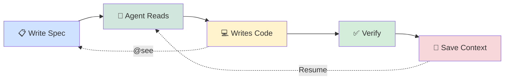

## The Problem

AI coding assistants are powerful but lose context easily:

- **Context loss**: Close the window, lose your train of thought
- **Scope creep**: "Fix a bug" becomes "refactor the entire module"
- **Orphaned code**: Code written without understanding why or what spec it serves
- **Verification burden**: No systematic way to prove code matches requirements
- **Session breaks**: Coffee break = starting over with context dump

## The Solution

AFX gives your AI coding agents a memory and a rulebook:

**1. Specs as Source of Truth & Traceability**

Every function gets an automatic `@see` link mapping it back to the exact spec requirement.

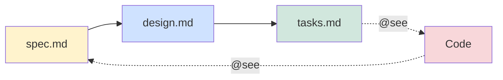

**2. Execution Verification**

Code isn't done just because it exists. `/afx-check path` traces logic from the UI down to the database to cryptographically prove the path works.

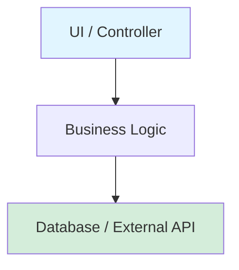

**3. Two-Stage Quality Gates**

AI agents can hallucinate completion. AFX forces tasks to require both Agent `[x]` and Human `[x]` before they can be closed.

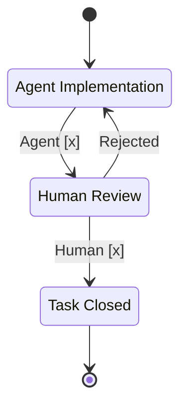

**4. Stateful Session Contexts & Continuity**

Close your laptop without losing context. `/afx-session save` records your train of thought, and `/afx-context save` bundles it so another agent can instantly resume tomorrow.

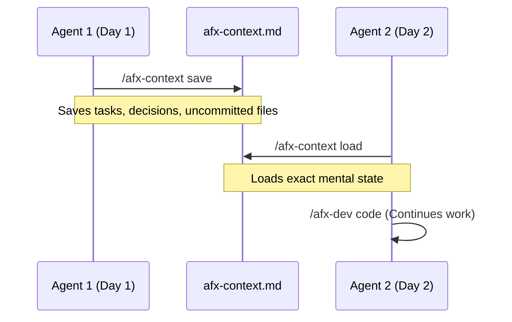

## Why AFX?

| Problem           | Without AFX                                                                            | With AFX                                                                         |
| :---------------- | :------------------------------------------------------------------------------------- | :------------------------------------------------------------------------------- |
| **Context**       | "Claude, can you continue from yesterday?" → _Spends 10 minutes re-explaining context_ | `/afx-work resume` → _Claude reads journal, picks up exactly where you left off_ |
| **Scope**         | Claude "fixes a bug" → _Refactors 3 unrelated files you didn't ask for_                | Claude follows specs → _Only implements what's approved, no scope creep_         |
| **Understanding** | "Why does this function exist?" → _No idea, Claude wrote it 2 weeks ago_               | Every function has a `@see` link → _Instant understanding of why code exists_    |
| **Completion**    | Task says "Done" → _Code exists but isn't actually called anywhere_                    | Task requires verification → _Both agent AND human must approve before closing_  |
| **Verification**  | Need to prove feature works → _Manually click through UI hoping nothing breaks_        | `/afx-check path` → _Automated trace from UI → business logic → database_        |

## The Four-File Structure

Every feature gets four files that separate concerns cleanly:

```text
docs/specs/user-authentication/
├── spec.md      # Requirements - WHAT to build
├── design.md    # Architecture - HOW to build it
├── tasks.md     # Implementation checklist - WHEN/WHO
├── journal.md   # Session logs - WHY decisions were made
└── research/    # (Auxiliary) Feature-local ADRs
```

**`spec.md`** - Requirements only. No implementation details. This is a living document that represents the _current factual state_ of requirements.

- User stories, acceptance criteria, business rules
- What the feature must do, not how it does it
- Example: "Users must be able to reset passwords via email"

**`design.md`** - Technical architecture. How you'll implement the spec.

- **Living document**: Overwrite it to reflect current reality rather than appending history.
- API endpoints, data models, algorithms
- Technology choices (JWT vs sessions, bcrypt vs argon2)
- Example: "Password reset tokens stored in Redis with 1-hour TTL"

**`tasks.md`** - Implementation checklist with two-stage verification.

- Numbered tasks (1.1, 1.2, 2.1, etc.) that map to design sections
- Each task has Agent `[x]`/`[ ]` and Human `[x]`/`[ ]` columns
- Tasks cannot close without both checked
- Example: "1.2: Implement JWT token generation [x] [x]"

**`journal.md`** - Append-only historical log of all discussions and decisions.

- `/afx-session save` appends entries with timestamps
- **Event log**: All historical context, abandoned ideas, and chronological narrative belong here.
- Records context: what was discussed, why decisions were made, blockers encountered
- Makes sessions resumable days/weeks later
- Example: "Decided on JWT over sessions due to mobile app requirements"

**`research/`** - (Auxiliary) Dedicated space for feature-local decision records and deep-dive explorations.

- Used when a decision is too complex for a quick `journal.md` entry.
- Stores immutable records of why a specific technical path was chosen.
- Keeps `design.md` clean by moving historical context out of the living document.

**Why four files instead of one?**

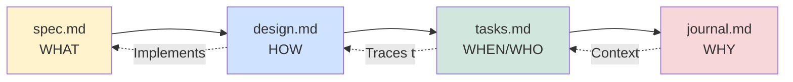

- **Separation of concerns**: Requirements don't change when implementation details do
- **Approval workflow**: Freeze `spec.md`, iterate on `design.md`
- **Context preservation**: Journal captures the "why" that's lost in code comments
- **Agent guidance**: Claude reads the right file for the right purpose

## Architecture Decision Records (ADRs)

Decisions get lost in Slack threads, PR comments, and meeting notes. ADRs capture _why_ a technical choice was made so future developers (and AI agents) don't re-debate settled decisions.

AFX supports ADRs at two levels:

```text
docs/adr/                          # Global ADRs (cross-cutting)
├── ADR-0001-database-choice.md
├── ADR-0002-api-versioning.md
└── ...

docs/specs/{feature}/research/     # Feature-local ADRs
├── 0001-auth-provider.md
└── ...
```

**Global ADRs** (`docs/adr/`) are for decisions that affect the entire project — database choice, API versioning strategy, deployment architecture, coding standards. These are created with:

```bash
/afx-init adr "database choice"
# Creates: docs/adr/ADR-0001-database-choice.md
```

**Feature-local ADRs** (`docs/specs/{feature}/research/`) are scoped to a single feature — which auth provider to use, pagination strategy for a specific API, etc. These are promoted from discussions via `/afx-session promote`.

Each ADR follows a standard lifecycle:

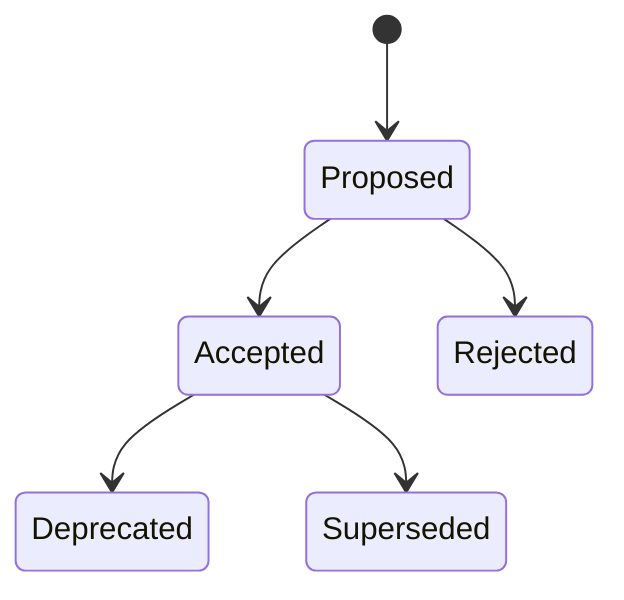

**Why this matters for AI agents**: When Claude encounters a decision point (e.g., "Should I use Redis or Memcached for caching?"), it checks existing ADRs first. If `ADR-0003-caching-strategy.md` already says "Use Redis because X, Y, Z", Claude follows the decision instead of re-debating it.

## Global Context vs Local Context

AFX operates on a strict **Global Brain** vs **Local Brain** segregation paradigm to manage UI definitions and architectural constraints.

**Claude Code, Codex, Gemini, and GitHub Copilot (AI agents) are the primary consumers** of this split architecture. By separating global design tokens from local feature layouts, we prevent AI context window bloat and conflicting agent instructions during development.

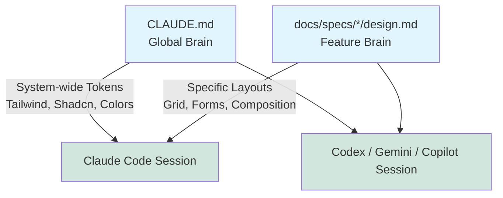

1. **Global Context (`CLAUDE.md`)**: The "Project Brain". Defines system-wide visual constraints and tech stack rules.
   - Example global rules: _"Use TailwindCSS for styling", "Always use Shadcn UI components", "Primary brand color is `#FF5500`."_
2. **Local Context (`docs/specs/*/design.md`)**: The "Feature Brain". Defines the individual feature's visual layout and component composition.
   - Example local rules: _"The login form has a two-column grid on desktop, stacking to single-column on mobile. Use a Shadcn `Card` component."_

By splitting context, your individual feature specs don't have to redefine what a "Button" looks like every single time—they just inherit the global rules from `CLAUDE.md`.

## Commands

### Context & Navigation

**`/afx-next`** - Context-aware guidance
Analyzes your project state and tells you exactly what to work on next. Checks for unapproved specs, incomplete tasks, pending verifications, and stale sessions.

**`/afx-discover [capabilities|scripts|tools|project]`** - Project intelligence
Scans your codebase to understand build systems, test runners, package managers, and available tooling. Claude learns how to build, test, and deploy your project.

**`/afx-work status|next|resume|sync`** - Workflow orchestration

- `status` - Current work state across all features
- `next <spec>` - Pick and start the next task from a spec
- `resume` - Continue interrupted work with full context restoration
- `sync` - Sync task completion states between code and specs

**`/afx-spec list|show|validate|review|approve`** - Specification management

- `list` - Show all specs with status, owner, and progress
- `show <name>` - Display spec overview with phase completion and recent journal entries
- `validate <name>` - Check spec structure integrity (4 required files, frontmatter, links)
- `phases <name>` - List all phases with completion percentages
- `requirements <name>` - Extract FR/NFR from spec.md
- `coverage <name>` - Requirements vs tasks gap analysis
- `discuss <name>` - Interactive spec discussion and gap identification
- `review <name>` - Comprehensive automated review (completeness, quality, consistency, gaps, risks)
- `approve <name>` - Mark spec as approved after validation (automated gate)
- `sign-off <name>` - Human approval with signature and timestamp (compliance/audit trail)

### Development

**`/afx-dev code|refactor|fix`** - Traced development
Write code with automatic `@see` annotation insertion. Claude links every function back to the spec section or task that required it. No orphaned code.

**`/afx-init feature|adr <name>`** - Scaffold new work

- `feature <name>` - Creates the four-file spec structure (spec.md, design.md, tasks.md, journal.md)
- `adr <title>` - Creates a global ADR in `docs/adr/` with auto-incrementing numbering

### Verification

**`/afx-check path|lint|links`** - Quality gates

- `path` - **BLOCKING GATE**: Trace execution from UI → business logic → database
- `lint` - Verify all code has valid `@see` annotations
- `links` - Check spec integrity and cross-references

**`/afx-task verify|audit|close`** - Task management

- `verify <task-id>` - Confirm implementation matches task requirements
- `audit` - Review all tasks for completion criteria
- `close <task-id>` - Close task after verification (requires both `[x]` columns)

### Session Management

**`/afx-session save|recall|list`** - Context preservation

- `save` - Capture current discussion into journal.md with structured metadata
- `recall <session-id>` - Restore previous session context
- `list` - Browse all recorded sessions across features

**`/afx-context save|load`** - Context transitions
Package current context for transfer to another agent or future session. Includes spec state, task progress, verification status, and discussion history.

### Reporting

**`/afx-report traceability|health|coverage`** - Project metrics

- `traceability` - Code-to-spec coverage analysis
- `health` - Spec quality and task completion rates
- `coverage` - Which specs have implementation vs which are documentation-only

### Framework Maintenance

**`/afx-update check|apply`** - Keep AFX assets current

- `check` - Compare local AFX version to upstream latest release
- `apply` - Run installer update flow with optional safety flags (`--dry-run`, `--skills-only`, etc.)

## Project Intelligence

AFX doesn't just track specs - it learns how your project works:

```bash
/afx-discover capabilities
```

**What it discovers:**

| Category          | Examples                                | Used By                                  |
| ----------------- | --------------------------------------- | ---------------------------------------- |
| Build systems     | npm/yarn/pnpm scripts, Makefile, gradle | `/afx-check`, `/afx-work`                |
| Test runners      | jest, pytest, cargo test, go test       | `/afx-dev code` (auto-run after changes) |
| Package managers  | npm, yarn, pnpm, pip, cargo             | Dependency installation                  |
| Development tools | eslint, prettier, tsc, mypy             | `/afx-check lint`                        |
| Database tools    | Migrations, seeders, schema management  | `/afx-dev` database tasks                |
| Deployment        | Docker, CI/CD configs, deploy scripts   | `/afx-work` deployment integration       |

**Why this matters:** Claude learns your project's commands and can automatically run tests, linters, and builds without asking how.

```bash
# Example: AFX discovers and stores in .afx.yaml
capabilities:
  build: npm run build
  test: npm test
  lint: npm run lint
  dev: npm run dev
  migrate: npm run db:migrate
```

## Example Workflow

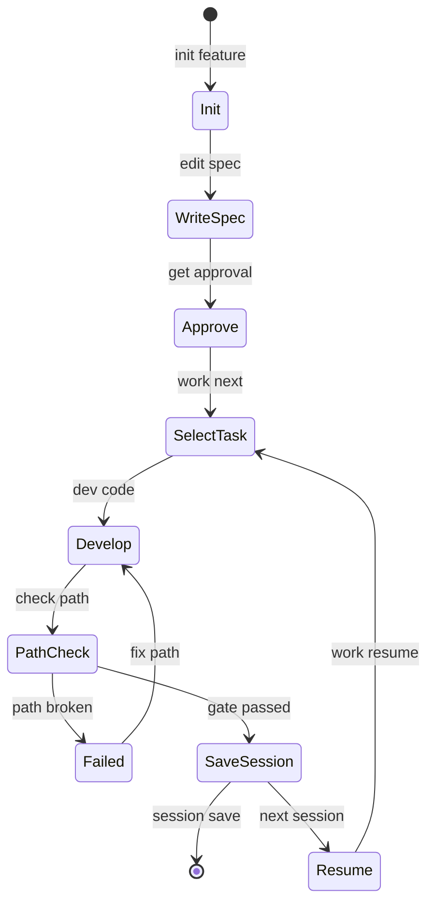

**Day 1: Starting a new feature**

```bash
/afx-init feature user-authentication
# Creates docs/specs/user-authentication/ with all templates

# Edit spec.md with requirements, get approval
/afx-work next user-authentication
# Claude reads tasks.md, picks task 1.1

/afx-dev code
# Implement login endpoint with @see annotations

/afx-check path
# Trace: LoginButton.onClick() → authService.login() → db.users.findOne()
# ✓ Gate 1 passed

/afx-session save "Implemented login endpoint, discussed token strategy"
# Context saved to journal.md
```

**Day 2: After lunch (new session)**

```bash
/afx-next
# AFX: "Resume user-authentication task 1.2 (Password hashing).
#       Last session saved 2 hours ago. Gate 1 passed for task 1.1."

/afx-work resume
# Context restored: reads journal, understands token strategy decision

/afx-dev code
# Implement password hashing with @see annotations

/afx-check path
# Trace password hashing in registration flow
# ✓ Gate 1 passed

/afx-task verify 1.2
# Agent marks [x] in tasks.md

# Human reviews, marks [x]
/afx-task close 1.2
# Task closed with both verifications
```

**Day 3: Transfer to another developer**

```bash
/afx-context save
# Packages: spec state, completed tasks, open discussions, verification status

# Other developer:
/afx-context load
# Full context restored, continues from task 1.3 without explanation needed
```

## Code Traceability in Action

AFX enforces bidirectional links between specs and code via JSDoc `@see` annotations:

**In your spec** ([docs/specs/user-auth/design.md](docs/specs/user-auth/design.md)):

```markdown
### 2.1 Token Generation

Use JWT with 24-hour expiry. Include user ID and role in payload.
```

**In your code** (`src/auth/tokens.ts`):

```typescript
/**
 * @see docs/specs/user-auth/design.md#21-token-generation
 * @see docs/specs/user-auth/tasks.md#12-implement-jwt-tokens
 */
export function generateToken(userId: string, role: string): string {
  return jwt.sign({ userId, role }, process.env.JWT_SECRET, { expiresIn: "24h" });
}
```

**Bidirectional traceability:**

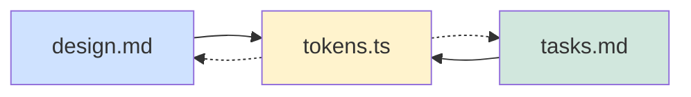

**What this enables:**

- **Impact analysis**: `/afx-report traceability` shows which code will be affected by spec changes
- **Orphan detection**: `/afx-check lint` finds code without spec justification
- **Audit trail**: Understand why every function exists and what requirement it fulfills
- **Agent guidance**: Claude reads `@see` links to understand context when modifying code

## Documentation

- [Full Manual](docs/agenticflowx/agenticflowx.md) - Complete framework reference
- [SDD Guide](docs/agenticflowx/guide.md) - Spec-Driven Development methodology
- [Cheatsheet](docs/agenticflowx/cheatsheet.md) - Quick reference
- [Multi-Agent Commands](docs/agenticflowx/multi-agent.md) - `afx-xxx` skills and parity mapping

## How It Works Across Agents

AFX skills are the single source of truth for all agent behavior. Each skill is a standard-compliant `SKILL.md` file under `skills/`. The installer copies skills to the appropriate provider target directory for each agent platform.

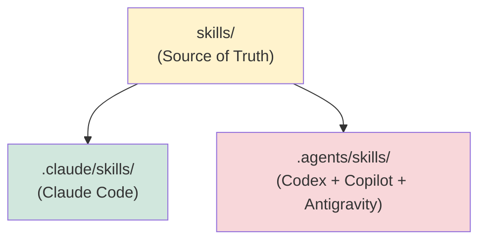

| Skill Target       | Agents                            | Context File |
| ------------------- | --------------------------------- | ------------ |
| `.claude/skills/`   | Claude Code                       | CLAUDE.md    |
| `.agents/skills/`   | Codex, Copilot, Antigravity       | AGENTS.md    |
| _(none)_            | Gemini CLI (opt-in)               | GEMINI.md    |

**Why `skills/` is canonical**: Skill files contain the full behavioral specification — subcommands, validation rules, output formats, and traceability requirements. Skill target directories receive copies during installation, ensuring all agents behave identically regardless of which one you use.

See [Multi-Agent Commands](docs/agenticflowx/multi-agent.md) for the full parity mapping.

## Project Structure

**AFX Repository:**

```
afx/
├── skills.json              # Standard manifest (pack catalog + version)
├── skills/                  # All skills (standard SKILL.md format)
│   ├── dev/                 # Developer skills (clean-code, tdd, debugging, git, patterns)
│   ├── qa/                  # QA skills (methodology, test-planning)
│   ├── security/            # Security skills (owasp, audit)
│   ├── architect/           # Architect skills (architect, research)
│   ├── product-owner/       # Product owner skills
│   ├── starter/             # Starter skills (hello)
│   └── agenticflowx/       # Workflow skills (next, work, dev, check, task, session, etc.)
├── packs/                   # Pack manifests (afx-pack-*.yaml)
├── docs/
│   ├── adr/                 # Global Architecture Decision Records
│   ├── agenticflowx/        # Framework documentation
│   └── specs/               # Feature specifications
├── templates/               # Spec templates (spec, design, tasks, journal, adr)
├── prompts/                 # Integration snippets (CLAUDE.md, AGENTS.md, GEMINI.md)
├── examples/                # Example project setup
├── afx-cli                  # CLI installer/manager script
└── .afx.yaml.template       # Configuration template
```

**Your Project (after install):**

```
your-project/
├── .claude/skills/       # AFX skills for Claude Code
├── .agents/skills/       # AFX skills for Codex + Copilot + Antigravity
├── docs/
│   ├── adr/              # Global Architecture Decision Records
│   ├── agenticflowx/     # AFX reference documentation
│   │   ├── agenticflowx.md
│   │   ├── guide.md
│   │   ├── cheatsheet.md
│   │   └── templates/    # AFX spec templates
│   │       ├── spec.md
│   │       ├── design.md
│   │       ├── tasks.md
│   │       ├── journal.md
│   │       └── adr.md
│   └── specs/            # Your feature specifications
│       └── {feature}/
│           ├── spec.md
│           ├── design.md
│           ├── tasks.md
│           └── journal.md
├── .afx.yaml             # Project configuration
├── CLAUDE.md             # Claude Code instructions (with AFX section)
├── AGENTS.md             # Codex/Copilot/Antigravity instructions (with AFX section)
└── GEMINI.md             # Gemini CLI instructions (opt-in, with AFX section)
```

## Configuration

AFX uses `.afx.yaml` for project-specific configuration:

```yaml
version: "1.0"

paths:
  specs: "docs/specs"
  adr: "docs/adr"
  templates: "docs/agenticflowx/templates"

features:
  - my-feature
  - another-feature

prefixes:
  specs: GEN
  my-feature: MF

quality_gates:
  require_path_check: true
  require_human_approval: true
```

See `.afx.yaml.template` for full configuration options.

## Quality Gates

AFX enforces verification before tasks can close:

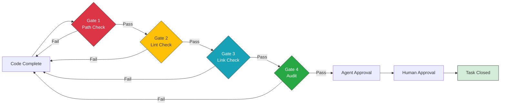

### Gate 1: Path Verification (BLOCKING)

**Command**: `/afx-check path`

Traces code execution through the stack to prove the feature actually works:

```text
[UI] src/components/LoginForm.tsx:42
 └── [Service] src/services/auth.ts:18
      └── [Logic] src/auth/validator.ts:91
           └── [Database] src/db/users.ts:15
```

**Why it's blocking**: Without path verification, you can't prove the feature is wired up correctly. Code might exist but never be called.

### Gate 2: Annotation Compliance

**Command**: `/afx-check lint`

Verifies every function has valid `@see` annotations linking to specs. Finds:

- Orphaned functions without spec justification
- Broken links to non-existent spec sections
- Missing `@see` annotations in new code

**Example:**

```typescript
// ❌ Orphaned function (Fails Gate 2)
export function calculateTax(amount) { ... }

// ✅ Compliant function (Passes Gate 2)
/**
 * @see docs/specs/checkout/design.md#31-tax-calculation
 */
export function calculateTax(amount) { ... }
```

### Gate 3: Spec Integrity

**Command**: `/afx-check links`

Validates spec document cross-references:

- Internal links between spec sections
- Task references to design sections
- Journal entries citing specific tasks

**Example:**

```bash
❌ Error in docs/specs/auth/tasks.md: Task 1.2 references #jwt-format, but section doesn't exist in design.md
✅ Success: All 142 spec cross-references resolve correctly.
```

### Gate 4: Requirements Alignment

**Command**: `/afx-task audit`

Compares implementation against task acceptance criteria:

- All required functionality implemented
- Edge cases handled per spec
- No out-of-scope additions

**Example:**

```markdown
# Failure Report from /afx-task audit

Task: 1.2 Implement JWT token generation
Status: REJECTED ❌
Reason: Spec requires 24-hour expiry, but implementation hardcodes 1-hour expiry.
```

## What Makes AFX Different

| AFX is NOT...           | AFX actually is...                                                                 |
| ----------------------- | ---------------------------------------------------------------------------------- |
| Documentation generator | Living contracts that AI agents actively read and enforce during development       |
| Task tracker            | Embedded tasks with two-stage verification (agent + human approval required)       |
| Linter                  | Execution path tracer that proves code paths exist from UI to database             |
| Prompt library          | Complete methodology with enforced rules, not suggestions                          |
| Single-session tool     | Context preservation system - survives interruptions, days, and weeks between work |

## Core Philosophy

- **State vs Event Separation**
  - Maintain a strict boundary between living documents (`spec.md`, `design.md`) which reflect the _current factual state_, and append-only logs (`journal.md`, `tasks.md`) which record _events_ of how the system evolved.
- **Specs as Executable Contracts**
  - Specifications are living rules AI agents read and enforce during runtime, not documentation that gets written and forgotten.
- **Bidirectional Traceability**
  - Code points to specs (`@see`), and specs point to code (via tasks). Navigate seamlessly from requirement to implementation and back.
- **Context over Memory**
  - AI agents don't have memory between sessions. The journal preserves the "why" behind the "what," making interrupted work resumable.
- **Two-Stage Verification**
  - Agents implement; humans verify. Both columns must show `[x]` before tasks close.
- **Execution Proof over Promises**
  - Don't trust that code works just because it exists. `/afx-check path` traces execution from the entry point to the database to prove the path is wired up.

## Best Used For

| Use AFX When                                        | Skip AFX When                              |
| --------------------------------------------------- | ------------------------------------------ |
| Multi-session features spanning days/weeks          | Quick prototypes or throwaway code         |
| Complex requirements needing clear AI guidance      | Simple bug fixes (< 1 hour)                |
| Frequent interruptions (meetings, context switches) | Solo sprint with no breaks                 |
| "Why does this exist?" is a common question         | Requirements change faster than you code   |
| Need to prove execution paths work                  | Specs would take longer to write than code |
| Scope creep is a concern                            | Exploring/experimenting without direction  |
| Audit trails required (compliance, handoffs)        | One-off scripts with no maintenance        |

**Rule of thumb**: The more complex the feature or the longer the timeline, the more value AFX provides.

## Real-World Benefits

| Category    | Benefit                           | Impact                                         |
| ----------- | --------------------------------- | ---------------------------------------------- |
| **Time**    | Session resume                    | 30 seconds vs 10 minutes re-explaining context |
|             | Scope control                     | No wasted cycles on unasked-for refactors      |
|             | Context recovery                  | Resume after days/weeks without memory loss    |
| **Quality** | Traceability                      | Know why every function exists                 |
|             | Verification                      | Catch broken execution paths before production |
|             | Alignment                         | Code provably matches approved requirements    |
| **Flow**    | Fewer "what was I doing?" moments | Journal preserves your train of thought        |
|             | Better decisions                  | Technical choices documented with rationale    |
|             | Audit trail                       | Complete history of what changed and why       |

## Frontmatter Schema

AFX uses YAML frontmatter to make specs machine-readable for Claude:

```yaml
---
afx: true # Marks file as AFX-managed
type: SPEC # SPEC | DESIGN | TASKS | JOURNAL
status: Draft # Draft | Approved | Living
owner: "@yourhandle" # Who's responsible
version: 1.0 # Semantic versioning
tags: [auth, security, api] # Categorization
---
```

**Why this matters:**

- `/afx-next` scans frontmatter to find unapproved specs (status: Draft)
- `/afx-work status` groups features by tags
- `/afx-report health` tracks approval rates and ownership
- Claude knows which documents are authoritative (afx: true)

## Common Scenarios

| Problem                                       | Solution                                                 | Command                      |
| --------------------------------------------- | -------------------------------------------------------- | ---------------------------- |
| Need to step away mid-task                    | Save context, resume later with full memory              | `/afx-session save → resume` |
| Claude added features I didn't ask for        | Claude reads approved spec, only implements listed tasks | `/afx-work next <spec>`      |
| Need to prove feature actually works          | Trace execution from UI → logic → database               | `/afx-check path`            |
| Can't remember why we made a design decision  | Recall saved session with full context                   | `/afx-session recall`        |
| New developer needs to take over              | Package context, transfer with zero explanation needed   | `/afx-context save → load`   |
| Refactor broke something but tests still pass | Path verification catches missing execution links        | `/afx-check path`            |
| Which code breaks if I change this spec?      | Impact analysis shows all `@see` links to that section   | `/afx-report traceability`   |
| Lost in codebase, what should I work on?      | Context-aware guidance based on project state            | `/afx-next`                  |
| Need to understand what this function does    | Read `@see` annotation to jump to spec                   | Check JSDoc in code          |
| Task marked done but not actually complete    | Two-stage verification: agent + human both must approve  | `/afx-task verify → close`   |

## Quick Start

### One-Line Install

```bash
# From your project directory
curl -sL https://raw.githubusercontent.com/rixrix/afx/main/afx-cli | bash -s -- .
```

Or if you have AFX cloned locally:

```bash
./path/to/afx/afx-cli /path/to/your/project
```

The installer prompts you to select which AI agents you use, then installs:

- AFX skills to selected skill targets (`.claude/skills/` and/or `.agents/skills/`)
- Templates to `docs/agenticflowx/templates/`
- Configuration file `.afx.yaml`
- AFX documentation to `docs/agenticflowx/`
- Context files for selected agents (`CLAUDE.md`, `AGENTS.md`, and optionally `GEMINI.md`)
- Directory structure: `docs/specs/` and `docs/adr/`

## How to create your first specs

A common difficulty for new users is translating a raw idea into structured AFX specifications (the "blank canvas" problem). You don't have to write these specifications manually - you can use Claude Code, Codex, Gemini CLI, or GitHub Copilot to scaffold them for you.

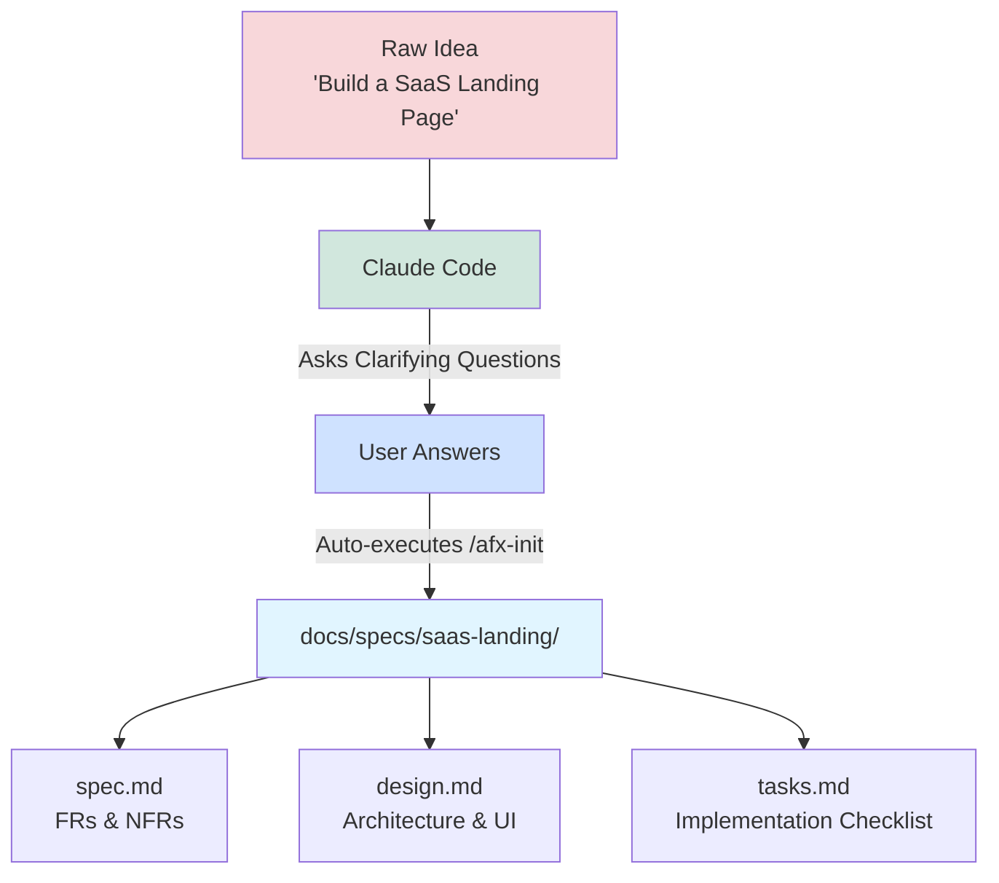

**Step 1: Start the CLI**
Navigate to your project directory and start the CLI by typing `claude`.

**Step 2: Paste the Kickoff Prompt**
Copy the prompt below and paste it directly into Claude. By default, it uses a simple "SaaS Landing Page" example so you can safely test how the framework operates. You can replace the first sentence with your actual feature idea:

```text
I want to build a single-page landing page for my SaaS product. Make it plain, static HTML/CSS/JS with no frameworks (no React, Next.js, etc) so I can easily preview it in my browser.

Please act as my Product Manager and Technical Architect:
1. Ask me 1-3 clarifying questions about this idea. Wait for my response.
2. Once answered, use the `/afx-init` command to scaffold the folder structure.
3. Write the `spec.md`, `design.md`, and `tasks.md` files based on our discussion. Remember to check `CLAUDE.md` for global UI conventions before writing the design document.

When you're done, ask me if I'm ready to run `/afx-work next` to start coding!
```

**Step 3: Answer the Questions**
Claude will act as your Product Manager and pause to ask you a few clarifying questions.

**Step 4: Review the Generated Output**
Once you answer, Claude will automatically run `/afx-init` and build out your specification files tailored to your answers:

- `spec.md`: Contains your User Stories, Functional Requirements, and Non-Functional Requirements.
- `design.md`: Contains your system architecture, color palettes, and component layouts.
- `tasks.md`: Contains Phase 1, Phase 2, etc., with atomic checkboxes mapped back to the spec via `@see`.

## Contributing

Contributions are welcome! Please read [CONTRIBUTING.md](CONTRIBUTING.md) before submitting PRs.

## License

MIT License - see [LICENSE](LICENSE) for details.

## Acknowledgments

AFX was developed as part of real-world production projects and refined through extensive use with Claude Code, Codex, Gemini CLI, and GitHub Copilot.
