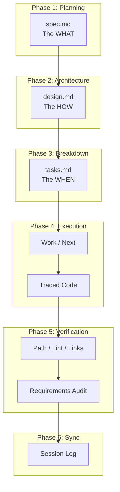
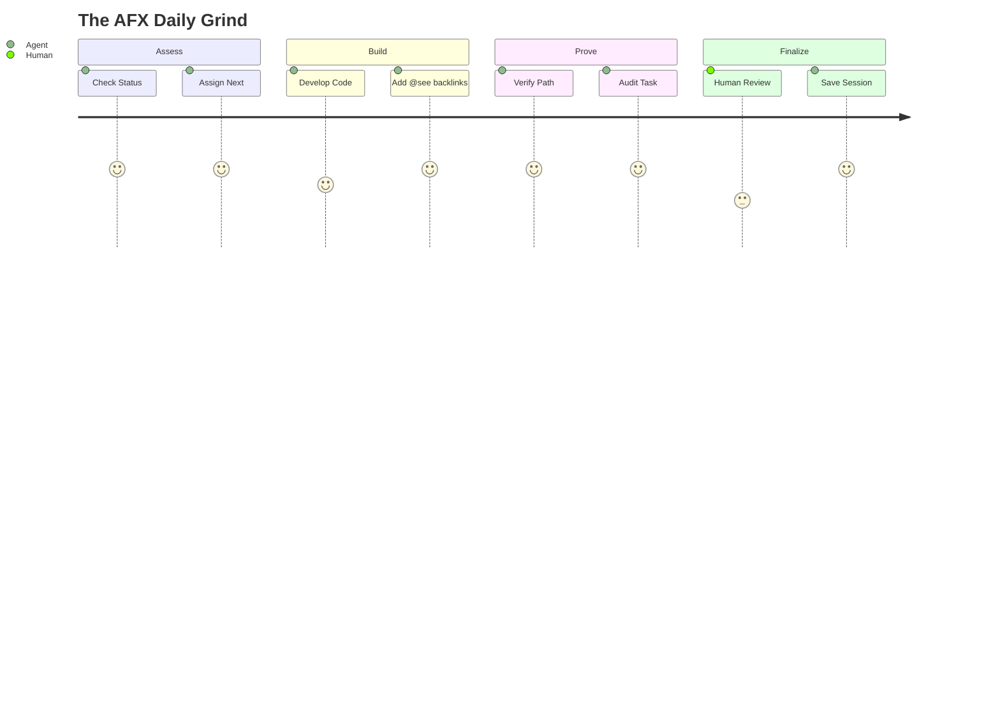
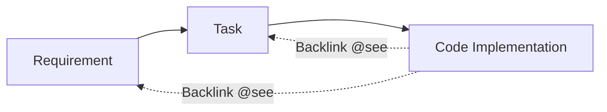
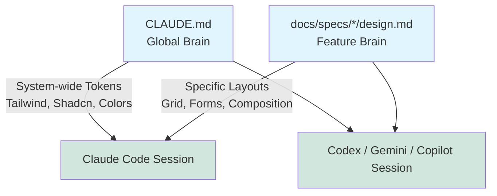
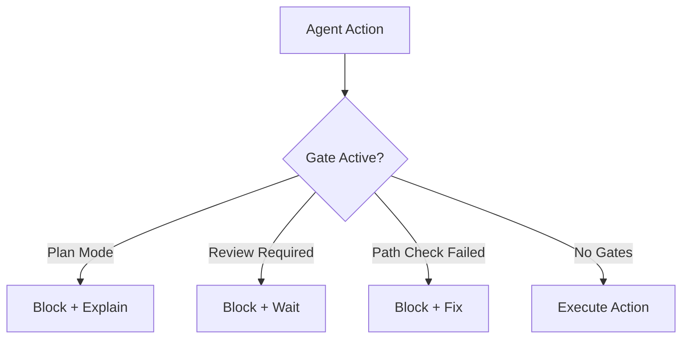
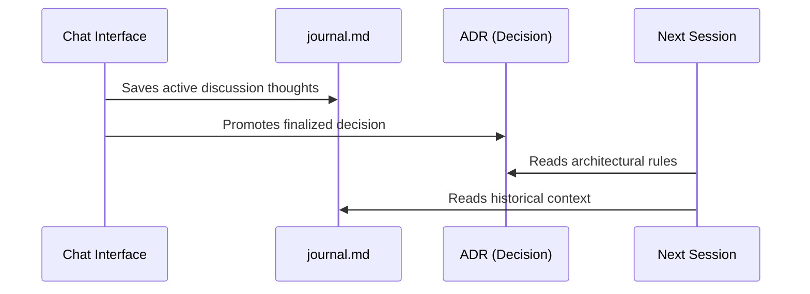

<p align="center">
  
</p>

# AgenticFlowX (AFX)

> **Pause. Think. Plan. Ship.**

**Version:** 2.0
**Author:** Richard Sentino
**Date:** 2025-01-16
**Attribution:** Created with LLM assistance

---

# Part 1: The AFX Philosophy

We are in an era of rapid, sloppy AI generation where speed is prioritized over technical debt. "One-prompt-builds-all" tools create massive amounts of code that no human (or future agent) truly understands.

**AFX forces developers and AI agents to slow down.** It requires you to build a "bird's-eye view" of the architecture, deliberately plan atomic tasks, and maintain strict traceability before a single line of code is written.

## Core Concepts

**AFX** is a strict workflow for AI-assisted software development enforcing:

1. **Spec-Driven Development**: All work originates from approved `spec.md` files.
2. **PRD-First Traceability**: Code MUST link back to requirements (`@see`).
3. **No Orphaned Code**: Code without a spec backlink is considered a defect.

Unlike frameworks that generate code _from_ specs, AFX requires code to link _back_ to specs. This ensures that documentation remains the single source of truth.

## Why bother with this workflow?

1. **Less hallucination**: Code MUST link back to an approved requirement. The AI can't invent features or drift out of scope as easily. 
2. **Focused context**: Separating concerns into 4 files (`spec`, `design`, `tasks`, `journal`) means the AI reads only what it needs, not the whole project.
3. **Git traceability**: Any developer (or future agent) can follow a `@see` annotation back to `tasks.md`, then to `spec.md`, to understand *why* a line of code exists.
4. **Session handoff**: Journals and context saves let you resume work across sessions, or hand off state to a different model (e.g., pick up in Gemini where you left off in Claude).

## Agent Compatibility

AFX skills are designed for the standard **agentskills.io** prompt format and have been tested against a specific set of tools. Your experience may vary on unsupported agents.

| Agent              | Status           | Notes                           |
| :----------------- | :--------------- | :------------------------------ |
| **Claude Code**    | ✅ Heavily tested | Primary development environment |
| **GitHub Codex**   | ✅ Tested         | Several validation runs         |
| **GitHub Copilot** | ✅ Tested         | Via `.github/prompts/`          |
| **Gemini CLI**     | ✅ Tested         | Via `.gemini/commands/`         |
| **Cline**          | ⚠️ Untested       | May work, not verified          |
| **AugmentCode**    | ⚠️ Untested       | May work, not verified          |
| **KiloCode**       | ⚠️ Untested       | May work, not verified          |
| **OpenCode**       | ⚠️ Untested       | May work, not verified          |

## Comparison

| Feature          | AFX (AgenticFlowX)                                            | Standard Workflow                            |
| :--------------- | :------------------------------------------------------------ | :------------------------------------------- |
| **Pacing**       | **Deliberate**: Pause, think, plan, architect.                | **Reckless**: Generate 20 files instantly.   |
| **Traceability** | **Bidirectional**: Code links to Spec (`@see task.md`).       | **Unidirectional**: Specs likely forgotten.  |
| **Verification** | **Runtime**: `/afx-check path` proves execution.              | **Static**: Tests only.                      |
| **Memory**       | **Persistent**: Session logs (`/afx-session`) survive reboot. | **Ephemeral**: Context lost on window close. |
| **Docs**         | **Living**: Updated via PRs with code.                        | **Stale**: Wikis/Docs drift from reality.    |

---

# Part 2: The AFX Lifecycle

The AFX lifecycle is a structured pipeline that converts raw ideas into cryptographically verified, traced code.

**The sequence is mandatory and gated.** You cannot skip or reorder these steps:

```
1. spec.md    → define WHAT to build      → requires human approval
2. design.md  → define HOW to build it    → requires human approval
3. tasks.md   → atomic implementation checklist → requires design approval to unlock
4. journal.md → append-only decisions log → updated every session, read before starting
```

Each gate blocks the next. A locked `design.md` cannot be worked on until `spec.md` is approved. A locked `tasks.md` cannot be opened until `design.md` is approved.



## The Standard Work Cycle

The operational heartbeat of AFX for completing any individual task. Repeat until the feature is complete.



| Step             | Command                  | What It Does                                             |
| :--------------- | :----------------------- | :------------------------------------------------------- |
| **1. Status**    | `/afx-work status`       | Check current state: What's in progress? What's blocked? |
| **2. Assign**    | `/afx-work next <spec>`  | Get the next unassigned task from the spec               |
| **3. Implement** | `/afx-dev code`          | Write the code with `@see` backlinks                     |
| **4. Verify**    | `/afx-check path <path>` | Trace execution from UI to DB (no mocks allowed)         |
| **5. Audit**     | `/afx-task audit <task>` | Confirm implementation matches spec requirements         |
| **6. Log**       | `/afx-session save`      | Record what was done for the next session                |

### Example: Implementing a Login Button

| Step | Action                   | Result                                               |
| :--- | :----------------------- | :--------------------------------------------------- |
| 1    | `/afx-work next auth`    | Returns "Task 1.2: Create Login Button"              |
| 2    | Implement button         | Create component with onClick handler                |
| 3    | Add backlink             | `@see docs/specs/auth/design.md#ui-tokens`           |
| 4    | `/afx-check path /login` | Verifies button → action → service → DB              |
| 5    | `/afx-task audit 1.2`    | Confirms files match task definition                 |
| 6    | `/afx-session save`      | Logs "Implemented login button with primary variant" |

---

# Part 3: Traceability & Orchestration

## The Traceability Mechanism

**Forward Links**: Spec → Task (guides implementation)
**Backlinks**: Code → Spec (enables automated verification)



**Rule**: Every major function MUST carry a JSDoc `@see` tag pointing to its specific task or requirement anchor.

**Example:**
```typescript
// TODO: Implement pagination for claim history
// @see docs/specs/user-auth/tasks.md#4.2-pagination
export function getClaimHistory() { ... }
```

## Global Context vs Local Context

AFX prevents AI context window bloat and conflicting instructions by separating global rules from local rules.



---

# Part 4: Quality Gates (Runtime Blocks)

Agents **MUST** check these gates before executing actions.



### Gate 1: Path Verification (BLOCKING)
**Command**: `/afx-check path`
Traces code execution through the stack (UI→DB) to prove the feature actually works. **Mocking is forbidden.** Without this, agents hallucinate completion.

### Gate 2: Annotation Compliance
**Command**: `/afx-check lint`
Verifies every function has valid `@see` annotations linking to specs. Finds orphaned code.

### Gate 3: Spec Integrity
**Command**: `/afx-check links`
Validates internal cross-references between the 4 specification files.

### Gate 4: Requirements Alignment
**Command**: `/afx-task audit`
Compares implementation against task acceptance criteria.

---

# Part 5: Session Continuity Flow

How discussions become permanent decisions. This prevents "context amnesia" where agents forget the architectural bird's-eye view.



### The Journal (`journal.md`)
Each feature has a journal for capturing discussions during development. Make sure your agent runs `/afx-session save` continuously.

---

# Part 6: CLI Reference & Setup

The AFX command suite. See `afx/skills.json` for full integrations.

## Setup & Context

| Command                    | Purpose                            |
| :------------------------- | :--------------------------------- |
| `/afx-init feature <name>` | Create new feature spec            |
| `/afx-init adr <title>`    | Create global ADR in `docs/adr/`   |
| `/afx-init config`         | Manage `.afx.yaml`                 |
| `/afx-context save`        | Generate context bundle            |
| `/afx-context load`        | Load context from previous session |

## Work Orchestration

| Command                         | Purpose                              |
| :------------------------------ | :----------------------------------- |
| `/afx-work status`              | Quick state check after interruption |
| `/afx-work next <spec-path>`    | Pick next task from spec             |
| `/afx-work resume [spec/num]`   | Continue in-progress work            |
| `/afx-work sync [spec] [issue]` | Bidirectional GitHub sync            |

## Task Management

| Command                       | Purpose                            |
| :---------------------------- | :--------------------------------- |
| `/afx-task verify <task-id>`  | Verify task implementation vs spec |
| `/afx-task summary <task-id>` | Get implementation summary         |
| `/afx-task list [phase]`      | List tasks by phase                |
| `/afx-task audit <task>`      | Check spec alignment               |

---

# Part 7: Standard Frontmatter & Schemas

All AFX-managed documentation MUST include YAML frontmatter.

### The 4 Core Files Schema (SPEC, DESIGN, TASKS, JOURNAL)

```yaml
---
afx: true # AFX ownership marker (required)
type: SPEC # Document type (SPEC | DESIGN | TASKS | JOURNAL)
status: Draft # Draft | Approved | Living
owner: "@handle" # GitHub handle
version: 2.0 # Semantic versioning
created: YYYY-MM-DDTHH:MM:SS.mmmZ 
tags: [feature, topic]
---
```

### Research / ADR Schema

```yaml
---
afx: true
id: 0001 # Optional numbered ID
type: RES # Document type (RES | ADR)
status: Approved # Draft | Approved | Deprecated
owner: "@handle"
date: YYYY-MM-DDTHH:MM:SS.mmmZ 
tags: [architecture, database]
---
```

---

# Part 8: Large Concrete Examples

To understand the workflow, you must understand the outputs. Here are abbreviated, real-world examples of what AFX agents generate and read.

<details>
<summary><b>1. spec.md (The "What")</b></summary>

```markdown
---
afx: true
type: SPEC
status: Approved
owner: "@rix"
version: 2.0
tags: [auth, login, user-management]
---

# User Authentication Feature

## Overview
We need a robust, magic-link based authentication system to replace our legacy password system.

## User Stories
- **US-1**: As a returning user, I want to login with a magic link so I don't have to remember a password.
- **US-2**: As an admin, I want to see a log of all failed login attempts to monitor for brute-force attacks.

## Functional Requirements
| ID   | Requirement                                                                  | Priority |
| ---- | ---------------------------------------------------------------------------- | -------- |
| FR-1 | System shall generate a cryptographically secure, single-use JWT magic link. | P0       |
| FR-2 | Magic links must expire exactly 15 minutes after generation.                 | P0       |
| FR-3 | Dashboard must display a toast notification upon successful login.           | P1       |

## Non-Functional Requirements
- **Performance**: Email delivery API (Resend) must trigger within 500ms of form submission.
- **Security**: Prevent enumeration attacks; do not confirm if an email exists on sign-in.
```
</details>

<details>
<summary><b>2. design.md (The "How")</b></summary>

```markdown
---
afx: true
type: DESIGN
status: Approved
owner: "@rix"
version: 2.0
tags: [auth, architecture, database]
---

# Auth System Architecture

## Core Flow
1. User enters email in `<LoginForm />`.
2. Action `signInWithEmail()` fires.
3. Server checks DB. Generates `VerificationToken`.
4. Resend API fires email.
5. User clicks link → `/api/auth/verify?token=...`
6. Server validates, creates session cookie, redirects to `/dashboard`.

## Database Schema (Prisma)
```prisma
model VerificationToken {
  identifier String
  token      String   @unique
  expires    DateTime

  @@unique([identifier, token])
}

model User {
  id            String    @id @default(cuid())
  email         String?   @unique
  sessions      Session[]
}
```

## Component Architecture
- `LoginForm.tsx`: Client component. Handles React Hook Form state and Zod validation.
- `SubmitButton.tsx`: Reusable UI button showing loading spinners during network requests.
```
</details>

<details>
<summary><b>3. tasks.md (The "When")</b></summary>

```markdown
---
afx: true
type: TASKS
status: Living
owner: "@rix"
version: 2.0
tags: [auth, wbs]
---

# Implementation Checklist

## Phase 1: Database & Core Logic
| Priority | Phase     | Description                                                                      | Status |
| -------- | --------- | -------------------------------------------------------------------------------- | ------ |
| 1.1      | Phase 1.1 | Add `VerificationToken` and `User` models to `schema.prisma` and run migrations. | [x]    |
| 1.2      | Phase 1.2 | Implement `generateVerificationToken()` utility function in `src/lib/auth.ts`.   | [x]    |
| 1.3      | Phase 1.3 | Create Resend API worker service `src/services/email.ts`.                        | [/]    |

## Phase 2: Frontend UI
| Priority | Phase     | Description                                                                 | Status |
| -------- | --------- | --------------------------------------------------------------------------- | ------ |
| 2.1      | Phase 2.1 | Build basic styling for `<LoginForm />` using Tailwind spacing standard.    | [ ]    |
| 2.2      | Phase 2.2 | Wire `<LoginForm />` to action and handle server-side errors (Zod mapping). | [ ]    |
```
</details>

<details>
<summary><b>4. journal.md (The "Why")</b></summary>

```markdown
---
afx: true
type: JOURNAL
status: Living
owner: "@rix"
version: 2.0
tags: [auth, logs]
---

# Agent Session: 2025-10-24T14:32:00Z
**Agent**: Claude 3.5 Sonnet
**Goal**: Complete Phase 1.1 and 1.2.

## Summary of Work
- Modified `schema.prisma`.
- Generated migrations.
- Discovered an issue where `cuid()` was throwing a deprecation warning in Prisma v5. Switched to `cuid2()`.

## Decisions
- **Decision 1**: Instead of using a standard 6-digit OTP, I opted for a full JWT for the verification token to embed the expiration time directly in the token payload, reducing DB lookups by 1.

## Blockers / Next Steps
- Waiting on the human to provide the Resend API key in the `.env.local` file before I can proceed with Phase 1.3. Halting execution.
```
</details>

<details>
<summary><b>5. adr.md (The "Decisions")</b></summary>

```markdown
---
afx: true
id: 0042
type: ADR
status: Approved
owner: "@rix"
date: 2025-10-24T14:32:00Z
tags: [database, orm, performance]
---

# ADR 0042: Migrate from Prisma to Drizzle ORM for Edge Compatibility

## Context
Our current application uses Prisma as its primary ORM. As we migrate our infrastructure towards Cloudflare Workers and Vercel Edge functions for reduced latency, we are running into cold-start bottlenecks caused by the Rust-based Prisma Query Engine binary.

## Decision
We will systematically replace Prisma with Drizzle ORM across all data access patterns.

## Consequences
### Positive
- **Edge Native**: Drizzle runs flawlessly in V8 isolate environments (Cloudflare, Vercel Edge).
- **Reduced Bundle Size**: Removing the Prisma binary shaves ~15MB off our serverless deployment size.

### Negative
- **Migration Cost**: Significant engineering effort required to rewrite existing queries.
- **Lost Tooling**: We lose Prisma Studio, requiring us to adopt generic SQL explorers (e.g., DBeaver or Turso Studio).
```
</details>


---

# Part 9: Context Management

To prevent LLMs from losing context between sessions or when switching between different models (e.g., from Claude to Gemini), AFX provides a strict mechanism to serialize the current architectural and operational state.

### Generating a Context Payload

When you run `/afx-context save`, the agent bundles the current state. The payload includes:
1. **The Global Rules** (`CLAUDE.md`, `AGENTS.md`)
2. **Current Specifications** (`spec.md` and `design.md` for the active feature)
3. **Task State** (What is ticked off in `tasks.md` and what is pending)
4. **Recent Conversation** (Extracted from `journal.md`)
5. **Quality Gate Status** (Did the last path check pass?)

**Where is it saved?**
Context bundles are output continuously to `.afx/context/latest.md` (or similar, depending on configuration). 

You can literally drag and drop this file into a fresh Claude or ChatGPT window, or have a new agent run `/afx-context load` to instantly resume the "bird's-eye view" of the project without losing a step.

---

# Part 10: The AFX Companion System — Skills & Packs

The AFX workflow (specs, tasks, quality gates) is the methodology. **Skills & Packs are the companion system that makes it work in practice.**

Commands like `/afx-work`, `/afx-spec`, and `/afx-check` only work because your AI coding agent has loaded the corresponding **Skill** — a prompt file in the [agentskills.io](https://agentskills.io) open format that tells it exactly what to do. Skills are grouped into **Packs** and installed once via `afx-cli`.

The companion system is separate from the workflow by design. You can use AFX's four-file structure and `@see` traceability with any agent, even without installing skills. The skills simply automate the workflow commands so you don't have to prompt everything from scratch.

A fresh install automatically includes `afx-pack-starter` and `afx-pack-agenticflowx` (the core 13 workflow skill commands). Additional role packs are opt-in:

| Pack                     | What it adds                              |
| :----------------------- | :---------------------------------------- |
| `afx-pack-dev`           | Clean code, TDD, Git workflows, debugging |
| `afx-pack-architect`     | System design, ADRs, quality attributes   |
| `afx-pack-qa`            | Testing, code review, PR analysis         |
| `afx-pack-security`      | OWASP checklist, security audit           |
| `afx-pack-product-owner` | Product Owner workflows                   |

```bash
# Install a pack
./afx-cli --pack qa .

# Disable a skill temporarily
./afx-cli --skill-disable afx-check .

# List what's installed
./afx-cli --pack-list .
```

Skills live in `.afx/skills/` (gitignored) and are synced to `.claude/skills/` and `.agents/skills/` depending on which agents you have enabled. The `.afx.yaml` file at your project root tracks which packs are installed.

> For the full reference — pack manifests, install options, the agentskills.io SKILL.md format, the 3-tier loading model, the broader ecosystem, and what makes AFX skills different — see **[packs-and-skills.md](packs-and-skills.md)**.

---

## Directory Structure

```text
project-root/
├── .afx.yaml            # User overrides (version, packs, custom settings)
├── docs/
│   ├── agenticflowx/    # Framework documentation
│   ├── adr/             # Global Architecture Decision Records
│   └── specs/           # Product Specs
│       └── {feature}/       # Feature specifications
│           ├── spec.md
│           ├── design.md
│           ├── tasks.md
│           ├── journal.md
│           └── research/
```

