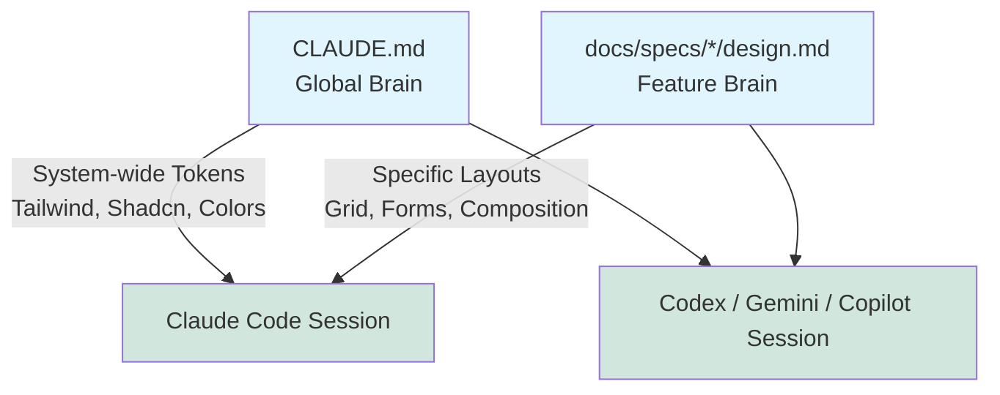
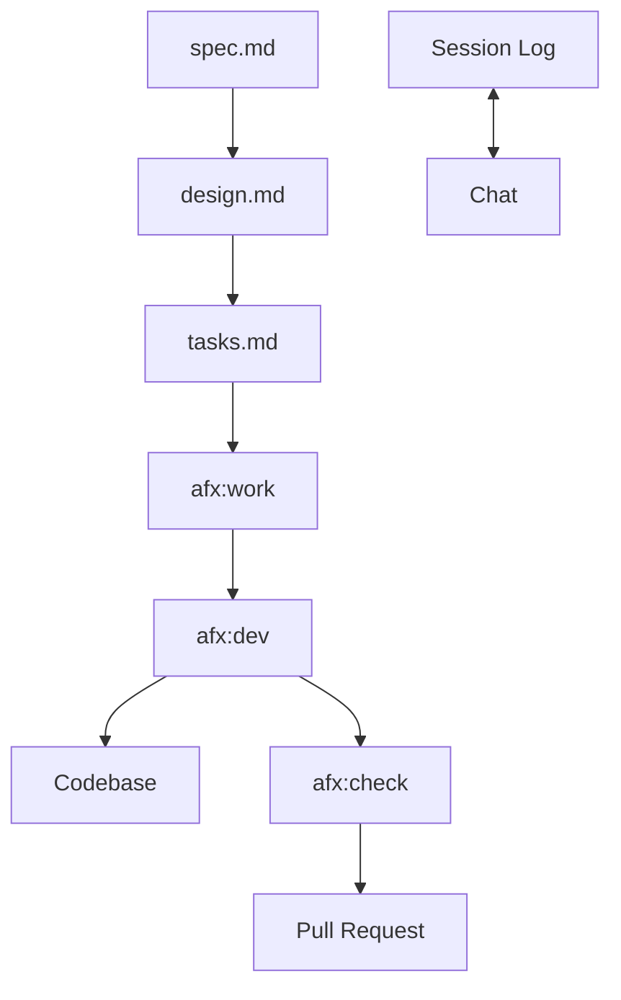
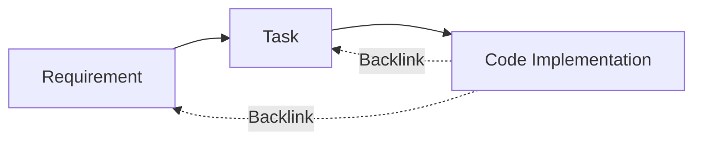
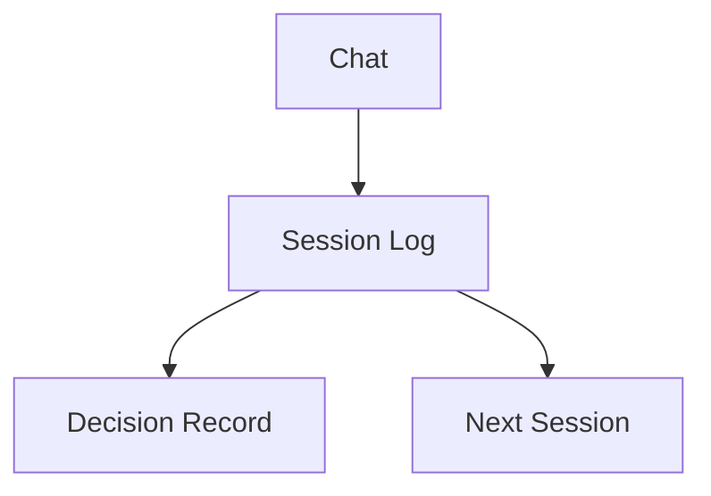
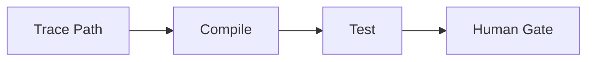
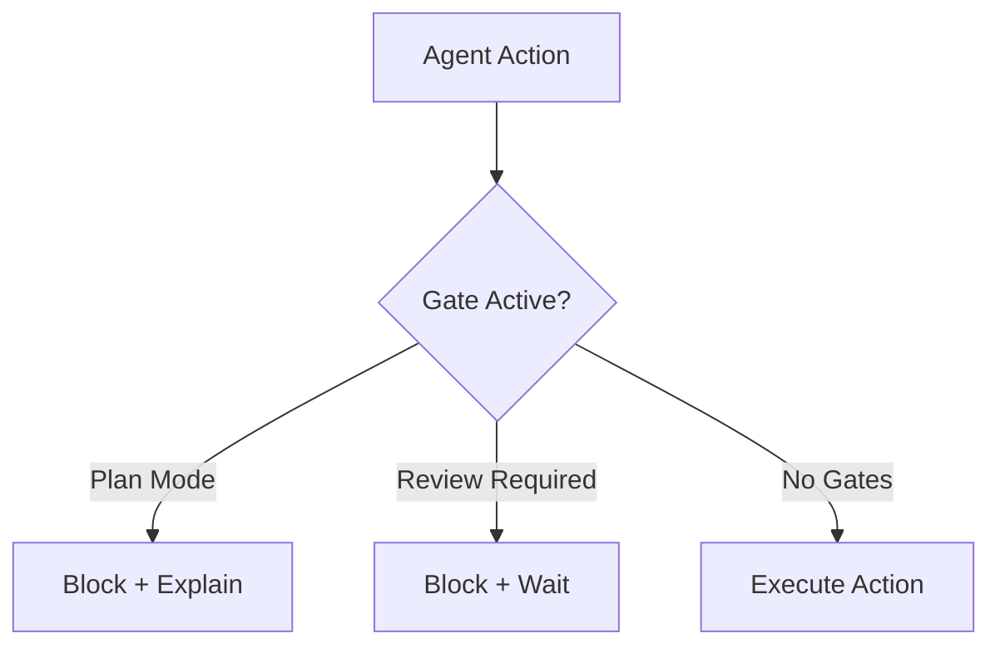
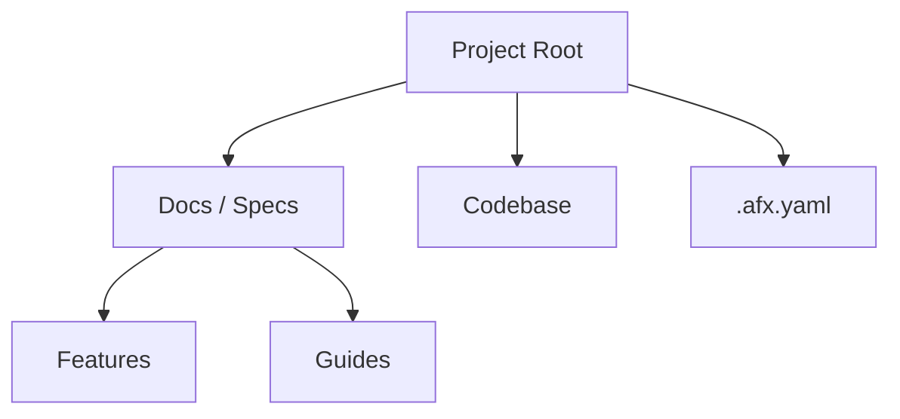

<p align="center">
  
</p>

# AgenticFlowX (AFX)

> **Agentic workflow—from spec to ship.**

**Version:** 1.0
**Author:** Richard Sentino
**Date:** 2025-01-16
**Attribution:** Created with LLM assistance

---

# Part 1: Core Concepts

## Definition

**AFX** is a strict workflow for AI-assisted software development enforcing:

1. **Spec-Driven Development**: All work originates from approved `spec.md` files.
2. **PRD-First Traceability**: Code MUST link back to requirements (`@see`).
3. **No Orphaned Code**: Code without a spec backlink is considered a defect.

> **Note**: This framework itself was created with LLM assistance, using the very workflow it describes.

Unlike frameworks that generate code _from_ specs, AFX requires code to link _back_ to specs (PRDs). This ensures that documentation remains the single source of truth and never becomes "orphaned" or outdated.

## Comparison

| Feature          | AFX (AgenticFlowX)                                            | Standard Workflow                            |
| :--------------- | :------------------------------------------------------------ | :------------------------------------------- |
| **Traceability** | **Bidirectional**: Code links to Spec (`@see task.md`).       | **Unidirectional**: Specs likely forgotten.  |
| **Verification** | **Runtime**: `/afx-check path` proves execution.              | **Static**: Tests only.                      |
| **Memory**       | **Persistent**: Session logs (`/afx-session`) survive reboot. | **Ephemeral**: Context lost on window close. |
| **Context**      | **Structured**: `/afx-context` serializes state.              | **None**: Next agent starts blind.           |
| **Docs**         | **Living**: Updated via PRs with code.                        | **Stale**: Wikis/Docs drift from reality.    |
| **Decisions**    | Promoted to immutable ADRs.                                   | Lost in Slack/Teams threads.                 |

## Core Capabilities

### 1. Orchestration Engine

- **Golden Thread** (`/afx-next`): Algorithmic next-action determination based on Git state, Task status, and Session history.
- **Smart Scaffolding** (`/afx-init`): Performs **Context Scans** and asks strategic questions before generating code. Supports custom **Templates**.
- **Parallelization Logic**: Explicit "Safe vs Unsafe" matrix for concurrent agent work.

### 2. Verification Matrix

- **Runtime Path Tracing** (`/afx-check path`): Validates 5-layer execution flow (UI→Action→Service→Repo→DB). Detects **Mock Patterns**.
- **Schema Consistency** (`/afx-check schema`): Verifies `design.md` internal integrity (Migrations vs Types vs Seeds vs ERD).
- **Spec Audit** (`/afx-task audit`): Static verification of implementation against requirements (file existence, `@see` links).

### 3. Memory & Context

- **Session Continuity**:
  - **Active Inference**: Auto-suggests saving key decisions.
  - **Smart Tagging**: Auto-categorizes discussion topics.
  - **Bidirectional Sync**: GitHub Issue comments ↔ Local `journal.md`.
- **State Context** (`/afx-context`): Serializes logic state, uncommitted changes, and decision context for the next agent.
- **Impact Analysis**: Calculates cross-feature risk when specifications change.

### 4. Traceability Guardrails

- **Link Integrity**: Enforces `@see` backlinks in code.
- **Orphan Detection** (`/afx-report orphans`): Hunts for code detached from specs.
- **Refactor Contracts**: Enforces "Update Design First" workflow for architectural changes.

### 5. Context Segregation (Global vs Local Brain)

AFX explicitly separates system-wide project rules from feature-specific logic to prevent duplicate or conflicting prompt instructions. **Claude Code, Codex, Gemini CLI, and GitHub Copilot are the primary consumers** of this split architecture.



- **Global Context (`CLAUDE.md`)**: The "Project Brain". Defines system-wide tech stack, overarching UI library rules (Tailwind/Material), and global design tokens.
- **Local Context (`docs/specs/*`)**: The "Feature Brain". Defines the individual feature's visual layout, internal component composition, and specific business logic.

---

# Part 2: Architecture

## System Flow

**Specs** drive **Tasks**, which drive **Agent Work**. Code is verified against **Specs**.



**Sample Flow**:

1. **Plan**: Define `User Login` in `spec.md`.
2. **Design**: Architect the `AuthService` in `design.md`.
3. **Task**: Break down `Phase 1: Basic Auth` in `tasks.md`.
4. **Work**: Agent picks up `Task 1.1`.
5. **Code**: Agent writes `auth.service.ts` with `@see` backlinks.
6. **Verify**: Agent runs `/afx-check path` to confirm `Login Flow`.

## Standard Work Cycle

The default workflow for completing any task. Repeat until the feature is complete.

```
STATUS → ASSIGN → IMPLEMENT → VERIFY → AUDIT → LOG
```

| Step             | Command                  | What It Does                                             |
| :--------------- | :----------------------- | :------------------------------------------------------- |
| **1. Status**    | `/afx-work status`       | Check current state: What's in progress? What's blocked? |
| **2. Assign**    | `/afx-work next <spec>`  | Get the next unassigned task from the spec               |
| **3. Implement** | `/afx-dev code`          | Write the code with `@see` backlinks                     |
| **4. Verify**    | `/afx-check path <path>` | Trace execution from UI to DB (no mocks allowed)         |
| **5. Audit**     | `/afx-task audit <task>` | Confirm implementation matches spec requirements         |
| **6. Log**       | `/afx-session save`      | Record what was done for the next session                |

### When You're Stuck

Run `/afx-next` to get context-aware guidance. This command:

1. Reads your git state (uncommitted changes, branch)
2. Checks active tasks in `tasks.md`
3. Reviews session history in `journal.md`
4. Recommends the single best next action

### Example: Implementing Login Button

| Step | Action                   | Result                                               |
| :--- | :----------------------- | :--------------------------------------------------- |
| 1    | `/afx-work next auth`    | Returns "Task 1.2: Create Login Button"              |
| 2    | Implement button         | Create component with onClick handler                |
| 3    | Add backlink             | `@see docs/specs/auth/design.md#ui-tokens`           |
| 4    | `/afx-check path /login` | Verifies button → action → service → DB              |
| 5    | `/afx-task audit 1.2`    | Confirms files match task definition                 |
| 6    | `/afx-session save`      | Logs "Implemented login button with primary variant" |

## Traceability Mechanism

**Forward Links**: Spec → Task (guides implementation)
**Backlinks**: Code → Spec (enables automated verification)



**Rule**: Every major function MUST carry a JSDoc `@see` tag pointing to its specific task or requirement anchor.

**Example: Warranty Claims System**

- **Requirement**: `FR-1: User can submit claim` (in `spec.md`).
- **Task**: `Task 2.1: Implement submitClaim action` (in `tasks.md`).
- **Code**: `submitClaim()` function in `actions.ts`.
  - _Annotation_: `// @see docs/specs/feature/tasks.md#2.1`
  - _Annotation_: `// @covers FR-1`

## Session Continuity Flow

How discussions become permanent decisions. This prevents "context amnesia" where agents forget why a decision was made.



**Process Example:**

1. **Chat**: "Should we use NextAuth or Clerk?"
2. **Log**: Agent records "Discussed Auth providers. Leaning towards NextAuth due to cost."
3. **Sync**: `/afx-work sync` pushes this log to the GitHub Issue comment thread.
4. **Decision**: User requests formalized decision.
5. **Artifact**: Created `docs/specs/auth/research/001-auth-provider.md` (ADR).
6. **Next Session**: New agent reads ADR and implements NextAuth without re-debating.

## Quality Gate Pipeline

**Mandatory Verification Sequence** before PR approval:



| Gate  | Check        | Tool              | Criteria                                            |
| :---- | :----------- | :---------------- | :-------------------------------------------------- |
| **1** | Trace Path   | `/afx-check path` | Full execution flow (UI→DB). **Mocking forbidden.** |
| **2** | Spec Audit   | `/afx-task audit` | All task items marked complete in `tasks.md`.       |
| **3** | Build/Test   | CI                | `tsc --noEmit` + unit tests pass.                   |
| **4** | Human Review | PR                | Aesthetics, architecture, edge cases.               |

## Operational Gates (Runtime Blocks)

Agents **MUST** check these gates before executing actions.

### Gate: Plan Mode

**Trigger**: `<system-reminder>Plan mode is active</system-reminder>` present in context

**Blocked Actions**:

- ALL file edits (except the designated plan file)
- Running non-readonly tools (bash commands that modify state, git commits, etc.)
- Any system modifications

**Allowed Actions**:

- Reading files (Read, Glob, Grep)
- Exploring codebase (Task with Explore agent)
- Editing the plan file only
- Asking user questions (AskUserQuestion)

**Response When Blocked**:

```
Plan mode is active. [action] will be performed after plan approval.
```

**Exit Condition**: User approves plan via `ExitPlanMode` tool

### Gate: Human Review Required

**Trigger**: Task marked with `READY FOR REVIEW` or `[ ]` in Human column of Work Sessions table

**Blocked Actions**:

- Moving to next task
- Marking current task as complete

**Allowed Actions**:

- Responding to review feedback
- Making requested changes

**Response When Blocked**:

```
Awaiting human review. Task [X.Y] is ready for your review before proceeding.
```

**Exit Condition**: Human marks `[x]` in Human column

### Gate Check Protocol

Before ANY write operation, agents MUST:

1. **Scan context** for gate triggers (system reminders, task states)
2. **If gate active** → Respond with blocked message, do NOT proceed
3. **If no gates** → Proceed with action



## File Structure Overview

Standardized directory structure ensures scalability. All documentation lives in `docs/`, while configuration resides at the root.



---

# Part 3: Standards & Structure

## Metadata Standards (Frontmatter)

All AFX-managed documentation MUST include YAML frontmatter. The `afx: true` marker identifies AFX-owned documents for Obsidian Dataview queries.

### Full Schema (SPEC, DESIGN, TASKS)

```yaml
---
afx: true # AFX ownership marker (required)
type: SPEC # Document type (required)
status: Draft # Draft | Approved | Living
owner: "@handle" # GitHub handle (quoted)
priority: High # High | Medium | Low (SPEC only)
version: 1.0 # Semantic versioning
created: YYYY-MM-DDTHH:MM:SS.mmmZ # ISO 8601 creation timestamp (millisecond precision)
last_verified: YYYY-MM-DDTHH:MM:SS.mmmZ # Last review timestamp (millisecond precision)
tags: [feature, topic] # Content tags (Obsidian convention)
---
```

### Minimal Schema (COMMAND, JOURNAL)

```yaml
---
afx: true
type: COMMAND
status: Living
tags: [afx, command, topic]
---
```

### Research Schema (RES, ADR)

```yaml
---
afx: true
id: 0001 # Optional numbered ID
type: RES # RES | ADR
status: Approved # Draft | Approved | Deprecated
owner: "@handle"
date: YYYY-MM-DDTHH:MM:SS.mmmZ # Decision/creation timestamp (millisecond precision)
tags: [topic1, topic2]
---
```

### Document Types

| Type        | Description                                                              | Location                                                                          |
| :---------- | :----------------------------------------------------------------------- | :-------------------------------------------------------------------------------- |
| Type        | Description                                                              | Location                                                                          |
| :---------- | :----------------------------------------------------------------------- | :--------------------------------                                                 |
| `SPEC`      | **Living state doc**: Functional requirements and user stories           | `docs/specs/{feature}/spec.md`                                                    |
| `DESIGN`    | **Living state doc**: Technical architecture and data models             | `docs/specs/{feature}/design.md`                                                  |
| `TASKS`     | Implementation checklist and status                                      | `docs/specs/{feature}/tasks.md`                                                   |
| `RES`       | Research findings (exploration)                                          | `docs/specs/{feature}/research/`                                                  |
| `ADR`       | Architectural Decision Record (final decision)                           | `docs/adr/` (global) or `docs/specs/{feature}/research/` (local)                  |
| `JOURNAL`   | **Append-only historical log**: Session logs and history                 | `docs/specs/{feature}/journal.md`                                                 |
| `COMMAND`   | AFX command definition (all agent platforms)                             | `skills/agenticflowx/afx-*.md` (canonical), `.agents/skills/` (provider wrappers) |
| `GUIDE`     | Developer guides and handbooks                                           | `docs/guides/*.md`                                                                |
| `FRAMEWORK` | Framework documentation (like this file)                                 | `docs/agenticflowx/*.md`                                                          |

### Ordering Conventions

| Document Type | Ordering        | Rationale                                          |
| :------------ | :-------------- | :------------------------------------------------- |
| **JOURNAL**   | Oldest first    | Discussions build context chronologically          |
| **Work Log**  | Oldest first    | Session history reads like a timeline              |
| **ADRs**      | Number prefixed | `0001-`, `0002-` ensure chronological file sorting |

> **Why the difference?** Journals are read "what led to this decision?" (follow the story).

## Directory Structure

**Standard Layout** is enforced:

```
project-root/
├── .afx.yaml            # User overrides (version, packs, custom settings)
├── .afx/
│   └── .afx.yaml        # Managed defaults (do not edit — maintained by afx-cli)
├── docs/
│   ├── agenticflowx/    # Framework documentation
│   │   ├── agenticflowx.md   # Manual (this file)
│   │   ├── guide.md          # Methodology (SDD)
│   │   └── templates/        # Spec templates
│   │
│   ├── adr/             # Global Architecture Decision Records
│   │   ├── ADR-0001-short-slug.md
│   │   └── ...
│   │
│   ├── architecture/    # Context: System constraints
│   ├── proposals/       # Context: Business intent
│   ├── research/        # Context: Global exploration
│   │
│   └── specs/           # Product Specs
│       ├── journal.md       # Global discussions
│       ├── research/        # Global ADRs
│       └── {feature}/       # Feature specs
│           ├── spec.md
│           ├── design.md
│           ├── tasks.md
│           ├── journal.md
│           └── research/
```

## Project Configuration

AFX uses **two-tier config resolution**:

| File             | Purpose                        | Edited by                |
| ---------------- | ------------------------------ | ------------------------ |
| `.afx/.afx.yaml` | Managed defaults (full config) | afx-cli (do not edit) |
| `.afx.yaml`      | User overrides                 | You                      |

Values in `.afx.yaml` take precedence over `.afx/.afx.yaml`. If neither file exists, hardcoded defaults are used.

### `.afx.yaml` (user overrides)

The root config is intentionally minimal — override only what you need:

```yaml
# AFX version — controls which branch/tag afx-cli fetches from.
version: "1.0"

packs: []

# Override any default below. Examples:
#   paths:
#     specs: my-specs
#   features:
#     - user-auth
#   quality_gates:
#     require_path_check: false
```

### `.afx/.afx.yaml` (managed defaults)

Contains all default settings (paths, quality gates, verification, etc.). This file is written by `afx-cli` on install/update — do not edit it directly. To customize a value, add the override to `.afx.yaml` instead.

See [.afx.yaml.template](../../.afx.yaml.template) for the full list of available settings.

## Research Folder Standards

The `research/` directory stores decisions, proposals, and reference material. All files must follow naming conventions and include frontmatter.

### Global vs Feature-Local ADRs

| Scope             | Location                         | Naming                       | Use When                                            |
| :---------------- | :------------------------------- | :--------------------------- | :-------------------------------------------------- |
| **Global**        | `docs/adr/`                      | `ADR-NNNN-slug.md` (4-digit) | Cross-cutting decisions affecting the whole project |
| **Feature-local** | `docs/specs/{feature}/research/` | `0001-slug.md`               | Decisions scoped to a single feature                |

Global ADRs are created via `/afx-init adr <title>`. The path is configured under `paths.adr` (default: `docs/adr`).

### File Types & Naming

| Type          | Prefix  | Description                        | Example Filename          |
| :------------ | :------ | :--------------------------------- | :------------------------ |
| **Decision**  | `0000-` | Architecture Decision Record (ADR) | `0001-database-choice.md` |
| **Proposal**  | `rfc-`  | Request for Comments               | `rfc-001-auth-flow.md`    |
| **Research**  | `res-`  | General research, POC findings     | `res-market-analysis.md`  |
| **Reference** | `ref-`  | External documentation summary     | `ref-stripe-api.md`       |

> **Note**: Decisions (ADRs) use pure number prefixes to ensure chronological sorting. All filenames must be **kebab-case** and **lowercase**.

### Glossary of Types

- **ADR (Architecture Decision Record)**: "The Law". A decision that has been made and is now immutable. Example: "We will use PostgreSQL, not MongoDB". Only superseded by a new ADR.
- **RFC (Request for Comments)**: "The Bill". A proposal for a change that invites discussion. Once approved, becomes an ADR or Tasks.
- **RES (Research)**: "The Data". Exploratory work, spikes, or findings. Documents _why_ a proposal was made.
- **REF (Reference)**: Summaries of external knowledge, patterns, or cheat sheets. Example: "Stripe Webhook Payload Structure".

## Layer Responsibilities

| Layer            | File           | Purpose                                                | Updated By    |
| :--------------- | :------------- | :----------------------------------------------------- | :------------ |
| **Requirements** | spec.md        | **State**: What to build, why, acceptance criteria     | Human         |
| **Architecture** | design.md      | **State**: How to build, interfaces, schemas, patterns | Human + Agent |
| **Tasks**        | tasks.md       | **History**: What to do, grouped by phase              | Human + Agent |
| **Execution**    | GitHub Ticket  | **History**: Granular subtasks, session state          | Agent         |
| **Research**     | research/\*.md | ADRs, RFCs, decision records                           | Human + Agent |

## Traceability & Annotation Standards

**Core Principle**: Code is never orphaned—every implementation links back to its origin.

### Required `@see` References

All spec-driven files MUST have JSDoc `@see` references:

| File Type         | Required Links                                 |
| :---------------- | :--------------------------------------------- |
| `*.repository.ts` | design.md section + tasks.md task number       |
| `*.service.ts`    | design.md section + tasks.md task number       |
| `*.action.ts`     | design.md section + tasks.md task number       |
| `*.model.ts`      | design.md section (if spec-driven)             |
| `*.constants.ts`  | research doc or design.md (if decision-driven) |

### Anchor Format

- **Section anchors**: Use kebab-case matching heading text (e.g., `#repository-implementation`)
- **Task anchors**: Use pattern `#{phase}.{task}-{slug}` (e.g., `#2.1-create-repository-interface`)
  - Matches task numbering format (2.1, 3.4) for easy grep/search
  - Example: `@see docs/specs/user-auth/tasks.md#7.1-create-supplier-constants`
- **Research anchors**: Link to the specific research file (e.g., `research/supplier-assignment.md`)

### Inline Annotations

**Rule**: Use standard annotation format + `@see` link for traceability.

| Annotation | Purpose                              | Severity |
| :--------- | :----------------------------------- | :------- |
| `TODO`     | Task to complete                     | Low      |
| `FIXME`    | Definitely broken, fix later         | Medium   |
| `XXX`      | Arguably broken, needs thought       | High     |
| `HACK`     | Brittle/ugly code, needs cleanup     | Medium   |
| `NOTE`     | Important context for future readers | Info     |
| `BUG`      | Known bug                            | High     |
| `OPTIMIZE` | Performance improvement needed       | Low      |
| `REVIEW`   | Needs code review                    | Medium   |

### AFX Annotation Format

Standard annotation + `@see` link on next line. At least one `@see` link **MUST** point to a PRD.

```typescript
// TODO: Implement supplier notification
// @see docs/specs/user-auth/tasks.md#2.1-notifications

// FIXME: Race condition in concurrent bookings
// @see docs/specs/user-auth/design.md#booking-locks
// @see https://github.com/org/repo/issues/123  (optional: external link)
```

### AI Attribution (Optional)

For compliance-heavy projects, mark AI-assisted code:

```typescript
/**
 * @see docs/specs/user-auth/tasks.md#7.1-create-supplier-constants
 * @ai-assisted claude-3.5-sonnet 2025-12-16
 */
```

### Test Traceability

Link tests to spec requirements using `@covers`:

```typescript
/**
 * @covers FR-1: User can submit feature claim
 * @see docs/specs/user-auth/spec.md#fr-1-submit-claim
 */
test("submitClaim creates new claim", async () => {
  // ...
});
```

### Anti-Patterns

```typescript
// ❌ BAD: Orphaned TODO (no spec link)
// TODO: implement pagination

// ❌ BAD: Only external link (no PRD)
// FIXME #789: Race condition
// @see https://github.com/org/repo/issues/789

// ✅ GOOD: PRD link required
// TODO: Implement pagination for claim history
// @see docs/specs/user-auth/tasks.md#4.2-pagination

// ✅ GOOD: PRD + optional external link
// FIXME: Race condition in concurrent booking updates
// @see docs/specs/user-auth/design.md#booking-locks
// @see https://github.com/org/repo/issues/789
```

---

# Part 4: Workflow Protocols

## Task Strategy

### Principles

1.  **Logical Grouping**: Group related tasks into single GitHub tickets.
2.  **Dependency Order**: Tasks within a group should flow naturally.
3.  **Agentic Scope**: Each ticket represents one focused work session.
4.  **File Proximity**: Tasks touching the same files should be grouped together.

### Naming & Numbering

```
Phase {N}-{Letter}: {Description}  (e.g., Phase 0-A: Infrastructure Fix)
Tasks: {Phase}.{Task}             (e.g., 0.1, 1.2)
```

### Definition of Done

1.  **Code exists**: Files created/modified as specified with `@see` links.
2.  **Path verified**: `/afx-check path` passes for the feature.
3.  **Types compile**: `npx tsc --noEmit` passes.
4.  **Tests pass**: Relevant tests execute successfully.
5.  **Build works**: `npx nx build` completes.

## GitHub Ticket Protocol

Agents **MUST** parse tickets using this template structure:

````markdown
## [{Phase}] {Title}

> Ref: [tasks.md - {section}](../specs/{module}/tasks.md#{anchor})

### Context for Agent

- **Spec**: [design.md - {section}](../specs/{module}/design.md#{anchor})
- **Target files**: `{path/to/files}`
- **Pattern**: {coding pattern to follow}

### Subtasks

#### {Task Number} {Task Name}

- [ ] **{Location/File}** `{full/path/to/file}`
  - [ ] {Specific change 1}
- [ ] **Discovered** (agent adds during implementation)

### Session Log

<!-- Agent updates this section after each work session -->

| Date | Task | Action | Files Modified | Agent | Human |
| ---- | ---- | ------ | -------------- | ----- | ----- |
|      |      |        |                |       |       |

### Discovered Issues

- [ ] _None yet_

### Decisions Made

- _None yet_

### Pre-Completion Verification

**Execution Path Status:**

```bash
/afx-check path <feature-path>
```

- [ ] Result: ALL PATHS VERIFIED
- [ ] **Mock Code Scan**: No `setTimeout`, `// Mock`, hardcoded returns

### Verification

- [ ] All subtasks checked
- [ ] No TypeScript errors
- [ ] Tests pass
- [ ] Build succeeds
````

## Resumption Protocol

When starting/resuming a session, Agents **MUST**:

1.  **READ** GitHub ticket (if exists) → See current state
2.  **READ** `journal.md` → Understand last session's work
3.  **CHECK** Discovered Issues → See pending edge cases
4.  **READ** linked spec/design → Get exact values and patterns
5.  **EXECUTE** only the assigned task
6.  **UPDATE** Journal when done

## Context Protocol

Before an agent session ends (timeout, window close), use `/afx-context save` to bundle context:

**Pre-Exit Checklist**:

1.  Update `journal.md` with latest session row.
2.  Commit "WIP" if necessary (or stash).
3.  Run `/afx-context save`.

**Entry Checklist**:

1.  Run `/afx-context load`.

**What Gets Bundled**:

- Uncommitted changes + Active Task status + Key Decisions
- Writes a "Prompt Bundle" to the session log
  - New agent reads `.afx/context.md`, reconstructs the context, and picks up seamlessly.

> **Why?** Prevents "context death" where the next agent has to re-read everything from scratch.

## Session Logging Rules (Journal)

**File**: `docs/specs/{feature}/journal.md`

Each feature has a `journal.md` file for capturing discussions during development. See [templates/journal.md](templates/journal.md) for the full template.

### Purpose

- **Captures**: Quick notes during active chat (scratchpad)
- **Discussions**: Recorded conversations with IDs for reference

### Discussion Entry Fields

| Field             | Purpose                                                 |
| ----------------- | ------------------------------------------------------- |
| `status:active`   | Inline status tag (active/blocked/closed)               |
| `[tags]`          | Auto-generated from content keywords                    |
| **Context**       | What prompted the discussion                            |
| **Summary**       | 2-3 sentence overview                                   |
| **Progress**      | Checkbox items for tracking (auto-synced on append)     |
| **Decisions**     | Key decisions made                                      |
| **Tips/Ideas**    | Insights captured during discussion                     |
| **Notes**         | Later additions via `/afx-session append`               |
| **Related Files** | **Cumulative** list of files mentioned across all notes |
| **Participants**  | Who was involved                                        |

### Related Files Tracking

The `**Related Files**:` field accumulates as notes are appended:

```markdown
# Initial record

**Related Files**: .env, packages/configs/src/backend.ts

# After N1 mentions amplify config

**Related Files**: .env, packages/configs/src/backend.ts, infrastructure/amplify/amplify.yml
```

### Progress Auto-Sync

**IF** `/afx-session append` text contains triggers (`[x]`, `[DONE]`, "deployed", "done", "complete"), **THEN**:

1. Find matching unchecked item in `**Progress**` (fuzzy keyword match).
2. Mark as `[x]`.
3. Append `_(N{X})_` ref linking to the confirming note.

```markdown
**Progress**:

- [x] RDS PostgreSQL setup _(N1)_
- [x] Local environment connected _(N2)_
- [ ] Deploy to Amplify
- [ ] Document configuration
```

**Status vs Progress**:

- `status:active` is discussion-level (entire discussion is in progress)
- Progress checkboxes are item-level (individual milestones)

When all Progress items are checked, consider updating `status:active` → `status:closed`.

### Prefix Convention

Each feature journal uses a 2-4 character prefix for discussion IDs:

| Feature           | Prefix | Example    |
| ----------------- | ------ | ---------- |
| (global)          | `GEN`  | `GEN-D001` |
| user-auth         | `UA`   | `UA-D001`  |
| users-permissions | `UP`   | `UP-D001`  |
| infrastructure    | `INF`  | `INF-D001` |

Define prefix in `<!-- prefix: XX -->` comment after the journal title.

### Work Session Table

The **Work Sessions** table tracks task execution history. This is the authoritative log of what code changes were made and when.

**Storage Location**:

- **Primary**: `docs/specs/{feature}/tasks.md` → `## Work Sessions` table
- **Mirror**: GitHub Issue (if linked) → `### Session Log` section

```markdown
## Work Sessions

<!-- Task execution log - updated by /afx-work next -->

| Date       | Task | Action                   | Files Modified      | Agent | Human |
| ---------- | ---- | ------------------------ | ------------------- | ----- | ----- |
| 2025-12-15 | 7.4  | Started supplier filter  | -                   | [ ]   | [ ]   |
| 2025-12-15 | 7.4  | Added dropdown component | feature-filters.tsx | [ ]   | [ ]   |
| 2025-12-15 | 7.4  | Wired searchParams       | page.tsx, action.ts | [x]   | [ ]   |
| 2025-12-15 | 7.4  | READY FOR REVIEW         | -                   | [x]   | [ ]   |
| 2025-12-15 | 7.4  | APPROVED                 | -                   | [x]   | [x]   |
```

### When to Update Work Sessions

| Trigger                           | Action                       | Agent | Human |
| :-------------------------------- | :--------------------------- | :---- | :---- |
| `/afx-work next` assigns task     | Add row: "Started {task}"    | [ ]   | [ ]   |
| `/afx-dev code` completes subtask | Add row: "{action taken}"    | [ ]   | [ ]   |
| `/afx-check path` passes          | Agent marks verified         | [x]   | [ ]   |
| `/afx-check path` fails           | Add row: "BLOCKED: {reason}" | [ ]   | [ ]   |
| Task complete                     | Agent requests review        | [x]   | [ ]   |
| Human reviews & approves          | Human marks verified         | [x]   | [x]   |

### Verification Columns

The Work Sessions table has **two verification columns**:

| Column    | Who       | Purpose                                                      |
| :-------- | :-------- | :----------------------------------------------------------- |
| **Agent** | AI agent  | Did `/afx-check path` pass? Code compiles? Tests pass?       |
| **Human** | Developer | Code review passed? Quality acceptable? No sloppy shortcuts? |

**Why two columns?**

- Agents can pass technical checks but miss quality issues
- Human review catches: over-engineering, wrong patterns, sloppy code, missing edge cases
- Task is NOT complete until both columns show `[x]`

### Verification States

| State | Meaning              |
| :---- | :------------------- |
| `[ ]` | Pending verification |
| `[x]` | Verified and passed  |

### Sync Rules

When a GitHub issue is linked to the spec:

1. **Single Source**: The `tasks.md` file is the master record.
2. **Mirroring**: Agents copy the last session's row to the GitHub issue comment for visibility.
3. **Conflict**: If GitHub says one thing and tasks.md says another, tasks.md wins (version-controlled with code).

---

# Part 5: CLI Reference

## Command Categories

### Work Orchestration

| Command                         | Purpose                              |
| :------------------------------ | :----------------------------------- |
| `/afx-work status`              | Quick state check after interruption |
| `/afx-work next <spec-path>`    | Pick next task from spec             |
| `/afx-work resume [spec/num]`   | Continue in-progress work            |
| `/afx-work sync [spec] [issue]` | Bidirectional GitHub sync            |
| `/afx-work plan [instruction]`  | Generate tickets from specs          |

### Task Verification

| Command                       | Purpose                            |
| :---------------------------- | :--------------------------------- |
| `/afx-task verify <task-id>`  | Verify task implementation vs spec |
| `/afx-task summary <task-id>` | Get implementation summary         |
| `/afx-task list [phase]`      | List tasks by phase                |
| `/afx-task status`            | Overall task completion            |
| `/afx-task audit <task>`      | Check spec alignment               |

### Quality Checks

| Command                   | Purpose                              |
| :------------------------ | :----------------------------------- |
| `/afx-check path <path>`  | Trace execution path UI→DB (Gate 1)  |
| `/afx-check lint [path]`  | Audit annotations for PRD compliance |
| `/afx-check links <spec>` | Verify cross-references              |
| `/afx-check schema`       | Verify design.md internal integrity  |
| `/afx-check all <path>`   | Run all checks                       |

### Development Actions

| Command                       | Purpose                             |
| :---------------------------- | :---------------------------------- |
| `/afx-dev code [instruction]` | Implement with @see traceability    |
| `/afx-dev debug [error]`      | Debug with spec trace               |
| `/afx-dev refactor [scope]`   | Refactor maintaining spec alignment |
| `/afx-dev review [scope]`     | Code review against specs           |
| `/afx-dev test [scope]`       | Run/generate tests                  |

### Session Capture

| Command                           | Purpose                                |
| :-------------------------------- | :------------------------------------- |
| `/afx-session note "content"`     | Smart note (auto-tags)                 |
| `/afx-session save [feature]`     | Save session to log                    |
| `/afx-session show [feature/all]` | Show recent discussions                |
| `/afx-session active [feature]`   | Show active discussions                |
| `/afx-session search "query"`     | Search notes across journals           |
| `/afx-session recap [feature]`    | Recap for resumption                   |
| `/afx-session promote <id>`       | Promote discussion to ADR              |
| `/afx-next`                       | Context-aware "Golden Thread" guidance |

### Reporting

| Command                       | Purpose                      |
| :---------------------------- | :--------------------------- |
| `/afx-report health [spec]`   | Overall traceability metrics |
| `/afx-report orphans [path]`  | Code without @see links      |
| `/afx-report coverage <spec>` | Spec→Code coverage map       |

### Capability Discovery

| Command                           | Purpose                                |
| :-------------------------------- | :------------------------------------- |
| `/afx-discover infra [type]`      | Find infrastructure scripts            |
| `/afx-discover scripts [keyword]` | Find automation/deployment scripts     |
| `/afx-discover tools`             | List dev/deployment tools              |
| `/afx-discover capabilities`      | High-level project automation overview |

### Setup & Context

| Command                    | Purpose                            |
| :------------------------- | :--------------------------------- |
| `/afx-init feature <name>` | Create new feature spec            |
| `/afx-init adr <title>`    | Create global ADR in `docs/adr/`   |
| `/afx-init config`         | Manage `.afx.yaml`                 |
| `/afx-context save`        | Generate context bundle            |
| `/afx-context load`        | Load context from previous context |
| `/afx-update check/apply`  | Check/apply upstream AFX updates   |
| `/afx-help`                | Show command reference             |

## CLI Tooling Scripts

| Script                  | Command            | Purpose                                                  |
| :---------------------- | :----------------- | :------------------------------------------------------- |
| `scripts/afx-config.js` | `/afx-init config` | Manage `.afx.yaml` (get/set/add values). Uses `js-yaml`. |
| `scripts/afx-report.js` | `/afx-report`      | Generate health reports based on frontmatter metadata.   |

**Usage:**

```bash
node scripts/afx-config.js get context.research
node scripts/afx-report.js health
```

---

# Appendix: Quick Reference Card

## Standard Work Cycle

```
STATUS → ASSIGN → IMPLEMENT → VERIFY → AUDIT → LOG
/afx-work status → /afx-work next → /afx-dev code → /afx-check path → /afx-task audit → /afx-session save
```

## Minimum Viable Annotations

```typescript
/**
 * Brief description of function
 *
 * @see docs/specs/{feature}/tasks.md#{task-anchor}
 */
```

## Gate Summary

| Gate         | Blocked When            | Exit Condition     |
| :----------- | :---------------------- | :----------------- |
| Plan Mode    | System reminder present | User approves plan |
| Human Review | `[ ]` in Human column   | Human marks `[x]`  |

## File Naming

| Type      | Format         | Example                   |
| :-------- | :------------- | :------------------------ |
| ADR       | `0000-name.md` | `0001-database-choice.md` |
| RFC       | `rfc-name.md`  | `rfc-001-auth-flow.md`    |
| Research  | `res-name.md`  | `res-market-analysis.md`  |
| Reference | `ref-name.md`  | `ref-stripe-api.md`       |

## Discussion ID Format

```
{PREFIX}-D{NNN}
Example: UA-D001, UP-D002, GEN-D003
```

## Common Discovery Workflows

### "Do we have a script for X?"

```
/afx-discover infra rds              # Find RDS provisioning scripts
/afx-discover scripts deploy         # Find deployment scripts
/afx-discover capabilities           # See what automation exists
```

### Setting up new infrastructure

```
/afx-discover infra dynamodb         # Check existing DynamoDB scripts
→ Found: npm run create:ddb:table:*
→ Use as template for new tables

/afx-discover infra lambda --all     # Deep scan for Lambda deployment
→ Not found
→ /afx-init script deploy-lambda     # Create new script
```

### Understanding project tooling

```
/afx-discover tools                  # List all dev tools
/afx-discover capabilities           # Overview of what's automated
/afx-discover scripts --all          # Comprehensive script inventory
```
