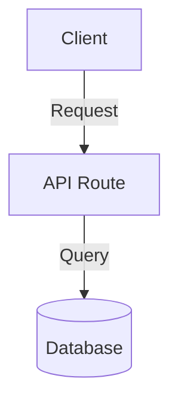

# Feature Architecture & Design

**Version:** 2.0
**Status:** Draft
**Feature:** [Feature Name]
**Spec:** [spec.md](./spec.md)

> This document defines the technical execution plan for the requirements gathered in `spec.md`. It must be approved before tasks are created.

---

## Architecture Overview

[High-level summary of the technical approach, technologies used, and patterns implemented.]



---

## Data Models / Schemas

[Define the database schema, Prisma models, Drizzle schemas, or TypeScript interfaces required for this feature.]

### Example Table: `users`
| Column | Type | Constraints | Description |
| :--- | :--- | :--- | :--- |
| `id` | UUID | Primary Key | Unique identifier |
| `email` | String | Unique, Not Null | User login email |

---

## API Contracts / Server Actions

[Define the inputs, outputs, and validation rules for the core server functions.]

```typescript
// Example Server Action
export async function createUser(data: CreateUserSchema): Promise<Result<User>> {
  // Implementation details...
}
```

---

## UI / Component Design

[Outline the core React/Vue components required. Detail props, state management, and file locations.]

- Location: `/src/app/(dashboard)/feature/`
- Components:
  - `FeatureTable.tsx`: Displays the list of entities.
  - `CreateFeatureDialog.tsx`: Modal for creating a new entity.

---

## Security & Permissions

[Define which roles can access this feature and how those permissions are verified (e.g., CASL, middleware, RLS).]

---

## Migration Strategy

[If modifying an existing system, detail how current data will be safely migrated to the new schema.]
