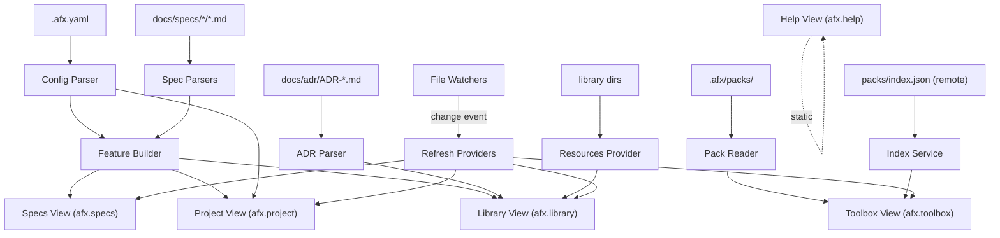

# AFX VSCode Extension -- Technical Design

**Version:** 2.0
**Spec:** [spec.md](./spec.md)

---

## 1. Overview

A read-only VSCode extension that parses `.afx.yaml` and spec documents to present a 5-view split-pane sidebar with project context, feature progress, a reference library, pack management (Toolbox), and help links. Built with TypeScript using the VSCode Extension API, bundled with esbuild, with `yaml` and `gray-matter` as runtime dependencies.

The extension is a pure observer -- it never writes spec files. The only mutations are pack management operations, which delegate to `install.sh` via terminal.

---

## 2. Architecture

### 2.1 System Context



### 2.2 Component Diagram

```
+-------------------------------------------------------------------+
| VSCode Extension Host                                              |
|                                                                    |
|  Parsers                    Models                                 |
|  +-------------------+     +-------------------+                   |
|  | afxConfigParser   |---->| AfxConfig         |                   |
|  | frontmatterParser |     | ConfigEntry       |                   |
|  | taskParser        |---->| SpecDocument      |                   |
|  | journalParser     |     |   Section         |                   |
|  | sectionParser     |     |   Phase           |                   |
|  | specDocumentParser|     |   Discussion      |                   |
|  +-------------------+     | Feature           |                   |
|                             +-------------------+                   |
|                                      |                              |
|  Sub-providers (6)                   v                              |
|  +-------------------+     +-------------------+                   |
|  | specsTreeProvider  |<---| Feature Builder   |                   |
|  | adrTreeProvider    |    +-------------------+                   |
|  | resourcesProvider  |                                            |
|  | tagsTreeProvider   |                                            |
|  | commandsProvider   |                                            |
|  | folderTreeProvider |                                            |
|  +-------------------+                                             |
|           |                                                        |
|  Composite providers (3) + Standalone (2)                          |
|  +-------------------+  +-------------------+  +---------------+  |
|  | projectProvider   |  | libraryProvider   |  | toolboxProvider|  |
|  |  (session,config, |  |  (adrs,resources, |  |  (overview,   |  |
|  |   folders,.afx/)  |  |   tags)           |  |   packs,      |  |
|  +-------------------+  +-------------------+  |   upstream,   |  |
|                                                 |   skills)     |  |
|  +-------------------+  +-------------------+  +---------------+  |
|  | specsProvider     |  | helpProvider      |                      |
|  +-------------------+  +-------------------+                      |
|           |                      |                |                 |
|           v                      v                v                 |
|  +--------+--------+--------+--------+--------+                   |
|  |afx.    |afx.    |afx.    |afx.    |afx.    | <- 5 TreeViews    |
|  |project |specs   |library |toolbox |help    |                   |
|  +--------+--------+--------+--------+--------+                   |
|                                                                    |
|  Cross-cutting                                                     |
|  +-------------------+  +-------------------+                      |
|  | fileDecoProvider  |  | statusBar         |                      |
|  | fileWatcher       |  | toolboxWatchers   |                      |
|  +-------------------+  +-------------------+                      |
+-------------------------------------------------------------------+
```

Provider count breakdown:

| Provider type | Count | Instances |
|---|---|---|
| Top-level view providers | 5 | project, specs, library, toolbox, help |
| Sub-providers (composed into views) | 6 | adr, resources, tags, commands, folder, fileDecoration |
| Total | 11 | |

---

## 3. UI/UX -- Split-Pane Sidebar

Registered as a custom `viewContainer` in the activity bar with five separate views. Each view has its own `TreeDataProvider` and is independently collapsible, resizable, and reorderable.

```json
"viewContainers": {
  "activitybar": [{ "id": "afx", "title": "AFX - AgenticFlowX", "icon": "resources/afx.svg" }]
},
"views": {
  "afx": [
    { "id": "afx.project", "name": "Project" },
    { "id": "afx.specs",   "name": "Specs" },
    { "id": "afx.library", "name": "Library" },
    { "id": "afx.toolbox", "name": "Toolbox" },
    { "id": "afx.help",    "name": "Help" }
  ]
}
```

### 3.1 Project View (`afx.project`)

The project-level dashboard. Shows session context, folder management, configuration, and local AFX data. Header displays the current folder name via `TreeView.description`. Header actions: Open Folder, Open Config, Refresh, Help.

**Root nodes (4):**

| Node | Icon | Collapsible | Description |
|---|---|---|---|
| Session Context | `hubot` | Yes (if exists) | afx-context.md with `## ` section children |
| My Projects | `folder-library` | Yes | Current folder + recent folders list |
| Config | `gear` | Yes | .afx.yaml entries + validation warnings |
| .afx/ | `folder-active` | Yes | Local data directory browser |

**Session Context** -- Looks for `afx-context.md` in the specs directory. If found, shows `saved {timeAgo}` description from file mtime. Click opens markdown preview. Children are `## ` headings parsed from the file, each opening the file at that line. If not found, shows `none` with no children.

**My Projects** -- Current folder shown with `root-folder-opened` icon and `(current)` description. Recent folders (up to 10) stored in `globalState` with `folder` icon. Click on current opens folder picker; click on recent switches to that folder via `loadFolder()`.

**Config** -- Contains a single `.afx.yaml` node that expands to show:
- Flattened key-value entries (`version`, `paths.*`, `features`, `prefixes`, `library.*`, `quality_gates.*`, `verification.*`, `test_traceability.*`, `anchors.*`) with type-appropriate codicons
- Validation warnings (missing specs dir, missing ADR dir, duplicate features, missing feature dirs, missing spec.md) shown with `warning` icon in `editorWarning.foreground` color
- Each entry click opens `.afx.yaml` at the corresponding line

**.afx/** -- Recursive directory browser for `.afx/` (packs, caches, config). Markdown files open in preview; other files open in editor. Hidden files (`.` prefix) are excluded.

### 3.2 Specs View (`afx.specs`)

The main work view. Header displays stats via `description` (e.g., `3 features · 29/98`). Header actions: Filter by Status, Search, Refresh. Supports `showCollapseAll`.

**Feature discovery:** Merges `features[]` from `.afx.yaml` (preserves ordering) with auto-discovered directories in `paths.specs`. Phantom features (in config but no docs on disk) are filtered out.

**Sorting:** Features sorted by status priority -- In Progress first, Complete last:

| Priority | Status |
|---|---|
| 0 | In Progress |
| 1 | Draft |
| 2 | Approved |
| 3 | Living |
| 4 | Stable |
| 5 | Not Started |
| 6 | Complete |

**Feature node:**
- Icon: `package`
- Description: `{status}  ·  {completed}/{total}`
- Tooltip: Markdown table with status, tasks, owner, tags, discussion count
- `contextValue`: `feature`

**Document children (4 per feature):** `spec.md`, `design.md`, `tasks.md`, `journal.md`

| Doc type | Icon | Description (if present) | Children |
|---|---|---|---|
| spec | `book` | Frontmatter status | `## ` and `### ` sections |
| design | `symbol-structure` | Frontmatter status | `## ` and `### ` sections |
| tasks | `tasklist` | `{completed}/{total}` | Phase sub-items |
| journal | `notebook` | `{N} active` or `{N} discussions` | Discussion sub-items |

Missing documents show `(missing)` description with `warning` icon and no children.

**Phase sub-items** (under tasks.md): `Phase {N}: {name}` with `{completed}/{total}` description. Icon reflects status (Complete/In Progress/Not Started). Click opens tasks.md at the phase heading line.

**Discussion sub-items** (under journal.md): `{id}` label with `{title}  ·  {status}` description. Icons: `comment-discussion` (active), `warning` (blocked), `pass` (closed). Click opens journal.md at the discussion heading line.

**Section sub-items** (under spec.md and design.md): Heading text as label. Icons: `symbol-class` (level 2) or `symbol-field` (level 3). Click opens file at the heading line.

### 3.3 Library View (`afx.library`)

Composite view combining ADRs, resource directories, and tags. Uses the composite provider pattern -- `libraryTreeProvider` delegates `getTreeItem` and `getChildren` to `adrTreeProvider`, `resourcesTreeProvider`, and `tagsTreeProvider` respectively, wrapping their elements in `lib-adr`, `lib-dir`, and `lib-tag` discriminated unions. Supports `showCollapseAll`.

**Root sections:**

| Section | Icon | Description | Source |
|---|---|---|---|
| ADRs | `law` | `architecture decisions` | `paths.adr` from .afx.yaml, globbed `ADR-*.md` |
| {library key} | context-aware | context-aware | `library:` block from .afx.yaml |
| Tags | `tag` | `from spec frontmatter` | Extracted from spec frontmatter `tags:` fields |

**ADRs:** Each ADR shows `ADR-{NNNN}` label, `{title}  ·  {status}  ·  {owner}` description, status-specific icon. Expands to show `## ` section headings. Click opens preview. `contextValue`: `adr`.

**Library directories:** Dynamically created from `library:` block in `.afx.yaml`. Each key becomes a collapsible section with a friendly label (capitalized key name) and context-aware icon:

| Directory name | Icon |
|---|---|
| architecture | `symbol-structure` |
| research | `beaker` |
| docs | `book` |
| design | `symbol-structure` |
| guides | `book` |
| diagrams | `graph` |
| (other) | `folder-library` |

Children are files and subdirectories from the mapped path, sorted alphabetically. Markdown files open in preview; other files open in editor.

**Tags:** Extracted from `tags:` arrays in spec frontmatter across all features. Sorted by count (descending), then alphabetically. Each tag expands to show features that carry that tag, with status icon and `{completed}/{total}` description.

### 3.4 Toolbox View (`afx.toolbox`)

Pack management and skills browser. See [vscode-toolbox/design.md](../vscode-toolbox/design.md) for full details. Header action: Check for Pack Updates. Supports `showCollapseAll`.

**4 collapsible sections:**

| Section | Icon | Description |
|---|---|---|
| Overview | `dashboard` | Stats: providers, packs, updates, last checked |
| Packs | `package` | `installed packages` -- Installed + Available groups |
| Upstream | `cloud` | `remote sources` -- Remote pack registries |
| Skills | `tools` | `installed on disk` -- Disk mirror of provider directories |

All pack mutations (install, remove, enable, disable, update) delegate to `install.sh` via `installShRunner` -- the extension never writes `.afx.yaml` or `.afx/packs/` directly. Index data is fetched from `packs/index.json` on GitHub, cached at `.afx/.cache/lastIndex.json`, with configurable auto-check interval (default: 24 hours).

### 3.5 Help View (`afx.help`)

Static list of links and commands. No refresh needed.

| Item | Icon | Action |
|---|---|---|
| AFX Repository | `github` | Opens `https://github.com/rixrix/afx` |
| Documentation | `book` | Opens agenticflowx.md on GitHub |
| Cheatsheet | `note` | Opens cheatsheet.md on GitHub |
| Check for Updates | `sync` | Runs `afx.checkForUpdates` (opens releases page) |
| Report Issue | `bug` | Opens GitHub new issue form |
| Update from Latest | `cloud-download` | Runs `afx.updateAfx` (install.sh --update) |

---

## 4. TreeItem Rendering

All metadata is shown inline using VSCode's native `TreeItem` properties:

| Property | Usage |
|---|---|
| `label` | Item name (feature name, file name, ADR ID, section title) |
| `description` | Right-aligned metadata (status, count, owner, time ago) |
| `iconPath` | Status/type icon via VSCode codicons (`ThemeIcon`) |
| `tooltip` | Full details on hover; supports `MarkdownString` for rich tooltips |
| `command` | Click action: preview, open at line, open editor, navigate |
| `contextValue` | Controls which inline/context menu items appear |
| `resourceUri` | File path for file decorations (status badges) |
| `collapsibleState` | `Collapsed` for items with children, `None` for leaves |

---

## 5. Click Behavior

| File type | Default click | Via hover/right-click |
|---|---|---|
| Markdown (`.md`) | Open in Markdown Preview (`markdown.showPreview`) | Edit (text editor), Preview to Side |
| Non-markdown | Open in text editor (`vscode.open`) | -- |
| Section/Phase/Discussion | Open parent file at specific line (`afx.openAtLine`) | Edit, Reveal in Explorer |
| Session context | Markdown preview | Edit |

The `afx.openAtLine` command opens the file in text editor mode, scrolls to the target line, and places the cursor there.

---

## 6. Hover & Context Menus

### 6.1 Inline Hover Icons

Shown on hover for items with file-backed `contextValue`:

| Icon | Command | Shown when `contextValue` matches |
|---|---|---|
| `$(go-to-file)` | Reveal in Explorer | `document`, `adr`, `resourceFile`, `markdownFile`, `feature`, `skills-file`, `skills-dir` |
| `$(edit)` | Edit (open in text editor) | `document`, `adr`, `resourceFile`, `markdownFile`, `skills-file` |
| `$(preview)` | Open Preview | `document`, `adr`, `resourceFile`, `markdownFile`, `skills-file` |
| `$(open-preview)` | Open Preview to Side | `document`, `adr`, `resourceFile`, `markdownFile`, `skills-file` |

### 6.2 Right-Click Context Menu Groups

**Standard views (Project, Specs, Library):**

| Group | Commands | Condition |
|---|---|---|
| `1_open` | Edit, Open Preview, Open Preview to Side | File-backed items |
| `2_nav` | Reveal in Explorer, Copy @see Reference, Open in Terminal, Remove from Recents | Varies by contextValue |
| `3_claude` | Claude Commands | Specs view only: `feature`, `document`, `markdownFile` |

**Toolbox view -- pack items:**

| Group | Commands | Condition |
|---|---|---|
| `inline` | Update Pack, Disable Pack, Remove Pack | `pack-enabled` |
| `inline` | Enable Pack | `pack-disabled` |
| `inline` | Install Pack | `pack-available` |
| `inline` | Disable Skill | `pack-item-enabled` |
| `inline` | Enable Skill | `pack-item-disabled` |
| `inline` | Refresh Upstream | `upstream-provider` |
| `1_pack` | Pack/skill enable/disable/install actions | Same as inline |
| `2_danger` | Remove Pack | `pack-enabled` or `pack-disabled` |

**Toolbox view -- skills disk mirror:**

| Group | Commands | Condition |
|---|---|---|
| `1_edit` | Reveal in Explorer | `skills-dir` |
| `2_nav` | Reveal in Explorer | `skills-file` |
| `3_edit` | Rename | `skills-dir`, `skills-file` |
| `4_danger` | Delete | `skills-dir`, `skills-file` |

### 6.3 Claude Commands Quick-Pick

Right-clicking a feature, document, or section in Specs view and selecting "Claude Commands" opens a context-aware quick-pick with relevant `/afx-*` slash commands. The command text is copied to clipboard on selection.

The command set varies by file context:

| File | Command categories |
|---|---|
| `spec.md` | Spec (show, status, phases, requirements), Analyze (coverage, validate), Review (discuss, review, approve) |
| `design.md` | Develop (code, refactor, review), Verify (path, links), Spec (discuss) |
| `tasks.md` | Tasks (list, progress, audit, summary), Workflow (next, coverage) |
| `journal.md` | View (show, recap, search), Write (save, note, promote) |
| (default) | Spec (show, status, discuss, review), Workflow (next, code, path) |

---

## 7. Status Icons

Using VSCode built-in codicons. Mapped to AFX framework statuses.

| Category | Status | Codicon | ThemeIcon ID |
|---|---|---|---|
| **Computed** | Complete | `$(pass-filled)` | `pass-filled` |
| | In Progress | `$(wrench)` | `wrench` |
| | Not Started | `$(circle-outline)` | `circle-outline` |
| **Spec** | Draft | `$(edit)` | `edit` |
| | Approved | `$(verified-filled)` | `verified-filled` |
| | Living | `$(pulse)` | `pulse` |
| | Stable | `$(shield)` | `shield` |
| **ADR** | Proposed | `$(lightbulb)` | `lightbulb` |
| | Accepted | `$(verified-filled)` | `verified-filled` |
| | Rejected | `$(circle-slash)` | `circle-slash` |
| | Deprecated | `$(trash)` | `trash` |
| | Superseded | `$(history)` | `history` |
| **Doc type** | spec | `$(book)` | `book` |
| | design | `$(symbol-structure)` | `symbol-structure` |
| | tasks | `$(tasklist)` | `tasklist` |
| | journal | `$(notebook)` | `notebook` |

---

## 8. Filter

The Specs view header exposes a filter dropdown via a view action command.

- Trigger: `afx.filterByStatus` command, registered as a view/title action on `afx.specs`
- UI: VSCode quick-pick with options: `All`, `Draft`, `In Progress`, `Approved`, `Living`, `Stable`, `Complete`
- Values are hardcoded (not derived from data) to keep UX predictable
- Filter applies to the Specs view only -- other views are unaffected
- Persisted via `ExtensionContext.workspaceState` key `afx.filterStatus` so it survives panel collapse but resets on window reload

---

## 9. Commands

32 commands registered in `package.json`:

| Command | Title | Trigger |
|---|---|---|
| `afx.refresh` | Refresh | View header action (all views except Toolbox) |
| `afx.openConfig` | Open Config | View header action (Project view) |
| `afx.filterByStatus` | Filter by Status | View header action (Specs view) |
| `afx.openAtLine` | Open at Line | Internal: click on section/phase/discussion/config entry |
| `afx.openFolder` | Open Folder | View header action (Project view); quick-pick with recents + browse |
| `afx.switchFolder` | Switch Folder | Internal: click on recent folder item |
| `afx.preview` | Open Preview | Inline hover icon; right-click menu |
| `afx.previewToSide` | Open Preview to Side | Inline hover icon; right-click menu |
| `afx.showSpecs` | Show Specs | Status bar click target |
| `afx.copySeeReference` | Copy @see Reference | Right-click menu on documents, ADRs, phases, discussions |
| `afx.revealInExplorer` | Reveal in Explorer | Inline hover icon; right-click menu |
| `afx.openInTerminal` | Open in Terminal | Right-click menu on folders |
| `afx.search` | Search | View header action (Specs view); quick-pick across all entities |
| `afx.removeRecent` | Remove from Recents | Right-click menu on recent folder items |
| `afx.installAfx` | Install AFX | Welcome content button; command palette |
| `afx.openHelp` | Help | View header action (Project view); opens GitHub README |
| `afx.checkForUpdates` | Check for Updates | Help view item; opens GitHub releases page |
| `afx.updateAfx` | Update AFX | Help view item; runs install.sh --update |
| `afx.claudeCommands` | Claude Commands | Right-click on feature/document in Specs view |
| `afx.editFile` | Edit | Inline hover icon; right-click menu (opens in text editor) |
| `afx.toolbox.installPack` | Install Pack | Inline on available packs |
| `afx.toolbox.removePack` | Remove Pack | Inline on installed packs |
| `afx.toolbox.enablePack` | Enable Pack | Inline on disabled packs |
| `afx.toolbox.disablePack` | Disable Pack | Inline on enabled packs |
| `afx.toolbox.updatePack` | Update Pack | Inline on enabled packs |
| `afx.toolbox.disableSkill` | Disable Skill | Inline on enabled pack items |
| `afx.toolbox.enableSkill` | Enable Skill | Inline on disabled pack items |
| `afx.toolbox.checkIndex` | Check for Pack Updates | View header action (Toolbox view) |
| `afx.toolbox.refreshUpstream` | Refresh Upstream | Inline on upstream providers |
| `afx.toolbox.deleteSkill` | Delete | Right-click on skills dir/file |
| `afx.toolbox.renameSkill` | Rename | Right-click on skills dir/file |

---

## 10. File Watchers

All watchers debounced at 500ms via a shared timer per watcher group. A change during the debounce window resets the timer.

**Core watchers** (created by `fileWatcher.ts`):

| Pattern | Triggers |
|---|---|
| `.afx.yaml` | Full rebuild: re-parse config, refresh all providers |
| `{paths.specs}/**/*.md` | Specs + Library (tags) + file decorations refresh |
| `{paths.adr}/ADR-*.md` | Library (ADRs) refresh |
| `{library.*}/**/*` | Library (resources) refresh (one watcher per library directory) |

**Toolbox watchers** (created by `toolboxWatchers.ts`):

| Pattern | Triggers |
|---|---|
| `.afx/packs/**/*` | Toolbox (packs) refresh |
| `.claude/**/*` | Toolbox (skills) refresh |
| `.codex/**/*` | Toolbox (skills) refresh |
| `.agents/**/*` | Toolbox (skills) refresh |
| `.agent/**/*` | Toolbox (skills) refresh |
| `.gemini/**/*` | Toolbox (skills) refresh |
| `.github/**/*` | Toolbox (skills) refresh |

**Pending-mode watcher:** When a folder is loaded without `.afx.yaml`, a watcher is created for `.afx.yaml` create/change events. Once detected, `loadFolder()` is re-invoked. A terminal close listener also retries after `AFX Install` terminal exits (1500ms delay).

---

## 11. Feature Status Derivation

Feature status is a hybrid of frontmatter and task completion. Task progress takes precedence once any tasks are completed:

| Condition | Status |
|---|---|
| Tasks exist, all completed (N/N) | Complete |
| Tasks exist, some completed | In Progress |
| No tasks completed, frontmatter status is Draft/Approved/Living/Stable | Frontmatter value |
| No tasks, no recognized frontmatter status | Draft |

Implementation: `deriveFeatureStatus()` in `src/models/feature.ts`.

---

## 12. Parsing Logic

| Entity | File | Regex Pattern | Example |
|---|---|---|---|
| Phase | `tasks.md` | `^##\s+Phase\s+(\d+):?\s+(.*)$` | `## Phase 1: Scaffolding` |
| Task | `tasks.md` | `^-\s+\[([ x])\]\s+(.*)$` | `- [x] Create repo` |
| Discussion | `journal.md` | `^###\s+([A-Z]{2,}-D\d+)\s+-\s+(.*)$` | `### VE-D001 - 2026-02-26 - Topic` |
| ADR | `ADR-*.md` | `^ADR-(\d+)-.+\.md$` (filename) + `^#\s+(.+)$` (title) | `ADR-0001-architecture.md` |
| Section | `spec.md`, `design.md` | `^(#{2,3})\s+(.+)$` | `## Architecture`, `### Data Flow` |
| Session section | `afx-context.md` | `^##\s+(.+)$` | `## Current Sprint` |
| Frontmatter | All `.md` | gray-matter library | `---\nstatus: Draft\n---` |

The section parser (`sectionParser.ts`) extracts `##` (level 2) and `###` (level 3) headings, skipping YAML frontmatter blocks. Each section records title, level, and 0-based line number.

---

## 13. Configuration Source (`.afx.yaml`)

The extension reads `.afx.yaml` from the workspace root to discover the project structure:

```yaml
version: "1.5"

paths:
  specs: "docs/specs"
  adr: "docs/adr"
  templates: "templates"
  sessions: "docs/specs"

features:
  - vscode-extension
  - vscode-toolbox

prefixes:
  vscode-extension: VE
  vscode-toolbox: VT

library:
  architecture: "docs/architecture"
  research: "docs/research"

quality_gates:
  require_path_check: true
  require_human_approval: true
  block_on_mock_code: true

verification:
  two_stage: true
  stale_threshold_days: 30
```

Mapping to views:

```
.afx.yaml                          Sidebar Views
-------------                      -------------
Session context (afx-context.md) -> PROJECT view (Session Context)
Recent folders (globalState)     -> PROJECT view (My Projects)
(all config keys)                -> PROJECT view (Config)
.afx/ directory                  -> PROJECT view (.afx/)
paths.specs + features[]         -> SPECS view
  + auto-discovered dirs         ->   (merged, config order first)
paths.adr + ADR-*.md             -> LIBRARY view (ADRs section)
library.*                        -> LIBRARY view (directory sections)
spec frontmatter tags            -> LIBRARY view (Tags section)
.afx/packs/ + packs/index.json   -> TOOLBOX view
.claude/, .codex/, etc.          -> TOOLBOX view (Skills section)
(static links)                   -> HELP view
```

---

## 14. Key Decisions

| Decision | Options Considered | Choice | Rationale |
|---|---|---|---|
| UI layout | Single TreeView, Split-pane, WebView | Split-pane (5 views) | GitLens pattern, native, each pane focused |
| View count | 3, 4, 5, 7 | 5 views | Consolidated from 7 using composite providers; balances discoverability with sidebar density |
| Composite providers | One provider per data source, one per view | Composite (Library wraps ADRs + Resources + Tags) | Reduces view count while keeping sub-providers reusable |
| Config format | JSON, YAML, TOML | YAML | Already used by `.afx.yaml` |
| Frontmatter parser | regex, gray-matter, custom | gray-matter | Battle-tested, handles edge cases |
| Activation event | onStartupFinished, workspaceContains | workspaceContains:.afx.yaml | Only loads in AFX projects |
| Tree refresh trigger | Polling, FileSystemWatcher | FileSystemWatcher | Event-driven, no CPU waste |
| Debounce interval | 200ms, 500ms, 1000ms | 500ms | Balances responsiveness and performance |
| Stats display | Status bar, TreeView.message, description | Both (TreeView.description + status bar) | Inline header stats + persistent status bar for global overview |
| Default click for markdown | Open editor, Open preview | Open preview | Read-first philosophy; edit via hover/right-click |
| Bundler | webpack, esbuild, unbundled | esbuild | Fast builds, simple config, single output file |
| Pack mutations | Direct file writes, CLI delegation | CLI delegation via install.sh | Single source of truth; extension stays read-only for pack state |
| Feature discovery | Config-only, disk-only, merged | Merged (config order + auto-discovered dirs) | Respects explicit ordering while catching new directories |

---

## 15. File Structure

```
vscode-afx/
├── src/
│   ├── extension.ts                         # Entry point: 5 views, state management, loadFolder()
│   ├── statusBar.ts                         # Status bar item (feature count, task stats)
│   ├── config/
│   │   └── afxConfigParser.ts               # .afx.yaml reader, normalizer, flattenConfig()
│   ├── models/
│   │   ├── afxConfig.ts                     # AfxConfig, ConfigEntry, ConfigElement interfaces
│   │   ├── specDocument.ts                  # SpecDocument, Section, Phase, Discussion, TaskStats
│   │   └── feature.ts                       # Feature interface, buildFeatures(), deriveFeatureStatus()
│   ├── parsers/
│   │   ├── frontmatterParser.ts             # YAML frontmatter extraction (gray-matter)
│   │   ├── taskParser.ts                    # Checkbox counting, phase extraction
│   │   ├── journalParser.ts                 # Discussion ID and status extraction
│   │   ├── sectionParser.ts                 # ## and ### heading extraction for spec/design
│   │   └── specDocumentParser.ts            # Unified parser orchestrator
│   ├── providers/
│   │   ├── projectTreeProvider.ts           # Project view: session, folders, config, .afx/
│   │   ├── specsTreeProvider.ts             # Specs view: features, docs, phases, discussions
│   │   ├── libraryTreeProvider.ts           # Library view: composite of ADRs + resources + tags
│   │   ├── adrTreeProvider.ts               # ADR sub-provider (used by Library)
│   │   ├── resourcesTreeProvider.ts         # Resources sub-provider (used by Library)
│   │   ├── tagsTreeProvider.ts              # Tags sub-provider (used by Library)
│   │   ├── commandsTreeProvider.ts          # Agent commands sub-provider (used internally)
│   │   ├── helpTreeProvider.ts              # Help view: static links
│   │   ├── folderTreeProvider.ts            # Recent folder management (globalState)
│   │   ├── fileDecorationProvider.ts        # File decoration badges (IP, OK, DR, AP)
│   │   └── treeItems.ts                     # Shared icon maps, makeOpenCommand, makePreviewCommand
│   ├── commands/
│   │   ├── commands.ts                      # 17 command handlers (refresh, open, filter, search, etc.)
│   │   ├── copySeeReference.ts              # @see reference builder for clipboard
│   │   └── search.ts                        # Unified search quick-pick across all entities
│   ├── toolbox/
│   │   ├── toolboxTreeProvider.ts           # Toolbox view: overview, packs, upstream, skills
│   │   ├── toolboxCommands.ts               # 11 toolbox command handlers + autoCheckIfDue()
│   │   ├── toolboxWatchers.ts               # File watchers for .afx/packs/ and provider dirs
│   │   ├── models.ts                        # Pack, PackItem, AvailablePack, UpstreamProvider, etc.
│   │   ├── afxDirReader.ts                  # .afx/packs/ disk scanner, Pack[] assembly
│   │   ├── afxYamlReader.ts                 # .afx.yaml packs[] state reader
│   │   ├── indexService.ts                  # Remote index fetch, cache, diff computation
│   │   └── installShRunner.ts               # CLI delegation: curl install.sh | bash
│   ├── watchers/
│   │   └── fileWatcher.ts                   # Core file watchers with 500ms debounce
│   └── utils/
│       └── logger.ts                        # Output channel wrapper (AFX output channel)
├── resources/
│   └── afx.svg                              # Activity bar icon
├── package.json                             # Extension manifest (32 commands, 5 views, menus, settings)
└── tsconfig.json                            # TypeScript configuration
```

35 source files total.

---

## 16. Dependencies

### Runtime

| Package | Version | Purpose |
|---|---|---|
| yaml | ^2.0.0 | Parse `.afx.yaml` |
| gray-matter | ^4.0.0 | Extract YAML frontmatter from markdown files |

### Dev Dependencies

| Package | Version | Purpose |
|---|---|---|
| @types/vscode | ^1.93.0 | VSCode Extension API type definitions |
| @types/node | ^20.0.0 | Node.js type definitions |
| typescript | ^5.0.0 | TypeScript compiler |
| esbuild | ^0.20.0 | Bundler (single-file CJS output with sourcemaps) |

### Build

```bash
esbuild ./src/extension.ts --bundle --outfile=dist/extension.js \
  --external:vscode --format=cjs --platform=node --sourcemap
```

---

## 17. Data Models

### AfxConfig

```typescript
interface AfxConfig {
  version: string;
  paths: {
    specs: string;
    adr: string;
    templates: string;
    sessions?: string;
  };
  features: string[];
  prefixes: Record<string, string>;
  library?: Record<string, string>;    // key -> relative directory path
  qualityGates: {
    requirePathCheck: boolean;
    requireHumanApproval: boolean;
    blockOnMockCode: boolean;
  };
  verification: {
    twoStage: boolean;
    staleThresholdDays: number;
  };
  testTraceability?: {
    enabled: boolean;
    annotation: string;
  };
  anchors?: {
    taskFormat: string;
    sectionFormat: string;
  };
}
```

### SpecDocument

```typescript
interface SpecDocument {
  path: string;
  type: 'SPEC' | 'DESIGN' | 'TASKS' | 'JOURNAL';
  frontmatter: Frontmatter;
  taskStats?: TaskStats;       // TASKS only
  discussions?: Discussion[];  // JOURNAL only
  sections?: Section[];        // SPEC and DESIGN only
}

interface Frontmatter {
  afx?: boolean;
  type?: string;
  status?: string;
  owner?: string;
  tags?: string[];
  version?: string | number;
}

interface Section {
  title: string;
  level: number;   // 2 for ##, 3 for ###
  line: number;     // 0-based
}

interface TaskStats {
  total: number;
  completed: number;
  phases: Phase[];
}

interface Phase {
  number: number;
  name: string;
  total: number;
  completed: number;
  line: number;
}

interface Discussion {
  id: string;       // e.g., "VE-D001"
  date: string;
  title: string;
  status: 'active' | 'blocked' | 'closed';
  line: number;
}
```

### Feature

```typescript
type FeatureStatus =
  | 'Not Started' | 'In Progress' | 'Complete'
  | 'Draft' | 'Approved' | 'Living' | 'Stable';

interface Feature {
  name: string;
  prefix: string;
  dirPath: string;
  spec?: SpecDocument;
  design?: SpecDocument;
  tasks?: SpecDocument;
  journal?: SpecDocument;
  taskStats: TaskStats;
  discussions: Discussion[];
  status: FeatureStatus;
}
```

### ConfigElement

```typescript
type ConfigElement =
  | { kind: 'entry'; entry: ConfigEntry }
  | { kind: 'warning'; message: string; line: number };

interface ConfigEntry {
  key: string;
  value: string;
  line: number;
  icon: string;    // codicon ID
}
```

### Toolbox Models

See [vscode-toolbox/design.md](../vscode-toolbox/design.md) for Pack, PackItem, AvailablePack, UpstreamProvider, CachedIndex, and ToolboxElement definitions.

---

## 18. File Decorations

The `fileDecorationProvider` adds status badges and color tints to feature directories and their document files in the VSCode Explorer:

| Status | Badge | Color |
|---|---|---|
| In Progress | `IP` | `charts.yellow` |
| Complete | `OK` | `charts.green` |
| Draft | `DR` | `disabledForeground` |
| Approved | `AP` | (no color) |

Decorations apply to both the feature directory and individual document files (`spec.md`, `design.md`, `tasks.md`, `journal.md`).

---

## 19. Error Handling

| Scenario | Handling |
|---|---|
| `.afx.yaml` missing | Pending mode: show welcome views with Install/Open Folder buttons; watch for `.afx.yaml` to appear |
| `.afx.yaml` malformed | Log error, return undefined; views remain empty |
| Spec file missing for a feature | Show `(missing)` description with `warning` icon; no children |
| Frontmatter parse failure | Skip document, log warning to output channel |
| Feature directory does not exist | Filtered out as phantom feature (not shown in tree) |
| ADR directory missing | Config validation warning in Project view |
| Library directory missing | Empty section (readdir catch returns []) |
| Pack directory missing on disk | Pack shown from .afx.yaml state but with 0 providers/items |
| Index fetch fails (network) | Show cached data if available; offline notification; auto-retry on next interval |
| No cache, no network | Empty index; show toolbox welcome content |

### Pending Mode

When a workspace folder is opened without `.afx.yaml`:
1. `afx.loaded` context set to `false`
2. Welcome content shown in Specs and Toolbox views with Install/Open Folder buttons
3. File watcher created for `.afx.yaml` create/change events
4. Terminal close listener watches for `AFX Install` terminal exit
5. On detection, `loadFolder()` re-invoked automatically

---

## 20. Extension Settings

| Setting | Type | Default | Description |
|---|---|---|---|
| `afx.toolbox.autoCheck` | boolean | `true` | Automatically check for pack updates on activation |
| `afx.toolbox.autoCheckInterval` | number | `86400` | Minimum seconds between auto-checks (default: 24 hours) |

---

## 21. Sidebar Mockup

```
+-------------------------------------------------------------------+
| [AFX icon]  AFX - AgenticFlowX                                     |
+-------------------------------------------------------------------+
|                                                                     |
| V PROJECT  my-project                       [folder] [gear] [R] [?]|
| .................................................................  |
|                                                                     |
| [hubot] Session Context            saved 2h ago                     |
|   [key]   Current Sprint                                            |
|   [key]   Active Features                                           |
|   [key]   Decisions Made                                            |
|                                                                     |
| > [folder-lib] My Projects        recently opened                   |
|                                                                     |
| > [gear] Config                   project configuration             |
|                                                                     |
| > [folder-active] .afx/           local data                        |
|                                                                     |
| V SPECS  3 features . 29/98                   [filter] [search] [R]|
| .................................................................  |
|                                                                     |
| V [pkg] vscode-extension           In Progress  .  1/70            |
|   [book] spec.md                   Draft                            |
|     [cls]   Overview                                                |
|     [cls]   Requirements                                            |
|     [fld]     Functional Requirements                               |
|   [struct] design.md               Draft                            |
|   [task] tasks.md                  1/70                             |
|     [wrench] Phase 1: Config       0/15                             |
|     [wrench] Phase 2: Models       0/7                              |
|     [circle] Phase 3: Sidebar      0/8                              |
|   [note] journal.md               1 active                          |
|     [chat]   VE-D001  Initial...   .  active                        |
|                                                                     |
| > [pkg] global-adr                 Complete  .  13/13               |
| > [pkg] afx-update                 Complete  .  15/15               |
|                                                                     |
| V LIBRARY                                                      [R] |
| .................................................................  |
|                                                                     |
| V [law] ADRs                       architecture decisions           |
|   V [verified] ADR-0001           Global ADR Dir  .  Accepted       |
|     [key]   Context                                                 |
|     [key]   Decision                                                |
|     [key]   Consequences                                            |
|   > [verified] ADR-0002           VSCode Extension  .  Accepted     |
|                                                                     |
| V [beaker] Research                notes & findings                 |
|   [file]   market-analysis.pdf                                      |
|   [file]   competitor-pricing.csv                                   |
|                                                                     |
| V [tag] Tags                       from spec frontmatter            |
|   V [tag] vscode-extension         2                                |
|     [wrench] vscode-extension      In Progress  .  1/70            |
|     [pass]   vscode-toolbox        Complete  .  18/18              |
|   > [tag] product                  3                                |
|                                                                     |
| V TOOLBOX                                            [check-idx]   |
| .................................................................  |
|                                                                     |
| > [dashboard] Overview                                              |
| > [package]   Packs               installed packages                |
| > [cloud]     Upstream             remote sources                   |
| > [tools]     Skills               installed on disk                |
|                                                                     |
| V HELP                                                              |
| .................................................................  |
|                                                                     |
| [github]  AFX Repository                                            |
| [book]    Documentation                                             |
| [note]    Cheatsheet                                                |
| [sync]    Check for Updates                                         |
| [bug]     Report Issue                                              |
| [cloud]   Update from Latest                                        |
|                                                                     |
+-------------------------------------------------------------------+
```

---

## 22. Open Technical Questions

| # | Question | Status |
|---|---|---|
| 1 | Should we use esbuild or webpack for bundling? | Resolved: esbuild |
| 2 | Should tree state (collapsed/expanded) persist? | Open |
| 3 | How to handle very large projects (100+ features)? | Open |
| 4 | Should search include full-text content search? | Open |
| 5 | Should file decorations be configurable (on/off)? | Open |
