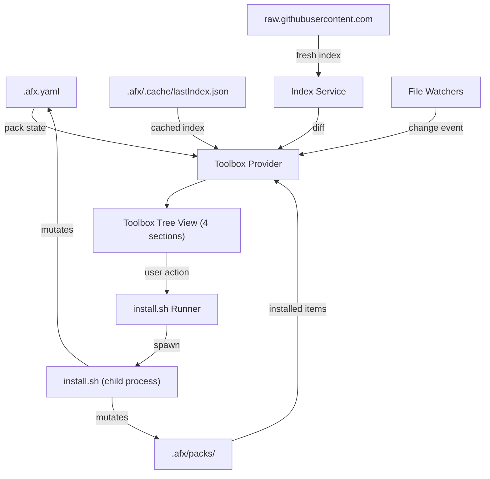

# VSCode AFX Toolbox - Technical Design

**Version:** 2.0
**Date:** 2026-03-01
**Status:** Living
**Author:** Richard Sentino
**Spec:** [spec.md](./spec.md)

---

## Overview

The Toolbox replaces the current flat **Skills** view in `vscode-afx` with a 4-section tree view for managing AFX packs and skills across providers. It reads state from `.afx.yaml` and `.afx/packs/`, fetches the pack index from `raw.githubusercontent.com`, and delegates all mutations to `install.sh` — the extension never writes files directly.

Built as an additive change to the existing `vscode-afx` extension (same repo, same activation, shared config parser and utilities).

---

## References

- **Spec**: [spec.md](./spec.md)
- **Research**: [res-vscode-pack-management.md](../../research/res-vscode-pack-management.md)
- **Research**: [res-skills-ecosystem-index.md](../../research/res-skills-ecosystem-index.md)
- **Pack System Design**: [afx-packs/design.md](../afx-packs/design.md) — `install.sh` CLI commands, manifest format, directory structure
- **Existing Extension Design**: [vscode-extension/design.md](../vscode-extension/design.md) — Current 5-view architecture

---

## 1. Architecture

### 1.1 System Context

The Toolbox is a read-only observer that delegates mutations. It reads from 3 local sources and 1 remote source, presenting a unified tree view. All write operations go through `install.sh`.



### 1.2 Component Diagram

```
┌─────────────────────────────────────────────────────────────────┐
│ VSCode Extension Host (vscode-afx)                               │
│                                                                   │
│  Existing (unchanged)           New (Toolbox)                     │
│  ┌─────────────────────┐       ┌──────────────────────────┐     │
│  │ Project View         │       │ Toolbox Tree Provider     │     │
│  │ Specs View           │       │   ├── Overview Section    │     │
│  │ Library View         │       │   ├── Packs Section       │     │
│  │ Help View            │       │   ├── Upstream Section    │     │
│  └─────────────────────┘       │   └── Skills Section      │     │
│                                 └──────────┬───────────────┘     │
│                                            │                      │
│  ┌────────────┐  ┌──────────┐  ┌──────────┼──────────────┐     │
│  │ Config     │  │  File    │  │          │               │     │
│  │ Parser     │  │ Watchers │  │  ┌───────┴──────┐       │     │
│  │ (shared)   │  │ (shared) │  │  │ Index Service│       │     │
│  └────────────┘  └──────────┘  │  └──────────────┘       │     │
│                                 │  ┌─────────────────┐    │     │
│                                 │  │ install.sh       │    │     │
│                                 │  │ Runner           │    │     │
│                                 │  └─────────────────┘    │     │
│                                 └─────────────────────────┘     │
└─────────────────────────────────────────────────────────────────┘
```

### 1.3 Integration with Existing Extension

The Toolbox is the `afx.toolbox` tree view, registered alongside the other 4 views (Project, Specs, Library, Help) in the AFX activity bar container. It shares the config parser, file watchers, and `install.sh` runner with the rest of the extension.

| Component             | Role                                                                                               |
| --------------------- | -------------------------------------------------------------------------------------------------- |
| `extension.ts`        | Creates `toolboxTreeProvider`, registers toolbox commands, sets up toolbox watchers                 |
| `package.json`        | Declares `afx.toolbox` view, 11 toolbox commands, inline/context menus, 2 settings                 |
| `afxConfigParser.ts`  | Parses core `.afx.yaml` fields; does NOT parse `packs:` — `afxYamlReader` handles pack state       |
| `toolboxWatchers.ts`  | Watches `.afx/packs/` and provider directories for changes                                         |
| `AfxConfig` interface | Core config only — pack data uses separate `Pack[]` model read by `afxDirReader`/`afxYamlReader`   |

### 1.4 Read-Only + CLI Delegation

The extension NEVER writes files. All state mutations flow through `install.sh`:

```
User clicks "Install" on available pack
    → extension spawns: install.sh --pack afx-pack-qa .
    → install.sh downloads, extracts, copies to providers
    → file watcher detects .afx.yaml change
    → tree refreshes automatically
```

---

## 2. Data Models

### 2.1 Core Interfaces

```typescript
/**
 * A pack as read from .afx.yaml + .afx/packs/ directory
 * @see docs/specs/vscode-toolbox/spec.md#FR-4
 */
interface Pack {
  name: string; // e.g., "afx-pack-qa"
  status: "enabled" | "disabled"; // from .afx.yaml
  installedRef: string; // git ref used at install (e.g., "v1.5.3", "main")
  disabledItems: string[]; // per-item overrides from .afx.yaml
  providers: ProviderDir[]; // from .afx/packs/{pack}/{provider}/
  itemCount: number; // total items across all providers
}

/**
 * A provider directory within an installed pack
 * @see docs/specs/vscode-toolbox/spec.md#FR-5
 */
interface ProviderDir {
  provider: ProviderType; // "claude" | "codex" | "antigravity" | "copilot"
  items: PackItem[]; // skills/plugins/agents in this provider dir
  dirPath: string; // absolute path to .afx/packs/{pack}/{provider}/
}

type ProviderType = "claude" | "codex" | "antigravity" | "copilot";

/**
 * A single skill, plugin, or agent within a pack's provider directory
 * @see docs/specs/vscode-toolbox/spec.md#FR-5
 */
interface PackItem {
  name: string; // e.g., "test-driven-development"
  itemType: "skill" | "plugin" | "agent"; // determined by directory convention
  isExternal: boolean; // true = pristine from upstream, false = AFX-built
  isDisabled: boolean; // true if in pack's disabled_items list
  filePath: string; // path to SKILL.md, plugin.json, or agent.md
}

/**
 * A pack from the remote index that is NOT installed locally
 * @see docs/specs/vscode-toolbox/spec.md#FR-6
 */
interface AvailablePack {
  name: string;
  description: string;
  category: string; // "role" | "domain"
  providers: ProviderType[];
}

/**
 * An upstream provider tracked in the index
 * @see docs/specs/vscode-toolbox/spec.md#FR-11
 * @see docs/specs/afx-packs/design.md#1.2-pack-index
 */
interface UpstreamProvider {
  repo: string; // e.g., "anthropics/claude-plugins-official"
  featured: string[]; // highlighted items (from index; empty array if not present)
  lastFetched?: string; // ISO timestamp from cached index
  newSinceLastCheck: string[]; // computed from index diff
}

/**
 * Cached index stored at .afx/.cache/lastIndex.json
 * Mirrors the structure of packs/index.json from the AFX repo.
 * @see docs/specs/vscode-toolbox/spec.md#FR-16
 * @see docs/specs/afx-packs/design.md#1.2-pack-index
 */
interface CachedIndex {
  fetchedAt: string; // ISO timestamp (added by extension, not in upstream index.json)
  packs: Record<string, { description: string; category: string; providers: string[] }>;
  upstream: Record<string, { featured?: string[] }>; // featured is optional — some repos have empty {}
}
```

### 2.2 Tree Element Union

The `ToolboxTreeDataProvider` uses a discriminated union for all tree elements:

```typescript
type ToolboxElement =
  // Section headers
  | { kind: "section"; id: "overview" | "packs" | "upstream" | "skills" }
  // Overview items
  | { kind: "overview-stat"; label: string; value: string; icon: string }
  // Packs
  | { kind: "pack-group"; id: "installed" | "available" }
  | { kind: "pack"; pack: Pack }
  | { kind: "pack-provider"; pack: Pack; provider: ProviderDir }
  | { kind: "pack-item"; pack: Pack; item: PackItem }
  | { kind: "available-pack"; entry: AvailablePack }
  // Upstream
  | { kind: "upstream-provider"; provider: UpstreamProvider }
  | { kind: "upstream-item"; repo: string; item: string }
  // Skills (disk mirror)
  | { kind: "skills-provider"; name: string; dirPath: string }
  | { kind: "skills-dir"; name: string; dirPath: string }
  | { kind: "skills-file"; name: string; filePath: string };
```

---

## 3. Data Flow

### 3.1 Data Sources

| Source                          | Type       | Read By              | Provides                                                                          |
| ------------------------------- | ---------- | -------------------- | --------------------------------------------------------------------------------- |
| `.afx.yaml` `packs:` section    | Local file | `afxDirReader` (new) | Pack list, status, installed_ref, disabled_items                                  |
| `.afx.yaml` `custom_skills:`    | Local file | `afxDirReader` (new) | One-off skills installed outside packs ([afx-packs §3.9](../afx-packs/design.md)) |
| `.afx/packs/{pack}/{provider}/` | Local dirs | `afxDirReader` (new) | Installed items grouped by provider                                               |
| `.afx/.cache/lastIndex.json`    | Local file | `indexService` (new) | Cached index + fetch timestamp                                                    |
| `packs/index.json` (remote)     | HTTP GET   | `indexService` (new) | Available packs, upstream providers                                               |

The `afxConfigParser` handles core `.afx.yaml` fields (`paths`, `features`, `prefixes`, etc.). Pack state (`packs:`, `custom_skills:`) is read by `afxYamlReader` and `afxDirReader`. See [afx-packs/design.md §1.3](../afx-packs/design.md) for the `.afx.yaml` packs schema.

### 3.2 Index Fetch Strategy

```
Activation → auto-check? ─yes─→ fetch index
                          ─no──→ use cached

User clicks "Check" → fetch index

fetch index:
  1. GET raw.githubusercontent.com/rixrix/afx/main/packs/index.json
  2. On success:
     a. Write to .afx/.cache/lastIndex.json with fetchedAt timestamp
     b. Diff against previous cache → compute newSinceLastCheck
     c. Refresh tree
  3. On failure (offline, timeout):
     a. Use existing cache (if any)
     b. Show "offline" indicator in Overview
     c. Log warning
```

No authentication required — `raw.githubusercontent.com` serves public repos. [NFR-3]

### 3.3 Index Diff Computation

When a fresh index is fetched, diff against the cached index:

```typescript
function computeDiff(
  cached: CachedIndex | undefined,
  fresh: CachedIndex,
): {
  newPacks: string[]; // in fresh but not in cached
  newUpstreamItems: Record<string, string[]>; // per-repo new featured items
} {
  if (!cached) return { newPacks: Object.keys(fresh.packs), newUpstreamItems: {} };

  const newPacks = Object.keys(fresh.packs).filter((k) => !(k in cached.packs));

  const newUpstreamItems: Record<string, string[]> = {};
  for (const [repo, data] of Object.entries(fresh.upstream)) {
    const oldFeatured = cached.upstream[repo]?.featured ?? [];
    const added = data.featured.filter((f) => !oldFeatured.includes(f));
    if (added.length > 0) newUpstreamItems[repo] = added;
  }

  return { newPacks, newUpstreamItems };
}
```

### 3.4 Pack State Assembly

Assembling the full pack state requires merging `.afx.yaml` (declarative state) with `.afx/packs/` (actual files on disk):

```
1. Read packs[] from .afx.yaml → list of { name, status, installed_ref, disabled_items }
2. For each pack:
   a. Scan .afx/packs/{name}/ for provider subdirectories (claude/, codex/, antigravity/, copilot/)
   b. For each provider dir, scan for items (skills/, plugins/, agents/)
   c. Cross-reference disabled_items to mark individual items as disabled
   d. Determine isExternal: items with "afx-" prefix are AFX-built, all others are external
      (Heuristic — afx-packs uses source_repo == "rixrix/afx" at install time,
       but at read time only the file names are available. All AFX-built skills
       use the afx- naming convention per afx-packs/design.md §3.7)
3. Return Pack[] array
```

### 3.5 Offline Handling

| Scenario              | Behavior                                                              |
| --------------------- | --------------------------------------------------------------------- |
| No network, no cache  | Overview shows "Never checked", Available packs empty, Upstream empty |
| No network, has cache | Overview shows "offline — last checked: {date}", data from cache      |
| Network available     | Fetch fresh index, update cache, compute diff                         |

---

## 4. Tree View Structure

### 4.1 Section Layout

The Toolbox tree has 4 top-level sections, each collapsible:

```
Toolbox
├── Overview          (flat stats list)
├── Packs             (Installed + Available groups)
├── Upstream          (tracked provider repos)
└── Skills            (disk mirror of provider dirs)
```

#### Full Pane Mockup

The full AFX sidebar with all 5 views. Toolbox (view 4) replaces the current flat Skills view. Hover actions shown as `[button]` on actionable rows. All Toolbox data sourced from afx-packs output: `.afx.yaml`, `.afx/packs/`, `.afx/.cache/lastIndex.json`, and provider directories on disk.

```
┌─────────────────────────────────────────────────────────────────────────┐
│ AFX                                                                     │
├─────────────────────────────────────────────────────────────────────────┤
│                                                                         │
│ ▾ PROJECT                                                               │
│   ├── $(folder-opened) myproject/               /Users/rix/myproject    │
│   ├── $(hubot)         Session Context          available               │
│   │   ├── $(symbol-key) ## Goals                                        │
│   │   ├── $(symbol-key) ## Next Steps                                   │
│   │   └── $(symbol-key) ## Blockers                                     │
│   ├── $(gear)          .afx.yaml                                        │
│   │   ├── name: myproject                                               │
│   │   ├── paths.specs: docs/specs                                       │
│   │   └── packs: 2 entries                                              │
│   └── $(history)       Recent                                           │
│       ├── $(folder)    other-project/           ~/Workspace/other       │
│       └── $(folder)    old-project/             ~/Workspace/old         │
│                                                                         │
│ ▾ SPECS                                                                 │
│   ├── $(package) vscode-toolbox               Draft · 0/35 · @rix      │
│   │   ├── $(file)      spec.md                Draft                     │
│   │   ├── $(file)      design.md              Draft                     │
│   │   ├── $(checklist) tasks.md               0/35                      │
│   │   │   ├── Phase 0: Design                 19/19                     │
│   │   │   ├── Phase 1: Foundation             0/5                       │
│   │   │   ├── Phase 2: Packs Section          0/6                       │
│   │   │   └── ...                                                       │
│   │   └── $(file)      journal.md             4 discussions             │
│   │       ├── $(pass)    TB-D001 Spec Promotion         closed          │
│   │       ├── $(pass)    TB-D002 Design Authoring       closed          │
│   │       ├── $(pass)    TB-D003 Design Sync Audit      closed          │
│   │       └── $(pass)    TB-D004 Full 5-Doc Sync        closed          │
│   │                                                                     │
│   └── $(package) afx-packs                    Approved · 0/45 · @rix   │
│       ├── $(file)      spec.md                Approved                  │
│       ├── $(file)      design.md              Approved                  │
│       ├── $(checklist) tasks.md               0/45                      │
│       └── $(file)      journal.md             2 discussions             │
│                                                                         │
│ ▾ LIBRARY                                                               │
│   ├── $(law)           ADRs                                             │
│   │   ├── $(pass)      ADR-0001               Install Script · Accepted │
│   │   ├── $(pass)      ADR-0002               Product Direction · Acc.  │
│   │   └── $(pass)      ADR-0003               Skill Mgmt Arch · Acc.   │
│   ├── $(beaker)        Research                                         │
│   │   ├── $(file)      res-vscode-pack-management.md                    │
│   │   └── $(file)      res-skills-ecosystem-index.md                    │
│   └── $(tag)           Tags                                             │
│       ├── vscode-extension · 2 features                                 │
│       ├── packs · 2 features                                            │
│       └── skills · 2 features                                           │
│                                                                         │
│ ▾ TOOLBOX                                                  [↻ Check]   │
│   ├── Overview                                                          │
│   │   ├── $(plug)     Providers: 4 active                               │
│   │   ├── $(package)  Packs: 2 installed (1 enabled, 1 disabled)        │
│   │   ├── $(tools)    Skills: 34 total (13 core · 8 pack · 3 custom)    │
│   │   ├── $(clock)    Last checked: 2h ago                              │
│   │   └── $(arrow-up) 2 new packs, 3 new upstream skills               │
│   │                                                                     │
│   ├── Packs                                                             │
│   │   ├── Installed                                                     │
│   │   │   │                                                             │
│   │   │   ├── afx-pack-qa (enabled)    3 providers · 12 items · v1.5.3  │
│   │   │   │                           [↻ Update] [⊘ Disable] [🗑 Remove]│
│   │   │   │   ├── claude/                                               │
│   │   │   │   │   ├── skills/                                           │
│   │   │   │   │   │   ├── test-driven-development (ext)  [⊘ Disable]   │
│   │   │   │   │   │   └── afx-qa-methodology (afx)       [⊘ Disable]   │
│   │   │   │   │   └── plugins/                                          │
│   │   │   │   │       └── code-review (ext)              [⊘ Disable]   │
│   │   │   │   ├── codex/                                                │
│   │   │   │   │   └── skills/                                           │
│   │   │   │   │       └── playwright (ext)               [⊘ Disable]   │
│   │   │   │   └── copilot/                                              │
│   │   │   │       └── agents/                                           │
│   │   │   │           └── afx-qa-methodology (afx)       [⊘ Disable]   │
│   │   │   │                                                             │
│   │   │   └── afx-pack-security (disabled)  3 prov · 8 items · main    │
│   │   │                                      [✓ Enable] [🗑 Remove]    │
│   │   │       ├── claude/                                               │
│   │   │       │   ├── skills/                                           │
│   │   │       │   │   ├── sast-review (ext)              [✓ Enable]    │
│   │   │       │   │   └── afx-security-audit (afx)       [✓ Enable]    │
│   │   │       │   └── plugins/                                          │
│   │   │       │       └── dependency-scanner (ext)       [✓ Enable]    │
│   │   │       ├── codex/                                                │
│   │   │       │   └── skills/                                           │
│   │   │       │       └── sast-review (ext)              [✓ Enable]    │
│   │   │       ├── antigravity/                                          │
│   │   │       │   └── skills/                                           │
│   │   │       │       └── sast-review (ext)              [✓ Enable]    │
│   │   │       └── copilot/                                              │
│   │   │           └── agents/                                           │
│   │   │               └── afx-security-audit (afx)       [✓ Enable]    │
│   │   │                                                                 │
│   │   └── Available                                  ← from index diff  │
│   │       ├── afx-pack-devops     DevOps Automation      [+ Install]   │
│   │       ├── afx-pack-architect  System Design          [+ Install]   │
│   │       └── afx-pack-frontend   Frontend Patterns      [+ Install]   │
│   │                                                                     │
│   ├── Upstream                                                          │
│   │   ├── Claude Plugins (anthropics/claude-plugins-official) [↻ Ref]  │
│   │   │   ├── Last fetched: 1d ago                                      │
│   │   │   └── New: playwright-e2e, security-scanner                     │
│   │   │                                                                 │
│   │   ├── Codex Skills (openai/skills)                       [↻ Ref]  │
│   │   │   └── Last fetched: 3d ago                                      │
│   │   │                                                                 │
│   │   └── Antigravity (anthropics/antigravity-awesome-skills)[↻ Ref]  │
│   │       ├── Last fetched: 1d ago                                      │
│   │       └── New: code-architect                                       │
│   │                                                                     │
│   └── Skills                                               ← disk mirror│
│       ├── .claude/                                                      │
│       │   ├── commands/                                                 │
│       │   │   ├── afx-next.md                            → click: open │
│       │   │   ├── afx-work.md                            → click: open │
│       │   │   └── ...                                                   │
│       │   ├── skills/                                                   │
│       │   │   ├── test-driven-development/               → click: open │
│       │   │   └── afx-qa-methodology/                    → click: open │
│       │   └── plugins/                                                  │
│       │       └── code-review/                           → click: open │
│       ├── .codex/                                                       │
│       │   └── skills/                                                   │
│       │       └── afx-next/                              → click: open │
│       ├── .agents/                                                      │
│       │   └── skills/                                                   │
│       │       ├── test-driven-development/               → click: open │
│       │       └── playwright/                            → click: open │
│       ├── .agent/                                                       │
│       │   └── skills/                                                   │
│       │       ├── test-driven-development/               → click: open │
│       │       └── afx-qa-methodology/                    → click: open │
│       ├── .gemini/                                                      │
│       │   └── commands/                                                 │
│       │       └── ...                                    → click: open │
│       └── .github/                                                      │
│           ├── prompts/                                                  │
│           │   └── ...                                    → click: open │
│           └── agents/                                                   │
│               └── afx-qa-methodology.agent.md            → click: open │
│                                                                         │
│ ▾ HELP                                                                  │
│   ├── $(github)         AFX Repository                   → open URL    │
│   ├── $(book)           Documentation                    → open URL    │
│   ├── $(sync)           Check for Updates                → command     │
│   ├── $(bug)            Report Issue                     → open URL    │
│   └── $(cloud-download) Update from Latest               → command     │
│                                                                         │
└─────────────────────────────────────────────────────────────────────────┘
```

**Data sources (Toolbox sections):**

| Section   | Source                                              | What it shows                                         |
| --------- | --------------------------------------------------- | ----------------------------------------------------- |
| Overview  | `.afx.yaml` + `.afx/packs/` + cached index          | Aggregate counts, last check time, index diff summary |
| Installed | `.afx.yaml` `packs[]` + `.afx/packs/` disk          | Pack name, status, installed_ref, provider tree       |
| Available | Index diff (in index, not in `.afx.yaml`)            | Pack name, description from `packs/index.json`        |
| Upstream  | `upstream` section of `packs/index.json`             | Repo names, featured items, diff vs cached index      |
| Skills    | Provider dirs on disk (`.claude/`, `.codex/`, etc.)  | Raw directory listing — whatever exists on disk       |

**Hover actions (Toolbox):**

| Element              | Actions (on hover)        | CLI command                                           |
| -------------------- | ------------------------- | ----------------------------------------------------- |
| Toolbox header       | Check                     | Fetch index, refresh tree                             |
| Pack (enabled)       | Update, Disable, Remove   | `--update --packs`, `--pack-disable`, `--pack-remove` |
| Pack (disabled)      | Enable, Remove            | `--pack-enable`, `--pack-remove`                      |
| Available pack       | Install                   | `--pack {name}`                                       |
| Pack item (enabled)  | Disable                   | `--skill-disable {name} --pack {pack}`                |
| Pack item (disabled) | Enable                    | `--skill-enable {name} --pack {pack}`                 |
| Upstream provider    | Refresh                   | Fetch index, refresh tree                             |
| Skills file/dir      | _(click to open in editor)_ | —                                                   |

### 4.2 Overview Section

Flat list of stats items. No nesting.

| Item         | Value Example                                       | Icon          | Source                                          |
| ------------ | --------------------------------------------------- | ------------- | ----------------------------------------------- |
| Providers    | "4 active"                                          | `$(plug)`     | Count distinct providers across installed packs |
| Packs        | "2 installed (1 enabled, 1 disabled)"               | `$(package)`  | `.afx.yaml` packs count                         |
| Skills       | "34 total (13 core, 8 pack, 3 custom, 10 disabled)" | `$(tools)`    | Aggregate from all sources                      |
| Last checked | "2h ago"                                            | `$(clock)`    | `.afx/.cache/lastIndex.json` fetchedAt          |
| Updates      | "2 new packs, 3 new upstream skills"                | `$(arrow-up)` | Index diff: new packs + new upstream featured (hidden if no changes) |

**Check button**: Inline action on the Overview section header via `view/title` menu.

### 4.3 Packs Section

Two sub-groups: Installed and Available.

#### Installed Packs

```
Installed
├── afx-pack-qa (enabled)         3 providers · 12 items · v1.5.3
│   ├── claude/
│   │   ├── skills/
│   │   │   ├── test-driven-development    (external)
│   │   │   └── afx-qa-methodology         (afx-built)
│   │   └── plugins/
│   │       └── code-review                (external)
│   ├── codex/
│   │   └── skills/
│   │       └── playwright                 (external)
│   └── copilot/
│       └── agents/
│           └── afx-qa-methodology         (afx-built)
│
└── afx-pack-security (disabled)  3 providers · 8 items · main
    └── (collapsed — disabled visual treatment)
```

The `description` shows `installed_ref` from `.afx.yaml` (e.g., `v1.5.3`, `main`). The **Update** hover action always appears on installed packs — it re-runs `install.sh --update --packs` which fetches the latest from the AFX repo regardless of the current ref. The index has no `latest_ref` field, so the Update action is unconditional and the Overview "Updates" stat row is hidden until version info is added to the index.

**TreeItem properties for installed pack:**

| Property           | Value                                                 |
| ------------------ | ----------------------------------------------------- |
| `label`            | Pack name (e.g., "afx-pack-qa")                       |
| `description`      | `"{N} providers · {M} items · {installedRef}"`        |
| `iconPath`         | `$(package)` enabled, `$(circle-slash)` disabled      |
| `collapsibleState` | Collapsed (enabled), Collapsed (disabled, dimmed)     |
| `contextValue`     | `pack-enabled` or `pack-disabled` (for hover actions) |

**Disabled visual treatment** [NFR-6]:

- Icon: `$(circle-slash)` with `editorWarning.foreground` color
- Description text includes "(disabled)"
- Children still viewable but dimmed

#### Available Packs

```
Available
├── afx-pack-devops     DevOps Automation                    [Install]
├── afx-pack-architect  System Design                        [Install]
└── afx-pack-frontend   Frontend Patterns                    [Install]
```

Available packs come from index diff (packs in index but not in `.afx.yaml`).

### 4.4 Upstream Section

```
Upstream
├── Claude Plugins (anthropics/claude-plugins-official)
│   ├── Last fetched: 1d ago
│   └── New: playwright-e2e, security-scanner
│
├── Codex Skills (openai/skills)
│   └── Last fetched: 3d ago
│
└── Antigravity (anthropics/antigravity-awesome-skills)
    ├── Last fetched: 1d ago
    └── New: code-architect
```

Clicking an upstream item opens the provider repo page in the browser.

### 4.5 Skills Section (Disk Mirror)

Mirrors provider directories on disk exactly — no grouping, no attribution, no filtering:

```
Skills
├── .claude/                    ← Claude Code (skills, commands, plugins)
│   ├── commands/
│   │   ├── afx-next.md
│   │   └── ...
│   ├── skills/
│   │   ├── test-driven-development/
│   │   └── afx-qa-methodology/
│   └── plugins/
│       └── code-review/
├── .codex/                     ← Codex CLI — core AFX skills (from install.sh core)
│   └── skills/
│       └── afx-next/
├── .agents/                    ← Codex CLI — pack-installed skills (from install.sh --pack)
│   └── skills/
│       ├── test-driven-development/
│       └── playwright/
├── .agent/                     ← Google Antigravity (skills)
│   └── skills/
│       ├── test-driven-development/
│       └── afx-qa-methodology/
├── .gemini/                    ← Gemini CLI (commands)
│   └── commands/
└── .github/                    ← GitHub Copilot (prompts, agents)
    ├── prompts/
    └── agents/
        └── afx-qa-methodology.agent.md
```

**Provider directory mapping** (see [afx-packs/design.md §2.4](../afx-packs/design.md)):

| Provider | Directories |
|---|---|
| `claude` | `.claude/` (skills, plugins, commands) |
| `codex` | `.codex/` (core AFX skills) and `.agents/` (pack-installed skills) |
| `antigravity` | `.agent/skills/` |
| `copilot` | `.github/agents/` |

Both `.codex/` and `.agents/` may exist — `.codex/` holds core AFX Codex skills, `.agents/` holds pack-installed Codex skills. The disk mirror shows whatever exists on disk.

Click any file to open in VSCode editor. This section uses the same pattern as the existing `commandsTreeProvider` but expanded to all provider directories.

---

## 5. Hover Actions

Hover actions are implemented via VSCode's `menus.view/item/context` with `group: "inline"` to show as icon buttons on hover.

### 5.1 Action Mapping

| Element             | contextValue         | Hover Actions                                                           |
| ------------------- | -------------------- | ----------------------------------------------------------------------- |
| Pack (enabled)      | `pack-enabled`       | Update `$(cloud-download)`, Disable `$(circle-slash)`, Remove `$(trash)` |
| Pack (disabled)     | `pack-disabled`      | Enable `$(check)`, Remove `$(trash)`                                    |
| Available pack      | `pack-available`     | Install `$(add)`                                                        |
| Pack item (enabled) | `pack-item-enabled`  | Disable `$(circle-slash)`                                               |
| Pack item (disabled)| `pack-item-disabled` | Enable `$(check)`                                                       |
| Upstream provider   | `upstream-provider`  | Refresh `$(refresh)`                                                    |

### 5.2 Command Registration

```typescript
// package.json contributes.commands
{ "command": "afx.toolbox.installPack",   "title": "Install Pack",   "icon": "$(add)" },
{ "command": "afx.toolbox.removePack",    "title": "Remove Pack",    "icon": "$(trash)" },
{ "command": "afx.toolbox.enablePack",    "title": "Enable Pack",    "icon": "$(check)" },
{ "command": "afx.toolbox.disablePack",   "title": "Disable Pack",   "icon": "$(circle-slash)" },
{ "command": "afx.toolbox.updatePack",    "title": "Update Pack",    "icon": "$(cloud-download)" },
{ "command": "afx.toolbox.disableSkill",  "title": "Disable Skill",  "icon": "$(circle-slash)" },
{ "command": "afx.toolbox.enableSkill",   "title": "Enable Skill",   "icon": "$(check)" },
{ "command": "afx.toolbox.checkIndex",    "title": "Check for Updates", "icon": "$(refresh)" },
{ "command": "afx.toolbox.refreshUpstream","title": "Refresh Upstream", "icon": "$(refresh)" },
```

### 5.3 Menu Bindings

```jsonc
// package.json contributes.menus
"view/item/context": [
  // Pack actions (inline hover)
  { "command": "afx.toolbox.updatePack",   "when": "viewItem == pack-enabled",  "group": "inline@1" },
  { "command": "afx.toolbox.disablePack",  "when": "viewItem == pack-enabled",  "group": "inline@2" },
  { "command": "afx.toolbox.removePack",   "when": "viewItem =~ /^pack-(enabled|disabled)$/", "group": "inline@3" },
  { "command": "afx.toolbox.enablePack",   "when": "viewItem == pack-disabled", "group": "inline@1" },
  { "command": "afx.toolbox.installPack",  "when": "viewItem == pack-available", "group": "inline@1" },
  // Item actions
  { "command": "afx.toolbox.disableSkill", "when": "viewItem == pack-item-enabled",  "group": "inline" },
  { "command": "afx.toolbox.enableSkill",  "when": "viewItem == pack-item-disabled", "group": "inline" },
  // Upstream
  { "command": "afx.toolbox.refreshUpstream", "when": "viewItem == upstream-provider", "group": "inline" }
]
```

---

## 6. CLI Integration (`install.sh` Runner)

### 6.1 Runner Pattern

All mutations use `install.sh` via `curl | bash` — the same pattern used by the existing `afx.installAfx` command. `install.sh` lives in the AFX repo (not in the user's project), so we always fetch it remotely. The runner handles argument construction, output display, and post-action refresh.

```typescript
/**
 * Run install.sh via curl-pipe with given arguments from the workspace root.
 * Shows output in a terminal, triggers tree refresh when complete.
 *
 * @see docs/specs/vscode-toolbox/spec.md#FR-10
 * @see docs/specs/afx-packs/design.md#3.12-remote-execution
 */
const INSTALL_SH_URL = "https://raw.githubusercontent.com/rixrix/afx/main/install.sh";

async function runInstallSh(root: string, args: string[], options?: { dryRun?: boolean; branch?: string; version?: string }): Promise<void> {
  // Check if AFX is set up (has .afx.yaml)
  const afxYaml = path.join(root, ".afx.yaml");
  if (!fs.existsSync(afxYaml) && !args.includes("--pack")) {
    showSetupPrompt(root);
    return;
  }

  const fullArgs: string[] = [];
  if (options?.dryRun) fullArgs.push("--dry-run");
  if (options?.branch) fullArgs.push("--branch", options.branch);
  if (options?.version) fullArgs.push("--version", options.version);
  fullArgs.push(...args, ".");

  const terminal = vscode.window.createTerminal({
    name: `AFX: ${args[0]}`,
    cwd: root,
  });
  terminal.show();
  terminal.sendText(`curl -sL ${INSTALL_SH_URL} | bash -s -- ${fullArgs.join(" ")}`);

  // Refresh tree after terminal closes
  const listener = vscode.window.onDidCloseTerminal((t) => {
    if (t === terminal) {
      listener.dispose();
      setTimeout(() => toolboxProvider.refresh(), 1500);
    }
  });
}
```

`install.sh` is always fetched from `raw.githubusercontent.com` via curl-pipe — it does not live in the user's project. See [afx-packs/design.md §3.12](../afx-packs/design.md).

### 6.2 Command Mapping

| User Action   | install.sh Command (via curl pipe)                     |
| ------------- | ------------------------------------------------------ |
| Install pack  | `--pack {name}`                                        |
| Remove pack   | `--pack-remove {name}`                                 |
| Disable pack  | `--pack-disable {name}`                                |
| Enable pack   | `--pack-enable {name}`                                 |
| Disable skill | `--pack {pack} --skill-disable {skillName}`            |
| Enable skill  | `--pack {pack} --skill-enable {skillName}`             |
| Update packs  | `--update --packs`                                     |
| List packs    | `--pack-list`                                          |
| Add skill     | `--add-skill {repo}:{path}/{skill}`                    |
| Dry run       | `--dry-run --pack {name}` (combinable with any action) |

**Ref control** (optional, for version-pinned installs):

| Option      | install.sh Flag   | Usage                                  |
| ----------- | ----------------- | -------------------------------------- |
| Branch      | `--branch {name}` | Install from specific branch           |
| Version tag | `--version {tag}` | Install from version tag (e.g., 1.5.3) |

See [afx-packs/design.md §3.3–3.4](../afx-packs/design.md) for full argument spec and download strategy.

### 6.3 Setup AFX Button

When `.afx.yaml` doesn't exist (no AFX installation in this project):

```typescript
function showSetupPrompt(root: string): void {
  const msg = "AFX is not installed in this project.";
  vscode.window.showInformationMessage(msg, "Install AFX").then((action) => {
    if (action === "Install AFX") {
      const terminal = vscode.window.createTerminal({ name: "AFX Install", cwd: root });
      terminal.show();
      terminal.sendText("curl -sL https://raw.githubusercontent.com/rixrix/afx/main/install.sh | bash -s -- .");
    }
  });
}
```

This reuses the same install pattern from the existing `afx.installAfx` command in `extension.ts`.

---

## 7. File Watchers

### 7.1 Watch Patterns

The Toolbox adds 3 new watch patterns to the existing file watcher setup:

| Pattern                                                              | Triggers                                                 |
| -------------------------------------------------------------------- | -------------------------------------------------------- |
| `.afx.yaml`                                                          | Full tree refresh (pack state changed) — already watched |
| `.afx/packs/**/*`                                                    | Packs + Skills sections refresh (items added/removed)    |
| `.claude/`, `.codex/`, `.agents/`, `.agent/`, `.gemini/`, `.github/` | Skills section refresh (provider dirs changed)           |

All watchers share the existing 500ms debounce timer from `fileWatcher.ts`.

### 7.2 Integration

```typescript
// In extension.ts loadFolder(), add to existing watcher setup:
const toolboxWatchers = createToolboxWatchers(config, folderPath, {
  refreshAll: () => toolboxProvider.refresh(),
  refreshSkills: () => toolboxProvider.refreshSection("skills"),
  refreshPacks: () => toolboxProvider.refreshSection("packs"),
});
watcherDisposables.push(...toolboxWatchers);
```

---

## 8. Settings

### 8.1 Extension Settings

```jsonc
// package.json contributes.configuration
{
  "afx.toolbox.autoCheck": {
    "type": "boolean",
    "default": true,
    "description": "Automatically check for pack updates on activation",
  },
  "afx.toolbox.autoCheckInterval": {
    "type": "number",
    "default": 86400,
    "description": "Minimum seconds between auto-checks (default: 24 hours)",
  },
}
```

### 8.2 Auto-Check Logic

On activation, check if enough time has elapsed since last fetch:

```typescript
const lastFetched = cachedIndex?.fetchedAt;
const interval = vscode.workspace.getConfiguration("afx.toolbox").get("autoCheckInterval", 86400);
const elapsed = lastFetched ? (Date.now() - new Date(lastFetched).getTime()) / 1000 : Infinity;
if (elapsed >= interval) {
  await indexService.fetchAndCache();
}
```

---

## 9. File Structure

### 9.1 New Files

All toolbox files live under `src/toolbox/`:

```
vscode-afx/src/
├── extension.ts                          # Entry point: registers toolbox provider and commands
├── toolbox/
│   ├── toolboxTreeProvider.ts           # Main tree data provider (4 sections inline)
│   ├── toolboxCommands.ts              # 11 command handlers + autoCheckIfDue()
│   ├── toolboxWatchers.ts             # File watchers for .afx/packs/ and provider dirs
│   ├── models.ts                        # Pack, PackItem, AvailablePack, UpstreamProvider, etc.
│   ├── afxDirReader.ts                  # Scan .afx/packs/ directory structure → Pack[]
│   ├── afxYamlReader.ts                 # Read pack state from .afx.yaml packs: section
│   ├── indexService.ts                  # Fetch, cache, diff index
│   └── installShRunner.ts              # Run install.sh via terminal (curl-pipe)
└── ...existing files unchanged...
```

### 9.3 package.json Changes

```jsonc
// Views: rename Skills → Toolbox
{ "id": "afx.toolbox", "name": "Toolbox" }  // was: { "id": "afx.skills", "name": "Skills" }

// Add view/title actions
{ "command": "afx.toolbox.checkIndex", "when": "view == afx.toolbox", "group": "navigation" }

// Add 9 new commands (see Section 5.2)
// Add 8 inline menu bindings (see Section 5.3)
// Add 2 settings (see Section 8.1)
```

---

## 10. Key Decisions

| Decision             | Options Considered                                             | Choice                        | Rationale                                                              |
| -------------------- | -------------------------------------------------------------- | ----------------------------- | ---------------------------------------------------------------------- |
| Provider pattern     | Single monolithic provider, Section-based providers, Composite | Single provider with sections | Simpler state management, consistent with existing vscode-afx patterns |
| Index fetch          | Bundled in VSIX, Live fetch, Git submodule                     | Live fetch                    | Always current, no release coupling, small payload                     |
| Cache location       | `globalState`, `.afx/.cache/`, temp dir                        | `.afx/.cache/`                | Visible, gitignored, shareable debug artifact                          |
| CLI integration      | Direct file writes, child_process, terminal                    | Terminal (sendText)           | User sees output, can cancel, matches existing installAfx pattern      |
| Skill type detection | Filename convention, directory name, manifest                  | `afx-` prefix check           | Simple, consistent with AFX naming convention                          |
| Disabled treatment   | Hide items, Collapse with indicator, Strikethrough             | Collapse with dimmed icon     | User can still see what's disabled, visual distinction clear           |

---

## 11. Error Handling

| Scenario                                  | Handling                                                     |
| ----------------------------------------- | ------------------------------------------------------------ |
| `.afx.yaml` has no `packs:` section       | Packs section shows "No packs installed" with Install button |
| `.afx/packs/` doesn't exist               | Same as above — no packs installed                           |
| Index fetch fails (network)               | Use cached index, show "offline" in Overview, log warning    |
| Index fetch fails (no cache)              | Overview shows "Never checked", Available/Upstream empty     |
| No `.afx.yaml` (AFX not installed)        | Show "Setup AFX" button, all mutation actions disabled       |
| `curl` fetch of install.sh fails          | Show error notification, suggest checking network            |
| `install.sh` exits non-zero               | Show error notification with exit code                       |
| Pack directory missing but in `.afx.yaml` | Show pack with warning icon, suggest reinstall               |
| Malformed `lastIndex.json`                | Delete cache, treat as "never checked"                       |

---

## 12. Performance

Tree render target: < 500ms for a project with 10 installed packs [NFR-4].

**Strategy:**

- `.afx.yaml` parsing is already fast (reuse existing parser)
- `.afx/packs/` scan is synchronous `readdir` — fast for typical pack counts
- Index diff is O(n) where n = number of packs (small)
- Provider dir scan (Skills section) uses lazy loading — only scan on expand
- No network calls during tree render — index fetch is async and non-blocking

---

## 13. Dependencies

### New Dependencies

None. The Toolbox uses only:

- Node.js built-in `fetch()` (available since Node 18, bundled with VSCode)
- Node.js `child_process` via `vscode.window.createTerminal()`
- Existing `yaml` and `gray-matter` packages (already in vscode-afx)

### External Dependencies

| Dependency                  | Purpose                        | Failure Mode                   |
| --------------------------- | ------------------------------ | ------------------------------ |
| `raw.githubusercontent.com` | Index fetch + install.sh fetch | Graceful offline (cached data) |
| `install.sh` (remote)       | All mutations (via curl pipe)  | "Setup AFX" button shown       |
